# 13 - Convention over Configuration (Convención sobre Configuración)

El principio de **Convención sobre Configuración** (*Convention over Configuration* o CoC) establece que un sistema de software debe adoptar valores predeterminados y estructuras canónicas razonables, de modo que el desarrollador o agente de IA solo deba escribir configuración explícita cuando necesite desviarse deliberadamente de la norma.

---

## 1. Definición y Orígenes

Popularizado históricamente por frameworks como Ruby on Rails y consolidado en ecosistemas modernos como FastAPI, Django, Pytest y Next.js:
- **Sin Convención:** Cada ruta, controlador, tabla y test requiere decenas de líneas de configuración XML, YAML o JSON para mapear nombres de archivos con clases.
- **Con Convención:** Si un archivo se ubica en `tests/unit/test_auth.py`, el arnés de pruebas asume automáticamente que contiene tests unitarios ejecutables sin configuración adicional.

---

## 2. Ventajas para Agentes Autónomos de IA

1. **Resolución Determinista sin Ambigüedad:** El agente sabe exactamente dónde ubicar un nuevo módulo (`src/paquete/services/`) o una prueba (`tests/unit/`) basándose en la topología estándar, sin tener que inferir rutas arbitrarias.
2. **Ahorro Masivo de Tokens:** Se elimina la necesidad de inyectar archivos gigantescos de configuración en el contexto; el agente asume las convenciones del stack estándar.
3. **Inyección de Dependencias por Tipos:** Frameworks modernos resuelven dependencias mediante firmas de tipo de Python (`Depends(get_db)`), eliminando cableados manuales propensos a errores.

```mermaid
flowchart TD
    subgraph Configuracion_Excesiva ["Configuración Manual Verbosa"]
        M1["Definir clase"] --> M2["Registrar en routes.yaml"]
        M2 --> M3["Mapear en di_container.py"]
        M3 --> M4["Declarar en test_manifest.json"]
        M4 --> M5["❌ Sobrecarga de tokens y riesgo de desincronización"]
    end

    subgraph Convencion_Estandar ["Convención sobre Configuración"]
        C1["Crear src/services/user_service.py"] --> C2["Descubrimiento Automático por AST / Inyector"]
        C2 --> C3["tests/unit/test_user_service.py"]
        C3 --> C4["✅ Ejecución inmediata sin fricción"]
    end
```



---

## 3. Comparativa de Código

### ❌ Anti-Patrón: Mapeo Manual y Configuración Excesiva
```python
# config/routes_mapping.py (Configuración verbosa propensa a desincronización)
ROUTES = {
    "/users/register": "src.controllers.user.RegisterController",
    "/users/login": "src.controllers.user.LoginController",
    "/items/list": "src.controllers.item.ListController",
}
```

### ✅ Patrón Conforme: Enrutamiento y Descubrimiento por Convención
```python
from fastapi import APIRouter, Depends
from pydantic import BaseModel

router = APIRouter(prefix="/users", tags=["users"])

class UserRegisterRequest(BaseModel):
    email: str
    password: str

@router.post("/register")
def register_user(payload: UserRegisterRequest) -> dict[str, str]:
    """Registra un nuevo usuario siguiendo la convención estándar de rutas y schemas."""
    return {"status": "created", "email": payload.email}
```

---

## 4. Riesgos y Límites: Cuándo la Convención se Convierte en "Magia Oscura"

- **Peligro:** Si las convenciones no están documentadas en `ARCHITECTURE.md` o son excesivamente implícitas (ej. metaprogramación oculta o inyección mágica no tipada), el LLM no podrá inferir el flujo de control y alucinará dependencias inexistentes.
- **Regla de Oro:** **Convención Explícita y Tipada.** La convención debe ser inspeccionable mediante el sistema de tipos de Python (`mypy`).
