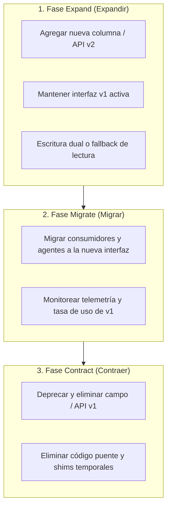

# 11 - Patrón Expand and Contract (Cambio en Paralelo)

El patrón **Expand and Contract** (*Parallel Change*) es una técnica de refactorización arquitectónica que permite introducir cambios incompatibles en esquemas de base de datos, APIs o contratos de interfaces en **fases graduales y seguras**, garantizando retrocompatibilidad y reversibilidad total en cada paso.

---

## 1. Anatomía del Patrón en Tres Fases



---

## 2. Aplicación Crítica en Agentes de IA

Cuando un agente autónomo recibe la orden de *"renombrar el campo `address` a `shipping_address`"*:
- ❌ **Antipatrón Destructivo:** Renombrar la columna de base de datos y el modelo Pydantic en un solo commit directo. Si el backend en producción aún espera `address`, el sistema colapsa de inmediato.
- ✅ **Enfoque Expand and Contract:**
  1. **Expand:** Agregar `shipping_address` como campo opcional o con alias `@computed_field` / getter retrocompatible.
  2. **Migrate:** Actualizar los servicios internos para leer `shipping_address`.
  3. **Contract:** Eliminar la propiedad legacy `address` una vez validada la suite completa de tests.

---

## 3. Ejemplo Práctico en Modelos Pydantic y APIs

```python
from pydantic import BaseModel, Field

# FASE 1: EXPAND (Soporta ambos campos sin romper clientes existentes)
class UserProfileSchema(BaseModel):
    id: str
    shipping_address: str = Field(..., description="Dirección canónica de entrega")
    
    # Campo legacy con soporte transicional
    @property
    def address(self) -> str:
        """Propiedad legacy para retrocompatibilidad con clientes v1."""
        return self.shipping_address

# FASE 2 & 3: CONTRACT (En release mayor posterior)
# Se remueve la propiedad address una vez que los consumidores han migrado.
```

---

## 4. Matriz de Reversibilidad

| **Fase** | **Acción Ejecutada** | **¿Es Reversible en caliente?** | **Mecanismo de Rollback** |
|:---|:---|:---:|:---|
| **Expand** | Agregar nueva columna / endpoint nuevo | ✅ Sí | Desplegar versión anterior; el nuevo campo es inocuo. |
| **Migrate** | Redirigir lecturas y escrituras | ✅ Sí | Conmutar feature flag o revertir commit de consumidor. |
| **Contract** | Eliminar columna antigua / endpoint v1 | ⚠️ Requiere migración DB | Restaurar backup o re-ejecutar fase Expand. |
