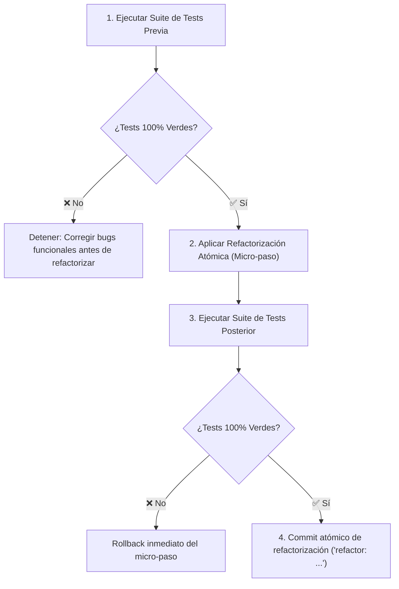

# 12 - Refactorización Continua y Preservación de Invariantes

La **Refactorización Continua** es la disciplina de modificar la estructura interna del código para mejorar su legibilidad, modularidad y mantenibilidad **sin alterar en absoluto su comportamiento observable externo ni sus contratos de dominio** (*Martin Fowler*).

---

## 1. Protocolo de Seguridad para Refactorización Agéntica

Un agente de IA solo puede ejecutar refactorizaciones si sigue estrictamente el siguiente protocolo determinista:

---

## 2. Distinción: Refactorización vs Reescritura Arbitraria

- **Refactorización Legítima:** Extraer un método de 80 líneas en tres funciones puras con Google Docstrings, renombrar variables crípticas (`d` -> `telemetry_data`), reemplazar condicionales anidados con polimorfismo o pattern matching.
- **Reescritura Arbitraria (Prohibida para Agentes):** Reemplazar SQLite por MongoDB *"porque es más moderno"*, cambiar la biblioteca de testing de `pytest` a `unittest`, o alterar esquemas públicos de API sin un ADR aprobado.

---

## 3. Catálogo de Técnicas Esenciales

1. **Extract Method / Function:** Convertir bloques con responsabilidad propia en funciones independientes y testables.
2. **Rename Symbol:** Asignar nombres semánticos que reflejen la intención exacta del dominio.
3. **Introduce Parameter Object / Dataclass:** Reemplazar listas de 7 parámetros primitivos por un objeto o modelo Pydantic validado.
4. **Replace Conditional with Guard Clauses:** Salir temprano (*Early Return*) para reducir la complejidad ciclomática.
