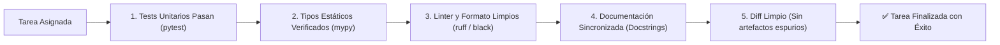

# 13 - Criterios de Aceptación Objetivos y Definition of Done (DoD) Ejecutable

Para un agente de Inteligencia Artificial, las instrucciones vagas como *"optimiza el código"* o *"agrega autenticación y haz que quede bien"* resultan inútiles y conducen a alucinaciones. Toda tarea asignada debe incluir **Criterios de Aceptación Objetivos** y regirse por una **Definition of Done (DoD) Ejecutable**.

---

## 1. La Definition of Done (DoD) Canónica

Ninguna tarea se considera finalizada por el agente a menos que cumpla **el 100% de la siguiente lista de verificación automatizable**:



---

## 2. Estructura de Tarea Óptima para Prompts Agénticos

Al asignar una tarea a un agente, estructurar la solicitud en el siguiente formato:

```markdown
### Objetivo de la Tarea
Implementar el validador de invariantes de número de serie en la entidad `Dispositivo`.

### Criterios de Aceptación (Gherkin / Verificables)
- [ ] Si el número de serie tiene menos de 8 caracteres, lanzar `ValidationError`.
- [ ] No permitir duplicados en memoria durante el registro.
- [ ] Agregar tests unitarios en `tests/unit/test_device_invariants.py` cubriendo casos límite.

### Comando de Validación DoD
`pytest tests/unit/test_device_invariants.py && mypy src/ && ruff check src/`
```

---

## 3. Automatización de la DoD mediante un Solo Comando

Para facilitar que el agente valide su trabajo con una sola llamada a herramienta, el repositorio debe proveer un script o tarea consolidada:

```bash
# Ejecutar verificación integral de la DoD
python scripts/validate_all.py
```
