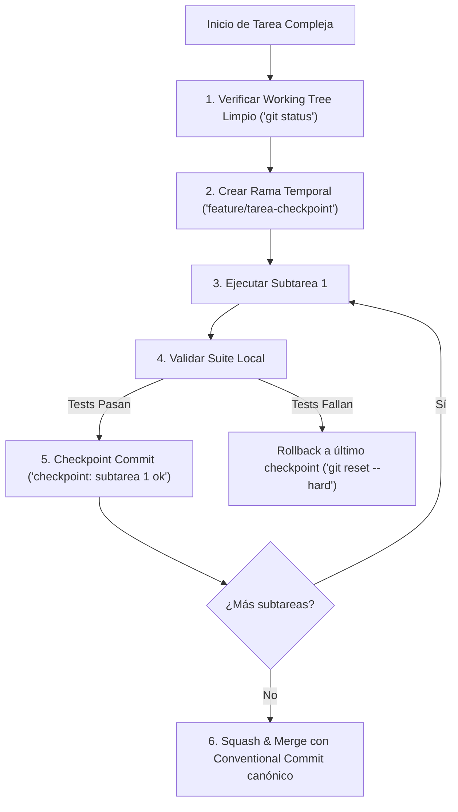

# 11 - Checkpointing y Migración Incremental para Tareas Agénticas

Las tareas extensas ejecutadas por agentes autónomos (refactorizaciones multi-archivo, migraciones de librerías o actualización de documentación masiva) conllevan el riesgo de **destruir el estado previo** si el agente comete un error crítico en pasos avanzados.

---

## 1. El Protocolo de Checkpointing Agéntico



---

## 2. Comandos de Recuperación Deterministas

- **Crear Checkpoint Seguro:**
  ```bash
  git add -A && git commit -m "checkpoint(safety): snapshot previo a refactor de modulo_x"
  ```
- **Revertir a Checkpoint Anterior ante Alucinación o Error Fatal:**
  ```bash
  git reset --hard HEAD~1
  ```
- **Limpiar Cambios no Confirmados:**
  ```bash
  git clean -fd && git checkout -- .
  ```
