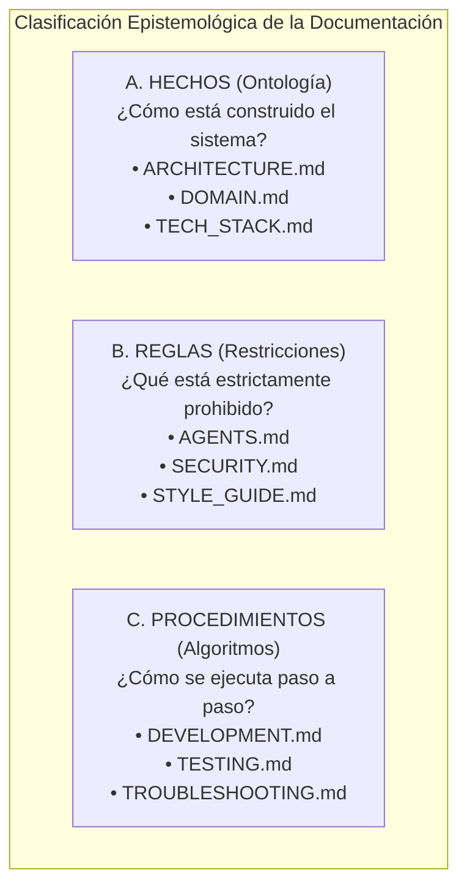

# 07 - Separación de Hechos, Reglas y Procedimientos

La ambigüedad en el razonamiento de los modelos de lenguaje ocurre con frecuencia cuando un documento mezcla simultáneamente descripciones de la arquitectura, restricciones de seguridad y comandos de ejecución. La **Tríada Cognitiva** clasifica la información en tres dimensiones epistemológicas puras.

---

## 1. La Tríada Cognitiva de la Documentación

---

## 2. Matriz de Clasificación de Documentos

| **Dimensión** | **Naturaleza Semántica** | **Archivos Canónicos** | **Efecto en el Razonamiento del Agente** |
|:---|:---|:---|:---|
| **Hechos** | Descriptivo / Estático | `ARCHITECTURE.md`, `DOMAIN.md` | Proporciona el mapa mental del sistema y sus entidades. |
| **Reglas** | Normativo / Invariante | `AGENTS.md`, `SECURITY.md` | Actúa como guardrail inviolable que frena acciones no autorizadas. |
| **Procedimientos** | Prescriptivo / Dinámico | `DEVELOPMENT.md`, `TESTING.md` | Proporciona la secuencia algorítmica de comandos a ejecutar. |
