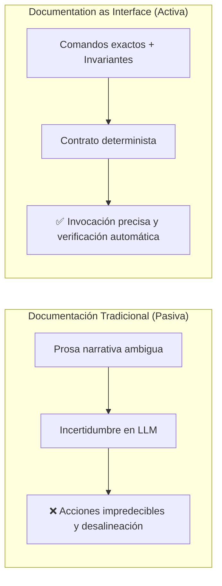

# 09 - Documentation as Interface (La Documentación como Interfaz Operativa)

En la ingeniería de software tradicional, la documentación es un artefacto pasivo redactado para humanos. En el paradigma **Agentic Software Engineering**, la documentación es el **plano de control primario y la interfaz de usuario de los agentes de IA**.

---

## 1. De Prosa Pasiva a Contrato Operacional

---

## 2. Principios de Redacción de Documentación como Interfaz

1. **Directivas Imperativas y Unívocas:** En lugar de *"sería deseable que el desarrollador use ruff"*, escribir *"OBLIGATORIO: Ejecutar `ruff check --fix src/` antes de cada commit"*.
2. **Vinculación con Herramientas Ejecutables:** Todo procedimiento debe incluir el comando exacto de CLI y el código de salida esperado (`exit code 0`).
3. **Contratos de Entrada y Salida Explícitos:** Especificar esquemas JSON / Pydantic para los intercambios de datos entre subagentes.
