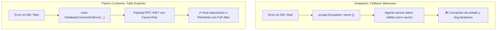

# 18 - No Silent Fallbacks (Prohibición de Fallbacks Silenciosos)

Los **fallbacks silenciosos** (capturar todas las excepciones y retornar `None`, `{}` o un valor predeterminado sin registrar el error) son el antipatrón más destructivo en sistemas agénticos, pues ocultan fallas críticas y causan corrupción progresiva de estado en pasos posteriores.

---

## 1. El Principio de Fallo Explícito (*Fail-Fast*)



---

## 2. Comparativa de Código

### ❌ Anti-Patrón: Enmascaramiento de Excepciones
```python
def get_user_profile(user_id: str) -> dict:
    try:
        return db.fetch_user(user_id)
    except Exception:
        # PÉSIMO: Oculta si fue un timeout, clave inexistente o credencial rota
        return {}
```

### ✅ Patrón Conforme: Elevación de Excepción Tipada
```python
class UserNotFoundError(Exception):
    """Excepción lanzada cuando el usuario no existe en el registro."""

class DatabaseUnavailableError(Exception):
    """Excepción lanzada cuando el motor de persistencia no responde."""

def get_user_profile(user_id: str) -> dict[str, str]:
    """Recupera el perfil de usuario o eleva una excepción de dominio explícita."""
    try:
        user = db.fetch_user(user_id)
        if not user:
            raise UserNotFoundError(f"Usuario '{user_id}' no encontrado.")
        return user
    except ConnectionError as e:
        raise DatabaseUnavailableError(f"Falla de conexión a base de datos: {e}") from e
```

---

## 3. Reglas de Linter para Forzar la Prohibición (Ruff / Flake8)

- **`BLE001` (Blind exception catch):** Prohíbe `except Exception:` sin re-lanzar o registrar.
- **`E722` (Bare except):** Prohíbe terminantemente bloques `except:`.
