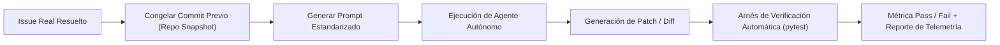

# 20 - Evaluación Sistemática y Benchmarking de Agentes de IA

Evaluar la calidad de las instrucciones y la arquitectura agéntica de un repositorio no puede basarse en pruebas anecdóticas (*"probé un prompt y funcionó"*). Requiere un **arnés de evaluación sistemático** basado en casos reales resueltos y métricas cuantitativas (*SWE-bench framework*).

---

## 1. Métricas Cuantitativas Clave

1. **Pass@1:** Proporción de tareas resueltas exitosamente en el primer intento sin asistencia humana.
2. **Tasa de Regresión:** Número de tests previamente verdes que fallaron tras la intervención del agente.
3. **Consumo Promedio de Tokens:** Costo computacional promedio por tarea resuelta.
4. **Llamadas Redundantes a Herramientas:** Cantidad de consultas duplicadas al sistema de archivos causadas por falta de memoria operativa.

---

## 2. Diseño de Suites Internas de Evaluación (*Eval Sets*)

