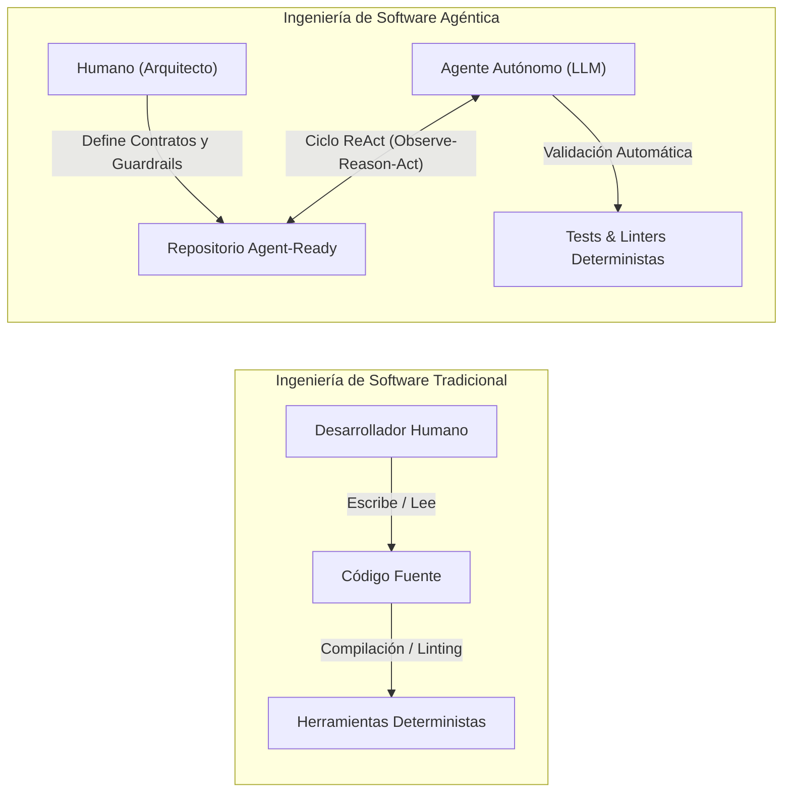

# 00 - Directrices Globales y Estándares de Repositorios Agénticos

Este documento establece el marco normativo, los fundamentos teóricos, los principios de diseño y las convenciones estructurales para repositorios de software optimizados para la interacción con agentes autónomos de Inteligencia Artificial (*AI Agents*) y desarrolladores humanos.

---

## 1. Fundamentos Teóricos de la Ingeniería de Software Agéntica (*Agentic Software Engineering*)

La **Ingeniería de Software Agéntica** representa un cambio de paradigma respecto a la ingeniería de software clásica: el código y la documentación ya no se diseñan únicamente para su lectura por humanos y su compilación por herramientas deterministas, sino como un **espacio de observación y actuación** para modelos de lenguaje (*Large Language Models* o LLMs) que ejecutan bucles de razonamiento, toma de decisiones y uso de herramientas (*Tool Use*).



### 1.1 El LLM como Actuador Cognitivo no Determinista
Un agente de IA opera como un sistema probabilístico que traduce lenguaje natural y estado del entorno en acciones discretas (ej. llamadas a herramientas, modificaciones en el árbol sintáctico abstracto AST, ejecución de comandos). Para garantizar la fiabilidad del sistema:
- **El entorno debe ser estrictamente determinista:** Si un comando de validación o una interfaz de herramienta entrega resultados ambiguos, el agente entrará en bucles de error o alucinación.
- **La documentación es un plano de control ejecutable:** La documentación no es un texto pasivo; actúa como la especificación del espacio de estados y acciones permitidas para el modelo.

### 1.2 Context Engineering y Presupuesto de Atención (*Attention Budget*)
Investigaciones fundamentales sobre modelos de lenguaje (*Liu et al., 2023 - "Lost in the Middle"*) demuestran que el rendimiento de los LLMs en recuperación y razonamiento se degrada en ventanas de contexto extensas y desordenadas (curva de atención en forma de U, donde los datos ubicados en el centro del prompt sufren mayor pérdida de señal).

Por consiguiente, este estándar adopta la disciplina de **Context Engineering**:
1. **Alta Relación Señal/Ruido (SNR):** Documentar exclusivamente restricciones críticas, invariantes y comandos verificables, eliminando redundancias y prosa corporativa no ejecutable.
2. **Divulgación Progresiva (*Progressive Disclosure*):** Estructurar el repositorio en capas para que el agente solo cargue en su memoria activa (*Hot Memory*) la información relevante para la subtarea actual, consultando el resto (*Cold Memory*) bajo demanda mediante herramientas de lectura específicas o protocolos como **MCP (Model Context Protocol)**.
3. **Anclaje de Contexto (*Context Anchoring*):** Ubicar las reglas inviolables y comandos de validación en posiciones privilegiadas (al inicio y final de los archivos normativos).

---

## 2. Principios Fundamentales de la Arquitectura *Agent-First*

1. **Determinismo y Parseabilidad Sintáctica:** Toda la documentación, esquemas y configuraciones deben seguir especificaciones formales estrictas (CommonMark/GFM, YAML 1.2, JSON Schema Draft 2020-12, Python Type Hints PEP 484/585/604) para permitir parsing por AST y herramientas automatizadas sin ambigüedad.
2. **Autocontención Contextual y Modularidad:** Cada módulo o documento debe definir sus propias precondiciones, dependencias y ejemplos de uso, permitiendo que un subagente resuelva tareas sin requerir una ingesta exhaustiva de todo el repositorio.
3. **Paridad Dual (Human-Agent Parity):** La estructura del proyecto debe ser simultáneamente ergonómica para desarrolladores humanos e interpretable algorítmicamente para agentes de IA.
4. **Seguridad por Diseño (*Safety by Design*) y Menor Privilegio:** Delimitación formal de permisos de ejecución, fronteras de mutación y protocolos de validación antes de realizar operaciones destructivas o modificaciones de estado.
5. **Idempotencia y Reversibilidad:** Toda herramienta o script ejecutado por el agente debe ser idempotente (su ejecución múltiple produce el mismo estado) y permitir retorno a un estado seguro ante fallas (rollback).

---

## 3. Convenciones de Archivos, Codificación y Formato

### 3.1 Codificación y Saltos de Línea
- **Encoding:** UTF-8 estricto sin BOM (*Byte Order Mark*).
- **Saltos de Línea:** LF (*Line Feed*, estilo Unix `\n`). Se prohíbe el uso de CRLF para evitar diffs espurios en entornos multiplataforma y errores en parsers de diffs agénticos.
- **Indentación:**
  - **Markdown:** 2 espacios para listas jerárquicas y anidamientos.
  - **YAML:** 2 espacios exactos (prohibido el uso de caracteres tabuladores `\t`).
  - **Python:** 4 espacios exactos (cumplimiento de PEP 8).
  - **JSON / JSONC:** 2 espacios para formateo estructurado.

### 3.2 Nomenclatura de Archivos y Directorios
- **Módulos y Paquetes de Código:** `snake_case` para entornos Python (ej. `core_engine/`, `data_loader.py`); `kebab-case` para proyectos TypeScript/Node.
- **Documentos de Especificación:** Prefijo numérico ordenado de dos dígitos (`XX_snake_case.md`) para guiar la secuencia de lectura determinista de los agentes (ej. `00_global_standards.md`, `01_readme_specification.md`).
- **Archivos Normativos de Raíz:** `UPPERCASE.md` (`README.md`, `ARCHITECTURE.md`, `AGENTS.md`, `CONTRIBUTING.md`, `LICENSE`, `CHANGELOG.md`, `SECURITY.md`).

---

## 4. Convenciones de Enlaces, Navegación y Rutas Relativas

1. **Rutas Relativas Estándar POSIX:** Utilizar siempre barras diagonales (`/`) independientemente del sistema operativo host (Windows, macOS o Linux).
2. **Estrategia de Hipervínculos Canónicos:**
   - Todo archivo referenciado internamente debe incluir un enlace Markdown relativo válido desde el archivo emisor: `[Guía de Arquitectura](docs/ARCHITECTURE.md)`.
   - Prohibido el uso de rutas absolutas de host local (`/home/user/...` o `C:\Users\...`).
3. **Anclajes Semánticos:** Los encabezados deben ser jerárquicos y estables (`#`, `##`, `###`) para facilitar la navegación directa mediante fragmentos de URI (`#seccion-ejemplo`).

---

## 5. Versionado Semántico y Registro de Cambios

- **Estándar SemVer 2.0.0:** Todos los paquetes, especificaciones, herramientas y esquemas del repositorio deben adoptar versionado `MAJOR.MINOR.PATCH`:
  - `MAJOR`: Cambios incompatibles en contratos de herramientas, esquemas de entrada/salida o políticas de AGENTS.md.
  - `MINOR`: Nuevas herramientas, especificaciones o funcionalidades retrocompatibles.
  - `PATCH`: Corrección de errores, optimización de prompts y mantenimiento de documentación sin alteración de contratos.
- **Registro de Cambios (*Changelog*):** Mantener un archivo `CHANGELOG.md` basado en el estándar *Keep a Changelog*, categorizando las modificaciones en `Added`, `Changed`, `Deprecated`, `Removed`, `Fixed` y `Security`.

---

## 6. Estándares de Lenguaje, Tono y Pragmática para LLMs

- **Tono:** Neutral, técnico, declarativo, libre de ambigüedades y formalmente conciso.
- **Voz y Modo:**
  - **Imperativo directo** para instrucciones y contratos de agentes (ej. *"Ejecutar la suite de tests unitarios antes de confirmar la tarea"*).
  - **Tercera persona descriptiva** para especificaciones funcionales y de arquitectura (ej. *"El módulo valida la invariante antes de persistir"*).
- **Vocabulario Técnico Estandarizado:** Mantener los términos técnicos de la industria en inglés cuando representen estándares de facto (*pipeline, runtime, payload, middleware, token, embedding, frontmatter, docstring, AST, guardrail*), evitando traducciones ambiguas.

---

## 7. Jerarquía Canónica de Archivos en el Repositorio

```yaml
nombre_repositorio:
  README.md: "Resumen ejecutivo, inicio rápido y visión general del sistema"
  ARCHITECTURE.md: "Topología técnica, capas arquitectónicas y diagramas Mermaid"
  AGENTS.md: "Constitución operativa, herramientas permitidas y guardrails de IA"
  CONTRIBUTING.md: "Algoritmo de contribución, flujo Git y Conventional Commits"
  CHANGELOG.md: "Historial estructurado de versiones bajo SemVer 2.0"
  SECURITY.md: "Políticas de reporte de vulnerabilidades y manejo de secretos"
  LICENSE: "Términos legales y licenciamiento SPDX"
  .env.example: "Plantilla de variables de entorno seguras (sin secretos reales)"
  pyproject.toml: "Configuración canónica de dependencias, herramientas y linters"
  docs:
    00_global_standards.md: "Directrices globales y fundamentos de ingeniería agéntica"
    01_readme_specification.md: "Especificación y plantilla maestra de README.md"
    02_architecture_specification.md: "Especificación y plantilla maestra de ARCHITECTURE.md"
    03_agents_specification.md: "Especificación y plantilla maestra de AGENTS.md"
    04_docstrings_and_code_standards.md: "Estándares de Google Docstrings y tipado estricto"
    05_metadata_and_field_schemas.md: "Esquemas de metadatos YAML e identificadores únicos"
    06_exception_handling_and_errors.md: "Taxonomía de excepciones, RFC 9457 y resiliencia"
  src:
    nombre_paquete:
      __init__.py: "Punto de entrada e inicializador del paquete"
      core: "Entidades del dominio puro e invariantes (sin dependencias I/O)"
      services: "Casos de uso, orquestación de flujos y pipelines"
      adapters: "Conectores externos, persistencia, APIs y clientes LLM"
  tests:
    unit: "Pruebas unitarias de dominio puro (< 50ms por test)"
    integration: "Pruebas de integración con conectores y esquemas"
```