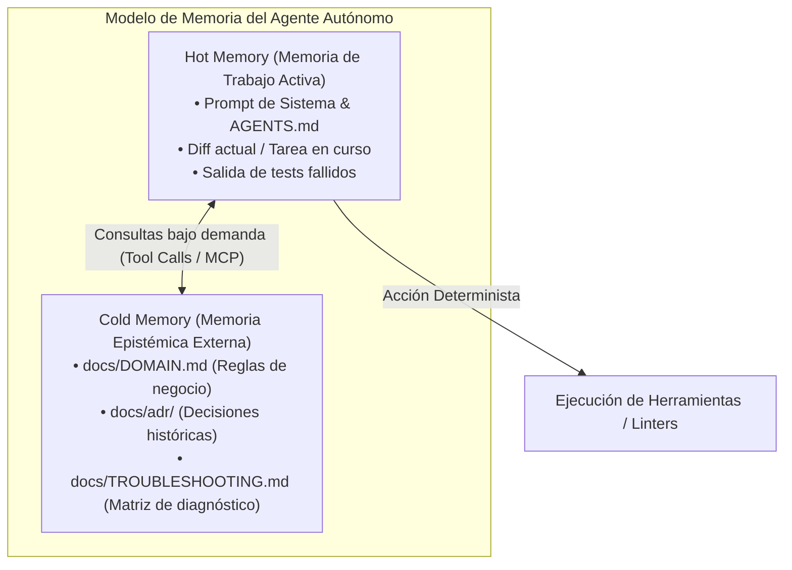
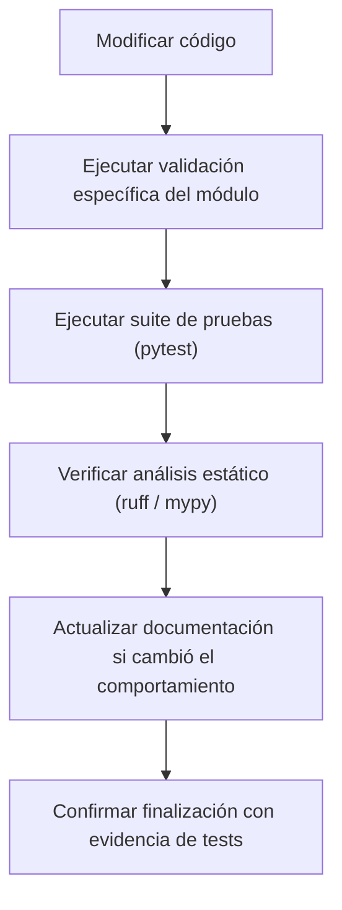
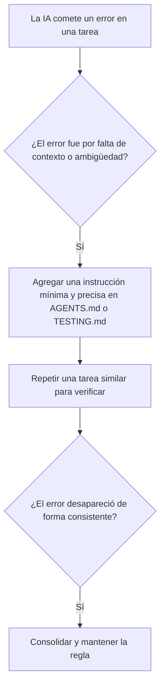

# 02 - Estándar para Repositorios Individuales Asistidos por IA Agéntica (1 Desarrollador + IA)

Este documento establece el marco normativo y los fundamentos de arquitectura cognitiva para repositorios de software desarrollados por una sola persona asistida por uno o varios agentes autónomos de Inteligencia Artificial (Claude Code, OpenAI Codex, GitHub Copilot Workspace, Gemini CLI, Cursor, etc.).

---

## 1. Fundamentos Teóricos: Carga Cognitiva, "Context Rot" y Arquitectura Epistémica

En el desarrollo asistido por agentes, el recurso más crítico y escaso no es el almacenamiento en disco ni los ciclos de CPU, sino el **presupuesto de atención y la memoria operativa (*Working Memory*) del LLM**.



### 1.1 El Problema del "Context Rot" (Degradación de Contexto)
Conforme una sesión de desarrollo avanza y el historial de mensajes se satura con intentos fallidos, trazas extensas y código descartado, los LLMs sufren **interferencia atencional y degradación de razonamiento** (*Context Rot* o *Context Drift*).
- **Sobrecarga de contexto:** Pasar especificaciones enciclopédicas innecesarias satura los mecanismos de auto-atención (*Self-Attention Mechanism*), provocando que el modelo olvide instrucciones críticas ubicadas al inicio del prompt.
- **Solución Arquitectónica:** Estructurar el repositorio en **Hot Memory** (lo que el agente debe tener siempre cargado: reglas operativas e invariantes) y **Cold Memory** (lo que el agente solo debe consultar bajo demanda mediante herramientas de lectura).

### 1.2 Alineación con Arquitecturas Cognitivas (ReAct, Reflexion y SWE-bench)
Este estándar adopta los principios de frameworks cognitivos validados empíricamente:
- **ReAct (*Yao et al., 2022*):** Intercalar razonamiento explícito (*Reasoning Trace*) con acciones en el entorno (*Action Execution*).
- **Reflexion (*Shinn et al., 2023*):** Bucles de auto-evaluación donde el agente aprende del error de un test sin intervención humana inmediata.
- **Metodología de Evaluación SWE-bench (*Jimenez et al., 2024*):** La tasa de éxito de un agente para resolver incidencias de software de extremo a extremo depende directamente de contar con un arnés de pruebas unívoco, comandos de build deterministas y límites de módulo precisos.

---

## 2. Filosofía Central: Documentación Lean vs Burocracia Corporativa

> **Principio Rector:**
> *Documentar para minimizar la reconstrucción de contexto del agente y del desarrollador, no para simular que el repositorio tiene 400 empleados.*

En un proyecto individual con IA, copiar ciegamente las ceremonias de macro-proyectos open-source genera ruido documental perjudicial. El objetivo fundamental no es acumular archivos `.md`, sino **proporcionar interfaces de control accionables, precisas y verificables** para que el agente opere de forma autónoma sin desviar la arquitectura ni alucinar decisiones.

---

## 3. Modelo de Documentación por Capas (Layered Documentation Model)

Para evitar que `AGENTS.md` se convierta en un archivo monolítico inmanejable de miles de líneas, la información debe distribuirse en capas con responsabilidades delimitadas:

```yaml
documentacion_por_capas:
  capa_1_entrada:
    archivo: "README.md"
    pregunta_clave: "¿Qué es este proyecto y cómo inicio?"
  capa_2_contrato_operativo:
    archivo: "AGENTS.md"
    pregunta_clave: "¿Cómo debe trabajar la IA aquí? (Contrato Operativo Canónico)"
  capa_3_especificaciones_tecnicas:
    arquitectura:
      archivo: "ARCHITECTURE.md"
      pregunta_clave: "¿Cómo funciona el sistema y su topología?"
    desarrollo:
      archivo: "DEVELOPMENT.md"
      pregunta_clave: "¿Cómo configuro y ejecuto el entorno local?"
    testing:
      archivo: "TESTING.md"
      pregunta_clave: "¿Cómo valido y ejecuto pruebas?"
  capa_4_contexto_profundo_docs:
    dominio:
      archivo: "docs/DOMAIN.md"
      pregunta_clave: "¿Cuáles son las reglas de negocio e invariantes puras?"
    decisiones:
      directorio: "docs/adr/"
      pregunta_clave: "¿Por qué se tomaron estas decisiones históricas?"
    diagnostico:
      archivo: "docs/TROUBLESHOOTING.md"
      pregunta_clave: "¿Cómo resolver errores y síntomas conocidos?"
```

### Regla de Oro de Separación de Responsabilidades:
- **Cada documento debe responder una sola pregunta principal.**
- Si dos archivos responden la misma pregunta, existe duplicidad y riesgo de inconsistencia que inducirá alucinaciones en el agente.

---

## 4. Taxonomía de la Información: Hechos, Reglas y Procedimientos

Toda la documentación del repositorio debe clasificarse rigurosamente en tres categorías epistemológicas para eliminar ambigüedades en el razonamiento de los LLMs:

| **Categoría** | **Propósito** | **Archivos Representativos** | **Ejemplo de Contenido** |
|:---|:---|:---|:---|
| **A. Hechos (Ontología)** | Describen el estado y diseño real del sistema. | ARCHITECTURE.md, DOMAIN.md, TECH_STACK.md | *"La API utiliza FastAPI y PostgreSQL; el dominio no depende de I/O."* |
| **B. Reglas (Restricciones)** | Restricciones e invariantes inviolables que no deben romperse. | AGENTS.md, SECURITY.md, STYLE_GUIDE.md | *"Prohibido almacenar secretos; no modificar contratos sin actualizar tests."* |
| **C. Procedimientos (Algoritmos)** | Algoritmos y comandos exactos paso a paso. | DEVELOPMENT.md, TESTING.md, TROUBLESHOOTING.md | *"Para validar la suite: pytest --cov=src tests/"* |

---

## 5. "Documentation as Interface" y Validación Automatizada

Para un agente de IA, la documentación es una **interfaz de control ejecutable**.

### 5.1 Reemplazo de Instrucciones Vagas por Verificables
- ❌ **Inútil para un agente:** *"Mantén una alta calidad de código y asegúrate de probar bien los cambios."*
- ✅ **Accionable y Verificable:**

> ## Validación Obligatoria antes de Finalizar Tarea
> 1. Ejecutar tests unitarios: `pytest tests/unit/`
> 2. Verificar tipos estáticos: `mypy src/`
> 3. Linter y formato: `ruff check src/ && black --check src/`
> 4. Validar documentación: `python scripts/validate_docs.py`

### 5.2 Ciclo de Ejecución de Tareas del Agente



---

## 6. Fuente Única de Verdad y Adaptadores de Proveedores

1. **AGENTS.md es la Verdad Canónica:** Concentra la política operativa, convenciones de código y guardrails del repositorio.
2. **Adaptadores Ligeros por Proveedor:** Archivos como `CLAUDE.md`, `GEMINI.md`, `.github/copilot-instructions.md` y `.cursorrules` deben ser **punteros mínimos** que referencian `AGENTS.md`, evitando duplicaciones y desincronización de versiones:

```markdown
# CLAUDE.md / GEMINI.md / copilot-instructions.md

Este proyecto se rige por el contrato operativo en [AGENTS.md](AGENTS.md)
y la arquitectura descrita en [ARCHITECTURE.md](ARCHITECTURE.md).

Comandos de validación:
- Tests: `pytest`
- Linter: `ruff check .`
```

3. **No Redocumentar lo que el Código ya Declara:** Las versiones de librerías viven en `pyproject.toml` o `package.json`. No duplicar tablas manuales de versiones en múltiples archivos Markdown.

---

## 7. Instrucciones Jerárquicas por Directorio

Cuando el repositorio crece en complejidad (ej. backend en Python + frontend en TypeScript):
- `AGENTS.md` (raíz): Reglas globales universales (UTF-8, LF, manejo de secretos, flujo Git).
- `src/backend/AGENTS.md`: Reglas especializadas de backend (Python 3.11+, pytest, aislamiento de dominio).
- `src/frontend/AGENTS.md`: Reglas especializadas de frontend (Node/TypeScript, componentes UI, linters ESLint).
- `docs/AGENTS.md`: Reglas de documentación (enlaces relativos, actualización de índices).

> **Nota:** Crear archivos `AGENTS.md` secundarios **únicamente** cuando existan reglas locales divergentes.

---

## 8. Presupuesto de Contexto: "Debe Saber" vs "Puede Consultar"

Los entornos de agentes operan con ventanas y presupuestos de contexto optimizados (típicamente ~32 KiB combinados para documentación de proyecto en prompt de sistema). La información se estructura en dos niveles:

```yaml
presupuesto_contexto_agents:
  siempre_en_contexto_must_read:
    prioridad: "alta"
    elementos:
      - "Reglas globales y guardrails inviolables"
      - "Comandos obligatorios de ejecución y test"
      - "Punteros a ARCHITECTURE.md y TESTING.md"
  consultable_bajo_demanda_read_when_relevant:
    prioridad: "bajo_demanda"
    elementos:
      - ruta: "docs/adr/"
        descripcion: "Decisiones arquitectónicas históricas"
      - ruta: "DOMAIN.md"
        descripcion: "Modelado profundo de reglas de negocio"
      - ruta: "TROUBLESHOOTING.md"
        descripcion: "Matriz de diagnóstico de errores"
```

---

## 9. Evolución de Instrucciones Basada en Errores Reales (Bucle Empírico)

La documentación de agentes debe ser un **organismo vivo** que evoluciona empíricamente a partir de fallos observados:



---

## 10. ADRs Prácticos: La Memoria Arquitectónica Contra Regresiones

Para un desarrollador individual asistido por IA, los **ADRs (`docs/adr/`)** son esenciales para evitar que un agente proponga refactorizaciones destructivas o reemplace tecnologías deliberate sin conocer el contexto histórico:
- **Sin ADR:** El agente sugiere cambiar PostgreSQL por SQLite *"porque es más simple"*.
- **Con ADR-0002:** El agente lee el registro histórico que justifica por qué PostgreSQL es mandatorio debido a consultas relacionales complejas, evitando regresiones.

---

## 11. Estructura de Repositorio Canónica Recomendada (1 Desarrollador + IA)

```yaml
estructura_canonica_proyecto:
  raiz:
    README.md: "¿Qué es y cómo empezar?"
    AGENTS.md: "¿Cómo debe operar la IA? (Fuente de verdad)"
    ARCHITECTURE.md: "Topología técnica, capas y flujos Mermaid"
    DEVELOPMENT.md: "Preparación de entorno, variables y debug"
    TESTING.md: "Estrategia de tests y comandos de validación"
    CHANGELOG.md: "Historial de cambios notables (Keep a Changelog)"
    SECURITY.md: "Política de seguridad y reglas de no-fuga de secretos"
    LICENSE: "Licencia MIT / Apache-2.0"
    .gitignore: "Exclusión de entornos, builds, cachés y secretos"
    .editorconfig: "Reglas de formato multiplataforma (UTF-8, LF, espacios)"
    CLAUDE.md: "Adaptador ligero para Claude Code"
    GEMINI.md: "Adaptador ligero para Gemini CLI"
    .github:
      copilot-instructions.md: "Adaptador ligero para GitHub Copilot"
      workflows:
        ci.yml: "Automatización de tests y linters"
    docs:
      adr:
        0001-stack-base.md: "Decisión de stack base"
        0002-persistencia.md: "Decisión de motor de base de datos"
      DOMAIN.md: "Reglas de negocio puras e invariantes"
      TROUBLESHOOTING.md: "Matriz de síntomas y soluciones"
    src:
      paquete_principal:
        core: "Dominio puro e invariantes (Cero dependencias I/O)"
        services: "Casos de uso y orquestación"
        adapters: "Conectores externos, DB y APIs"
    tests:
      unit: "Tests unitarios rápidos (< 50ms)"
      integration: "Tests de integración con mocks"
    scripts: "Scripts de validación y automatización local"
    config: "Configuraciones no sensibles"
```

---

## 12. Decálogo de Buenas Prácticas para el Desarrollador Individual

1. **Una Sola Fuente de Verdad:** `AGENTS.md` rige las políticas generales del repositorio.
2. **Documentación Modular:** Separar hechos, reglas y procedimientos en archivos autocontenidos.
3. **Instrucciones Accionables:** Escribir directivas imperativas y ejecutables, no declaraciones poéticas.
4. **Validación Automatizada Obligatoria:** Toda modificación concluye con tests y linters aprobados.
5. **ADRs para Decisiones Complejas:** Documentar el contexto de tecnologías e interfaces críticas.
6. **Contexto Jerárquico:** Reglas globales en raíz; reglas locales solo donde difieran.
7. **No Duplicar Declaraciones:** Centralizar versiones en archivos de build (`pyproject.toml`).
8. **Evolución Empírica:** Actualizar instrucciones basándose en fallos reales observados.
9. **Límites de Seguridad Explícitos:** Prohibir operaciones destructivas o acceso a producción para IA.
10. **Separar Política de Conocimiento:** `AGENTS.md` (qué hacer), `ARCHITECTURE.md` (cómo está construido), `DOMAIN.md` (qué significa), `TESTING.md` (cómo comprobarlo).