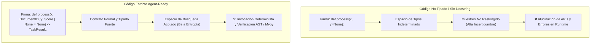

# 04 - Estándares de Código, Tipado Estricto y Google Docstrings

Este documento establece el marco normativo, los fundamentos teóricos y las reglas de implementación para anotaciones de tipo estáticas (*Type Hinting*), formateo de docstrings bajo el estándar de Google y diseño de código *agent-ready*.

---

## 1. Fundamentos Teóricos: Tipado Estricto y Reducción de Alucinaciones en LLMs

Los modelos de lenguaje generan código mediante muestreo probabilístico sobre distribuciones de tokens (*Next-Token Prediction*). En código dinámico no tipado, el espacio de estados y posibles signaturas es infinito, lo que genera alucinación de argumentos, tipos incompatibles y excepciones en tiempo de ejecución.



### 1.1 El Tipado como Restricción del Espacio de Búsqueda
Las anotaciones de tipo estáticas (PEP 484, PEP 585, PEP 604, PEP 695) actúan como **priors bayesianos** que constriñen la distribución de probabilidad del modelo:
1. **Reducción de Entropía:** El agente no tiene que inferir si un parámetro es un entero, string o diccionario; la signatura formal restringe el espacio de hipótesis.
2. **Auto-Corrección basada en AST:** Herramientas de análisis estático (`mypy`, `pyright`, `ruff`) proporcionan trazas de error deterministas que el agente utiliza en bucles de auto-depuración (*Self-Debugging Loops*).

### 1.2 Alineación con la Distribución de Pre-entrenamiento (Google Python Style Guide)
La **Google Python Style Guide** es el estándar de documentación más prevalente en los conjuntos de datos de pre-entrenamiento de alta calidad. Cuando un repositorio utiliza secciones normalizadas (`Args:`, `Returns:`, `Raises:`, `Yields:`, `Examples:`):
- Se maximiza la atención cruzada (*Cross-Attention*) del LLM hacia los contratos de las funciones.
- El agente puede generar llamadas a herramientas (*Tool Calls*) infiriendo precondiciones y efectos secundarios sin tener que inspeccionar la implementación interna.

### 1.3 El Principio de No-Redundancia Tipo-Docstring
Para optimizar el presupuesto de tokens y evitar desincronizaciones:
- **Los tipos viven en la firma de código:** `def calcular(tasa: float) -> int:`
- **El docstring describe semántica, invariantes y unidades:** Explicar el propósito del parámetro, el rango válido y la razón del retorno, **sin duplicar el tipo en texto plano** si ya está declarado en la signatura.

---

## 2. Especificación Estricta de Google Docstrings

Todo módulo, clase, método y función pública debe documentarse bajo la **Guía de Estilo de Google para Python (Google Style Docstrings)** (PEP 257).

### 2.1 Docstring de Módulo (Module Level)
Debe ubicarse al inicio absoluto del archivo, antes de los imports, definiendo el alcance del módulo y sus exportaciones principales.

```python
"""Módulo de orquestación de agentes y pipelines de ejecución.

Este módulo provee la clase controladora encargada de coordinar la ejecución
de herramientas, validación de esquemas y recuperación ante fallos en tiempo de ejecución.

Exports:
    AgentController: Clase principal de orquestación.
    ExecutionPipeline: Pipeline secuencial y paralelo de tareas.
"""
```

### 2.2 Docstring de Funciones y Métodos

Estructura obligatoria:
1. **Línea de resumen:** En una sola línea, modo imperativo, terminada en punto.
2. **Descripción extendida (opcional):** Explicación de la lógica, invariantes o supuestos del dominio.
3. **Sección Args:** Parámetros con nombre y descripción semántica/unidades (evitando duplicar tipos ya anotados).
4. **Sección Returns:** Descripción del valor de retorno y formato de salida.
5. **Sección Yields (si es generador):** Descripción de los elementos producidos en cada iteración.
6. **Sección Raises:** Excepciones explícitas y las condiciones exactas bajo las cuales se lanzan.
7. **Sección Examples:** Bloque funcional reproducible (apto para `doctest`).

```python
def calcular_metricas_agente(
    historial_ejecuciones: list[dict[str, Any]],
    umbral_exito: float = 0.95,
    *,
    incluir_latencia: bool = True,
) -> dict[str, float]:
    """Calcula las métricas consolidadas de rendimiento para un agente autónomo.

    Procesa la lista de ejecuciones pasadas, calcula la tasa de éxito ponderada
    y opcionalmente agrega percentiles de latencia de inferencia y llamada a herramientas.

    Args:
        historial_ejecuciones: Lista de registros de telemetría. Cada elemento
            debe contener las claves 'status' ('COMPLETED' | 'FAILED') y 'duration_ms'.
        umbral_exito: Tasa mínima requerida en el rango [0.0, 1.0] para considerar el lote exitoso.
            Por defecto es 0.95 (95%).
        incluir_latencia: Indicador para computar métricas de duración (p50, p90 y p99).

    Returns:
        Mapeo de métricas calculadas que contiene:
        - 'tasa_exito': Proporción de tareas con estado 'COMPLETED' (0.0 a 1.0).
        - 'latencia_media_ms': Duración promedio en milisegundos (si incluir_latencia=True).
        - 'cumple_umbral': 1.0 si supera el umbral, 0.0 en caso contrario.

    Raises:
        ValueError: Si `historial_ejecuciones` está vacío o si `umbral_exito`
            se encuentra fuera del rango cerrado [0.0, 1.0].
        KeyError: Si algún elemento del historial no contiene los campos obligatorios.

    Example:
        >>> ejecuciones = [{'status': 'COMPLETED', 'duration_ms': 120.5}]
        >>> metricas = calcular_metricas_agente(ejecuciones, umbral_exito=0.9)
        >>> metricas['tasa_exito']
        1.0
    """
```

### 2.3 Docstring de Clases

Debe describir la responsabilidad única de la clase, sus invariantes de estado, atributos públicos y notas de concurrencia o aislamiento.

```python
class TaskQueueManager:
    """Gestor de colas de tareas con priorización concurrente para agentes.

    Administra la inserción, priorización, bloqueo y despacho de tareas asíncronas
    garantizando aislamiento de estado y reintentos idempotentes.

    Attributes:
        max_workers: Número máximo de workers concurrentes permitidos.
        queue_name: Identificador semántico de la cola de mensajes.
        active_tasks: Diccionario de tareas actualmente en ejecución indexadas por task_id.

    Note:
        Esta clase es thread-safe y soporta sincronización asíncrona mediante asyncio.Lock.
    """

    def __init__(self, queue_name: str, max_workers: int = 4) -> None:
        """Inicializa el gestor de colas de tareas.

        Args:
            queue_name: Nombre semántico de la cola.
            max_workers: Cantidad de hilos de trabajo paralelos. Debe ser >= 1.
        """
        self.queue_name = queue_name
        self.max_workers = max_workers
        self.active_tasks: dict[str, Any] = {}
```

---

## 3. Estándares de Tipado Estricto (Python Typing Moderno)

1. **Uso de Tipos Nativos (Python 3.10+):**
   - Utilizar `list[T]`, `dict[K, V]`, `set[T]`, `tuple[T, ...]` en lugar de importar `List`, `Dict` de `typing` (PEP 585).
   - Utilizar operadores de unión por tubería `T1 | T2` y `T | None` en lugar de `Union[T1, T2]` u `Optional[T]` (PEP 604).
   - Para genéricos en Python 3.12+, preferir la sintaxis de parámetros de tipo `def run[T](item: T) -> T:` (PEP 695).

2. **Modelado y Validación en Tiempo de Ejecución con Pydantic v2:**
   - Para payloads de entrada/salida de herramientas y fronteras de API, utilizar `pydantic.BaseModel` con `Field(strict=True)` para evitar coerción silenciosa indeseada.
   - Para estructuras internas inmutables y contenedores de datos ligeros, utilizar `@dataclass(frozen=True)` o `NamedTuple`.

3. **Aliases Semánticos y Tipos Anotados:**
   - Definir `TypeAlias` o `Annotated` para enriquecer la semántica de los tipos primitivos:

```python
from typing import TypeAlias, Annotated
from pydantic import BaseModel, Field

AgentID: TypeAlias = str
Score: TypeAlias = Annotated[float, Field(ge=0.0, le=1.0, description="Puntaje normalizado")]

class AgentTaskPayload(BaseModel):
    task_id: str = Field(..., description="Identificador único en formato TypeID (task_...)")
    prompt: str = Field(..., min_length=5, description="Instrucción detallada de la tarea")
    confidence_threshold: Score = 0.85
```

---

## 4. Higiene Cognitiva de Comentarios Inline

- **Regla de Oro:** Comentar el **POR QUÉ** (intención, invariante, hipótesis, compensación empírica), nunca el **QUÉ** (lo que la sintaxis ya expresa).
- **Evitar comentarios redundantes que agregan ruido al contexto:**

```python
# ❌ MAL (Contamina la ventana de contexto sin aportar valor semántico):
x = x + 1 # Incrementa x en 1

# ✅ BIEN (Documenta una decisión arquitectónica o empírica no evidente):
# Compensamos el jitter de red observado en benchmarks de latencia p99
timeout_ajustado = timeout_base * LATENCY_JITTER_MULTIPLIER
```

---

## 5. Comparativa: Código No Conforme vs Código Conforme (Agent-Ready)

### ❌ Ejemplo Anti-Patrón (No Apto para Agentes)

```python
def process(data, t=0.5):
    # Procesa datos
    r = {}
    for item in data:
        if item['val'] > t:
            r[item['id']] = item['val']
    return r
```

### ✅ Ejemplo Conforme a Estándar (Agent-Ready)

```python
from typing import Any

def filtrar_senales_por_umbral(
    muestras: list[dict[str, Any]],
    umbral_corte: float = 0.5,
) -> dict[str, float]:
    """Filtra y extrae muestras de telemetría que superan un umbral especificado.

    Itera sobre el conjunto de señales capturadas y retorna un mapeo de
    identificadores hacia sus valores numéricos filtrados.

    Args:
        muestras: Lista de diccionarios con telemetría. Cada elemento debe
            contener 'id' (str) y 'val' (float o int).
        umbral_corte: Valor numérico mínimo para la inclusión de la muestra.

    Returns:
        Diccionario con formato {identificador: valor_filtrado}.

    Raises:
        KeyError: Si alguna muestra carece de las claves 'id' o 'val'.
        TypeError: Si los valores en 'val' no son convertibles a float.
    """
    resultados: dict[str, float] = {}
    for muestra in muestras:
        valor = float(muestra["val"])
        if valor > umbral_corte:
            identificador = str(muestra["id"])
            resultados[identificador] = valor
    return resultados
```
