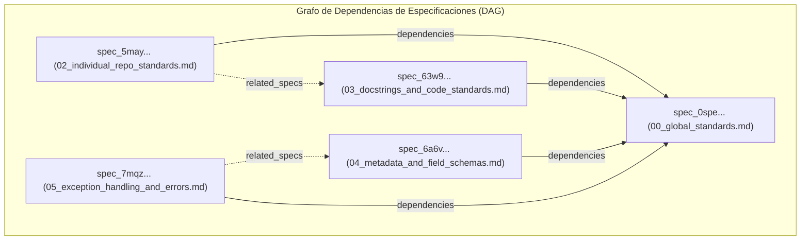

# 04 - Especificación de Metadatos YAML, Esquemas y Guía de Identificadores Únicos

Este documento establece el marco normativo, los fundamentos teóricos de modelado de conocimiento, las reglas de validación formal en **JSON Schema** y la taxonomía de **Identificadores Únicos (IDs)** para repositorios agénticos.

---

## 1. Fundamentos Teóricos: Grafos de Conocimiento y Parsing Basado en AST

En un repositorio tradicional, la documentación está compuesta por archivos de texto plano desestructurados que obligan al agente a realizar escaneos completos (*Full-Text Scanning*), consumiendo miles de tokens innecesarios.

El uso de **YAML Frontmatter** convierte el sistema de archivos en una **Base de Conocimiento Estructurada en Grafo Acíclico Dirigido (DAG)**:



### 1.1 Ventajas Cognitivas y Computacionales para Agentes
1. **Extracción por AST en O(1) de Tokens:** Un agente o harness de ejecución puede extraer el bloque Frontmatter mediante parsers de AST (como `tree-sitter` o `python-frontmatter`) en sub-milisegundos, inspeccionando dependencias y permisos sin inyectar el cuerpo del documento en la ventana de contexto.
2. **Navegación Topológica Determinista:** Las relaciones explícitas (`dependencies`, `parent_doc`, `related_specs`) permiten ordenar topológicamente los documentos que un subagente debe procesar para resolver un problema complejo.
3. **Mapeo con Convenciones Semánticas de OpenTelemetry (GenAI):** Campos como `agent_visibility`, `tool_access_level` y `execution_mode` se integran directamente con atributos de telemetría estándar (`gen_ai.agent.id`, `gen_ai.tool.name`).

---

## 2. Tabla Exhaustiva de Referencia de Metadatos

La siguiente tabla define todos los campos estandarizados para documentos, especificaciones y módulos del repositorio:

| **Campo** | **Tipo de Dato** | **Obligatorio** | **Reglas de Validación / Formato** | **Propósito y Utilidad para Agentes** | **Ejemplo Concreto** |
|:---|:---|:--:|:---|:---|:---|
| `id` | string | **Sí** | `^[a-z]{2,12}_[0-9a-hjkmnp-tv-z]{26}$` (TypeID). | Identificador único global e inmutable en formato TypeID (Crockford's Base32). | `spec_6a6vgwzvg6b6s9p00km1hwqbbq` |
| `name` | string | **Sí** | `^[a-z0-9_]{3,64}$` (snake_case sin espacios). | Identificador único del archivo/módulo en el catálogo del agente. | `01_readme_specification` |
| `title` | string | **Sí** | 5 a 120 caracteres. Sin saltos de línea. | Título legible para humanos y cabeceras de reportes del agente. | `Especificación de README` |
| `file_path` | string | **Sí** | Ruta POSIX relativa normalizada desde la raíz. | Ubicación canónica del archivo para indexación determinista. | `docs/01_readme.md` |
| `version` | string | **Sí** | SemVer 2.0 (`^\d+\.\d+\.\d+$`). | Control de compatibilidad y detección de cambios incompatibles. | `1.2.0` |
| `category` | enum | **Sí** | Uno de: `standards`, `architecture`, `agentic`, `code_standards`, `metadata`, `errors`, `templates`, `guides`, `universal_principles`. | Enrutamiento taxonómico y filtrado de contexto relevante. | `architecture` |
| `domain` | string | No | Subdominio o área funcional (`backend`, `ml`, `frontend`, `infra`). | Delimitación del contexto de aplicación del documento. | `backend` |
| `tags` | list[string] | **Sí** | Lista de 1 a 10 strings en minúsculas sin espacios. | Búsqueda semántica y recuperación por palabras clave. | `[readme, template, docs]` |
| `description` | string | **Sí** | 10 a 300 caracteres descriptivos. | Resumen de alto nivel para indexación en bases vectoriales/RAG. | `Plantilla y normas de README.` |
| `author` | string | No | Nombre del creador o rol. | Atribución de autoría original. | `Neru` |
| `owner` | string | **Sí** | Equipo responsable o email de contacto. | Enrutamiento de alertas y escalamiento humano. | `AI Architecture Team` |
| `maintainers` | list[string] | No | Lista de nombres o emails de mantenedores activos. | Notificación en revisiones de cambios automáticos. | `[dev@example.com]` |
| `status` | enum | **Sí** | Uno de: `draft`, `active`, `deprecated`, `archived`. | Los agentes solo deben aplicar estándares con estado active. | `active` |
| `created_at` | string | **Sí** | ISO 8601 UTC (`YYYY-MM-DDTHH:mm:ssZ`). | Marca temporal de creación para ordenamiento cronológico. | `2026-08-26T00:00:00Z` |
| `updated_at` | string | **Sí** | ISO 8601 UTC (`YYYY-MM-DDTHH:mm:ssZ`). | Detección de obsolescencia de contexto en caché del agente. | `2026-08-26T00:00:00Z` |
| `license` | string | No | Identificador SPDX estándar (ej. `MIT`, `Apache-2.0`). | Verificación de restricciones legales de redistribución. | `MIT` |
| `agent_visibility` | enum | No | Uno de: `public`, `internal`, `restricted`. Por defecto `public`. | Control de exposición en contextos compartidos. | `public` |
| `tool_access_level` | enum | No | Uno de: `read_only`, `safe_mutation`, `full_access`. | Nivel de permisos de herramientas que este módulo requiere. | `safe_mutation` |
| `execution_mode` | enum | No | Uno de: `sync`, `async`, `batch`, `event_driven`. | Modelo de ejecución esperado por el runtime del agente. | `async` |
| `priority` | integer | No | Entero de 1 (baja) a 5 (crítica). Por defecto `3`. | Priorización en colas de procesamiento automatizado. | `4` |
| `timeout_seconds` | integer | No | Entero positivo `>= 1`. | Límite de tiempo antes de abortar operaciones autónomas. | `120` |
| `dependencies` | list[string] | No | Lista de nombres de otros documentos o paquetes requeridos. | Construcción del grafo de dependencias para lectura previa. | `[00_global_standards]` |
| `parent_doc` | string | No | Nombre del documento padre si forma parte de una jerarquía. | Navegación ascendente en árboles de especificación. | `00_global_standards` |
| `related_specs` | list[string] | No | Lista de especificaciones complementarias recomendadas. | Sugerencias de lectura cruzada para el agente. | `[02_architecture_specification]` |
| `entrypoint` | string | No | Ruta relativa al archivo principal ejecutable si aplica. | Punto de entrada determinista para ejecución de scripts. | `src/paquete/main.py` |
| `schema_version` | string | **Sí** | Versión del esquema de metadatos (`1.0.0`). | Compatibilidad del parser de frontmatter. | `1.0.0` |

---

## 3. Esquema de Validación Formal JSON Schema (Draft-07 / 2020-12 Compatible)

A continuación se define el esquema formal para validación automatizada mediante herramientas de CI/CD y scripts pre-commit:

```json
{
  "$schema": "http://json-schema.org/draft-07/schema#",
  "title": "AgenticFrontmatterSchema",
  "type": "object",
  "required": [
    "id",
    "name",
    "title",
    "file_path",
    "version",
    "category",
    "tags",
    "description",
    "owner",
    "status",
    "created_at",
    "updated_at",
    "schema_version"
  ],
  "properties": {
    "id": {
      "type": "string",
      "pattern": "^[a-z]{2,12}_[0-9a-hjkmnp-tv-z]{26}$"
    },
    "name": {
      "type": "string",
      "pattern": "^[a-z0-9_]{3,64}$"
    },
    "title": {
      "type": "string",
      "minLength": 5,
      "maxLength": 120
    },
    "file_path": {
      "type": "string",
      "pattern": "^[a-zA-Z0-9_\\-\\./ ]+\\.md$"
    },
    "version": {
      "type": "string",
      "pattern": "^\\d+\\.\\d+\\.\\d+$"
    },
    "category": {
      "type": "string",
      "enum": [
        "standards",
        "architecture",
        "agentic",
        "code_standards",
        "metadata",
        "errors",
        "templates",
        "guides",
        "universal_principles"
      ]
    },
    "domain": {
      "type": "string"
    },
    "tags": {
      "type": "array",
      "items": { "type": "string" },
      "minItems": 1,
      "maxItems": 10
    },
    "description": {
      "type": "string",
      "minLength": 10,
      "maxLength": 300
    },
    "author": { "type": "string" },
    "owner": { "type": "string" },
    "maintainers": {
      "type": "array",
      "items": { "type": "string" }
    },
    "status": {
      "type": "string",
      "enum": ["draft", "active", "deprecated", "archived"]
    },
    "created_at": {
      "type": "string",
      "format": "date-time"
    },
    "updated_at": {
      "type": "string",
      "format": "date-time"
    },
    "license": { "type": "string" },
    "agent_visibility": {
      "type": "string",
      "enum": ["public", "internal", "restricted"],
      "default": "public"
    },
    "tool_access_level": {
      "type": "string",
      "enum": ["read_only", "safe_mutation", "full_access"],
      "default": "safe_mutation"
    },
    "execution_mode": {
      "type": "string",
      "enum": ["sync", "async", "batch", "event_driven"]
    },
    "priority": {
      "type": "integer",
      "minimum": 1,
      "maximum": 5,
      "default": 3
    },
    "timeout_seconds": {
      "type": "integer",
      "minimum": 1
    },
    "dependencies": {
      "type": "array",
      "items": { "type": "string" }
    },
    "parent_doc": { "type": "string" },
    "related_specs": {
      "type": "array",
      "items": { "type": "string" }
    },
    "entrypoint": { "type": "string" },
    "schema_version": {
      "type": "string",
      "pattern": "^\\d+\\.\\d+\\.\\d+$"
    }
  },
  "additionalProperties": false
}
```

---

## 4. Ejemplos Canónicos de Frontmatter

### 4.1 Para Especificaciones de Arquitectura

```yaml
---
id: spec_01h455vb4pex5v7cb50153dnq9
name: 02_architecture_specification
title: "Especificación y Plantilla Maestra de ARCHITECTURE.md"
file_path: docs/02_architecture_specification.md
version: 1.0.0
category: architecture
domain: core_system
tags: [architecture, topology, mermaid, layers]
description: "Estándar y plantilla canónica para el diseño de arquitectura hexagonal y diagramas Mermaid."
owner: AI Architecture Team
status: active
created_at: 2026-08-26T00:00:00Z
updated_at: 2026-08-26T00:00:00Z
dependencies: [00_global_standards]
related_specs: [03_agents_specification]
schema_version: 1.0.0
---
```

### 4.2 Para Módulos de Código o Tareas de Agentes

```yaml
---
id: task_01j7w2b8k4r90v3ysx1pxk7y23
name: agent_task_executor
title: "Ejecutor Autónomo de Tareas y Herramientas"
file_path: src/engine/task_runner.md
version: 2.1.0
category: agentic
domain: execution_engine
tags: [agent, runner, tools, execution]
description: "Runtime de orquestación y despacho seguro de herramientas para agentes autónomos."
owner: AI Engineering Team
status: active
tool_access_level: safe_mutation
execution_mode: async
timeout_seconds: 300
priority: 4
created_at: 2026-08-26T00:00:00Z
updated_at: 2026-08-26T00:00:00Z
entrypoint: src/engine/task_runner.py
schema_version: 1.0.0
---
```

---

## 5. Fundamentos y Taxonomía de Identificadores Únicos (IDs)

Los identificadores únicos constituyen la base para la resolución determinista de contexto, trazabilidad de tareas agénticas, indexación en bases de datos y prevención de colisiones en enjambres multi-agente.

### 5.1 Fundamentos de TypeID y UUIDv7 (RFC 9562)
1. **TypeID (Stripe / Jetpack):** Combina un prefijo semántico tipado con un sufijo UUIDv7 codificado en **Crockford's Base32** (26 caracteres).
   - *Ventaja cognitiva para LLMs:* El prefijo tipado (`spec_`, `task_`, `err_`) evita confusiones semánticas cuando el modelo maneja múltiples entidades en el mismo prompt.
   - *Inmunidad a errores OCR y visuales:* Crockford's Base32 excluye explícitamente caracteres visualmente ambiguos (`I`, `L`, `O`, `U`), eliminando alucinaciones sintácticas.
2. **Propiedades K-Sortable y Localidad de Caché (UUIDv7):**
   - Incorpora una marca temporal de precisión de milisegundos en los bits más significativos (MSB).
   - *Ventaja en bases de datos:* Evita la fragmentación de índices B-Tree en motores relacionales y almacenes de vectores durante la persistencia de trazas y eventos agénticos de alto volumen.

### 5.2 Resumen de Modelos Estándar

| **Modelo** | **Patrón / Estándar** | **Uso Principal** | **Ejemplo** |
|:---|:---|:---|:---|
| **TypeID** | `^[a-z]{2,12}_[0-9a-hjkmnp-tv-z]{26}$` | Especificaciones, tareas de agentes, entidades de dominio y APIs. | `spec_6a6vgwzvg6b6s9p00km1hwqbbq` |
| **UUIDv7 (RFC 9562)** | 128-bit Time-Sortable (K-Sortable) | Llaves primarias en DB, eventos de streaming y logs de auditoría. | `018e3f20-9e6b-74b2-a6f9-03b9f694e241` |
| **Hierarchical Namespace** | `^[a-z0-9_]+:[a-z0-9_]+:[a-z0-9_]+$` | Permisos de herramientas (RBAC), control de acceso y telemetría. | `tools:filesystem:read_file` |
| **Códigos RFC 9457** | SCREAMING_SNAKE_CASE | Taxonomía de excepciones y respuestas estructuradas de error. | `ERR_TOOL_TIMEOUT` |

> [!NOTE]
> Para la guía técnica completa, comparativas de rendimiento, generación en Python/TypeScript y matrices de decisión por tipo de proyecto, consultar el documento maestro:
> **[`id_standards_guide.md`](file:///G:/REPOSITORIOS%20GITHUB/BUENAS%20PRACTICAS/id_standards_guide.md)** en la raíz del repositorio.
