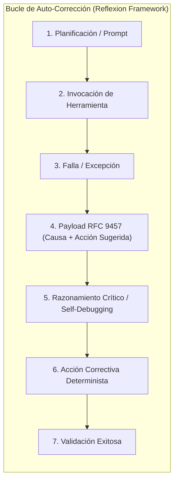

# 06 - Taxonomía de Errores, Manejo de Excepciones y Protocolos de Recuperación

Este documento establece el marco normativo, los fundamentos teóricos de resiliencia y auto-corrección, la jerarquía formal de excepciones, el estándar de payloads de error bajo **RFC 9457** y los protocolos de recuperación para agentes de IA en repositorios autónomos.

---

## 1. Fundamentos Teóricos: El Error como Señal Semántica de Auto-Corrección

En sistemas agénticos, las excepciones y fallas no son simples interrupciones del flujo de ejecución; constituyen la **señal primaria de retroalimentación semántica** dentro de la fase de observación (*Observation*) del ciclo cognitivo del modelo.



### 1.1 El Costo de los Errores Desestructurados
Investigaciones sobre auto-depuración en agentes (*Chen et al., 2023 - "Teaching Large Language Models to Self-Debug"*; *Shinn et al., 2023 - "Reflexion"*):
- Si una herramienta retorna una traza de pila ilegible (*stack trace* crudo de 500 líneas) o un volcado HTML genérico (`500 Internal Server Error`), el LLM carece de información accionable y tiende a repetir la misma acción fallida en bucle (*Doom Loop*).
- Si la herramienta entrega un **payload estructurado con causa raíz y sugerencia determinista**, la probabilidad de recuperación exitosa en el siguiente turno supera el 85%.

---

## 2. Jerarquía Estándar de Excepciones del Sistema

Todas las excepciones del repositorio deben heredar de una clase base común y organizarse por dominio funcional:

```mermaid
graph TD
    BaseRepositoryError["BaseRepositoryError (Excepción Raíz)"]
    AgentExecutionError["AgentExecutionError (Errores de Agente)"]
    ValidationError["ValidationError (Validación de Datos)"]
    InfrastructureError["InfrastructureError (Fallas de I/O y Red)"]
    SecurityError["SecurityError (Fronteras y Permisos)"]

    BaseRepositoryError --> AgentExecutionError
    BaseRepositoryError --> ValidationError
    BaseRepositoryError --> InfrastructureError
    BaseRepositoryError --> SecurityError

    AgentExecutionError --> ToolInvocationError["ToolInvocationError (Fallo al ejecutar herramienta)"]
    AgentExecutionError --> AgentTimeoutError["AgentTimeoutError (Límite de tiempo excedido)"]
    AgentExecutionError --> ContextLengthExceededError["ContextLengthExceededError (Ventana saturada)"]

    ValidationError --> SchemaMismatchError["SchemaMismatchError (Estructura inválida)"]
    ValidationError --> InvariantViolationError["InvariantViolationError (Regla de negocio rota)"]

    InfrastructureError --> NetworkConnectionError["NetworkConnectionError (Falla de conexión externa)"]
    InfrastructureError --> StoragePersistenceError["StoragePersistenceError (Error en disco / DB)"]

    SecurityError --> UnauthorizedToolAccessError["UnauthorizedToolAccessError (Permiso denegado)"]
    SecurityError --> SecretExposureError["SecretExposureError (Intento de fuga de credenciales)"]
```



---

## 3. Payload Estructurado de Error (*Standard Problem Details - RFC 9457*)

Cuando una función, servicio o herramienta agéntica falla, debe retornar o serializar un payload JSON estandarizado conforme al estándar **RFC 9457** (*Problem Details for HTTP APIs*), enriquecido con metadatos de contexto para agentes:

```json
{
  "type": "https://errors.repo.internal/probs/tool-execution-failed",
  "title": "Tool Execution Failed",
  "status": 422,
  "error_code": "TOOL_EXECUTION_FAILED",
  "detail": "La herramienta 'git_commit' falló debido a pruebas no aprobadas en tests/unit/.",
  "category": "agent_execution",
  "severity": "HIGH",
  "retryable": true,
  "suggested_action": "Ejecutar 'pytest tests/unit/' para identificar fallas antes de reintentar el commit.",
  "instance": "/runs/task_01j7w2b8k4/tools/git_commit/attempt_1",
  "invalid_params": [
    {
      "name": "tests_status",
      "reason": "Expected 0 failing tests, found 2 failing tests."
    }
  ],
  "context": {
    "agent_id": "agent_runner_01",
    "task_id": "task_01j7w2b8k4",
    "timestamp": "2026-08-26T00:00:00Z"
  }
}
```

### Definición de Campos del Payload de Error:

- `type` (URI): Enlace unívoco a la documentación técnica del tipo de error.
- `title` (str): Resumen corto y legible del problema.
- `status` (int): Código de estado HTTP o equivalente semántico (400, 403, 422, 500, 504).
- `error_code` (str): Identificador en `SCREAMING_SNAKE_CASE` (ej. `VALIDATION_FAILED`, `TOOL_TIMEOUT`).
- `detail` (str): Explicación específica y contextualizada de la falla actual.
- `category` (enum): Uno de `domain`, `agent_execution`, `infrastructure`, `security`.
- `severity` (enum): `LOW`, `MEDIUM`, `HIGH`, `CRITICAL`.
- `retryable` (bool): `true` si el agente puede intentar recuperarse automáticamente; `false` si requiere detención inmediata.
- `suggested_action` (str): Instrucción determinista que guía el siguiente paso del agente.
- `instance` (URI/path): Identificador unívoco de la ejecución fallida específica para trazabilidad.
- `invalid_params` (list[dict]): Desglose de parámetros específicos que violaron el contrato.
- `context` (dict): Metadatos de sesión, agente y marca temporal.

---

## 4. Protocolos de Resiliencia y Algoritmo de Reintentos (*Full Jitter*)

### 4.1 Matriz de Decisión ante Fallas

| **Tipo de Error** | **¿Reintentable?** | **Estrategia de Recuperación del Agente** | **Límite de Intentos** |
|:---|:--:|:---|:--:|
| **Error de Sintaxis / Linter** | ✅ Sí | Corregir el formato automáticamente según las reglas de [Estándares de Código](03_docstrings_and_code_standards.md). | 3 intentos |
| **Error de Validación de Esquema** | ✅ Sí | Corregir los campos faltantes o inválidos consultando [Metadatos YAML](04_metadata_and_field_schemas.md). | 2 intentos |
| **Falla de Herramienta Transitoria** | ✅ Sí | Reintentar aplicando *Exponential Backoff* con **Full Jitter** (1s, 2s, 4s). | 3 intentos |
| **Timeout de Inferencia / Contexto** | ✅ Sí | Reducir el tamaño del lote, invocar subagentes o solicitar compactación de contexto. | 1 reintento |
| **Violación de Permiso de Seguridad** | ❌ **No** | **Detener inmediatamente la ejecución.** Notificar al desarrollador sin intentar evasiones. | 0 reintentos |
| **Corrupción de Estado Crítico** | ❌ **No** | Ejecutar rollback atómico (`git checkout` / reversión) y solicitar intervención humana. | 0 reintentos |

### 4.2 Modelo Matemático de Backoff con Full Jitter
Para evitar que múltiples subagentes concurrentes generen un efecto de estampida (*Thundering Herd Problem*) sobre APIs o bases de datos compartidas (*Brooker, AWS Architecture*), el tiempo de espera $t_i$ en el intento $i$ debe calcularse como:

$$t_i = \text{random\_uniform}(0, \min(T_{\text{cap}}, T_{\text{base}} \times 2^i))$$

Donde $T_{\text{base}} = 1.0\text{ s}$ y $T_{\text{cap}} = 16.0\text{ s}$.

---

## 5. Estándares de Logging y Observabilidad (OpenTelemetry GenAI)

Todo repositorio agéntico debe emitir registros estructurados en formato JSON que sigan las convenciones semánticas de **OpenTelemetry para Inteligencia Artificial Generativa (`gen_ai.*`)**:

```python
import json
import logging
import random
from datetime import datetime, timezone
from typing import Any

def calcular_backoff_full_jitter(
    intento: int,
    base_segundos: float = 1.0,
    cap_segundos: float = 16.0,
) -> float:
    """Calcula el tiempo de espera usando el algoritmo Exponential Backoff con Full Jitter.

    Args:
        intento: Número de reintento actual (0-indexed).
        base_segundos: Tiempo base inicial de espera.
        cap_segundos: Límite superior máximo de espera.

    Returns:
        Tiempo de espera en segundos con aleatoriedad distribuida uniformemente.
    """
    techo = min(cap_segundos, base_segundos * (2 ** intento))
    return random.uniform(0, techo)

class AgentJSONFormatter(logging.Formatter):
    """Formateador de logs JSON estructurado conforme a OpenTelemetry GenAI Conventions."""

    def format(self, record: logging.LogRecord) -> str:
        log_data: dict[str, Any] = {
            "timestamp": datetime.now(timezone.utc).isoformat(),
            "level": record.levelname,
            "logger": record.name,
            "message": record.getMessage(),
            "code.filepath": record.pathname,
            "code.lineno": record.lineno,
            "code.function": record.funcName,
        }
        # Inyección de atributos semánticos de telemetría agéntica
        if hasattr(record, "agent_id"):
            log_data["gen_ai.agent.id"] = record.agent_id
        if hasattr(record, "task_id"):
            log_data["gen_ai.task.id"] = record.task_id
        if hasattr(record, "tool_name"):
            log_data["gen_ai.tool.name"] = record.tool_name
        if hasattr(record, "error_code"):
            log_data["error.type"] = record.error_code

        return json.dumps(log_data)
```
