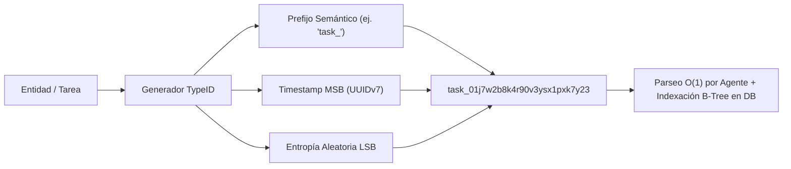

# 06 - Especificación y Estándares de Identificadores Únicos (IDs) y Nomenclatura

Este documento establece el marco normativo, los modelos sintácticos, las expresiones regulares de validación y las directrices de implementación para la asignación de **Identificadores Únicos (IDs)** y convenciones de nomenclatura en sistemas agénticos.

---

## 1. Fundamentos Teóricos: IDs Tipados y K-Sortables en Sistemas Agénticos

En arquitecturas *Agent-First*, los identificadores no son cadenas opacas o aleatorias. Constituyen **puntos de anclaje semántico** que resuelven tres problemas críticos:

1. **Eliminación de Ambigüedad Epistémica:** Un ID con prefijo tipado (`spec_...`, `task_...`, `user_...`) informa instantáneamente al LLM sobre la entidad referenciada sin necesidad de consultar el contexto previo.
2. **Inmunidad a Errores Visuales y Alucinaciones:** El uso de codificaciones como **Crockford's Base32** excluye caracteres ambiguos (`0/O`, `1/I/l`, `U`), evitando que modelos o parsers cometan errores de transcripción.
3. **Localidad Temporal e Indexación B-Tree (K-Sortability):** Identificadores como **UUIDv7 (RFC 9562)** y **TypeID** incorporan marcas de tiempo de milisegundos en los bits más significativos, garantizando orden cronológico natural y evitando la fragmentación de índices en bases de datos relacionales y de vectores.



---

## 2. Taxonomía de Modelos Estándar y Comparativa

| **Modelo de ID** | **Estructura / Formato** | **Longitud** | **K-Sortable** | **Uso Principal en Repositorio** |
|:---|:---|:---:|:---:|:---|
| **TypeID (Stripe-Style)** | `<prefix>_<base32_uuidv7>` | 29-39 chars | ✅ Sí | Metadatos de Frontmatter, tareas de agentes, APIs y entidades de dominio. |
| **UUIDv7 (RFC 9562)** | `8-4-4-4-12` hexadecimal | 36 chars | ✅ Sí | Llaves primarias relacionales, transacciones y eventos de telemetría. |
| **Slug Secuencial** | `^[0-9]{2}_[a-z0-9_]{3,60}$` | Variable | ❌ No | Nombres de archivos Markdown y módulos con secuencia de lectura fija. |
| **Hierarchical Namespace** | `<domain>:<resource>:<action>` | Variable | ❌ No | Control de acceso de herramientas (RBAC), permisos y guardrails. |
| **Código de Decisión/Error** | `[A-Z]+-[0-9]{4}` o `ERR_[A-Z_]+` | Variable | ❌ No | Registros ADR (`ADR-0001`) y payloads de error RFC 9457 (`ERR_TOOL_TIMEOUT`). |

---

## 3. Reglas Sintácticas y Expresiones Regulares (Regex)

### 3.1 TypeID
```regex
^[a-z]{2,12}_[0-9a-hjkmnp-tv-z]{26}$
```
- **Prefijo:** 2 a 12 caracteres en minúsculas (`spec`, `bp`, `task`, `run`, `doc`, `tool`, `agent`).
- **Separador:** Guion bajo (`_`).
- **Sufijo:** 26 caracteres en Crockford's Base32 (sin `i`, `l`, `o`, `u`).

### 3.2 Slug Secuencial de Archivos
```regex
^[0-9]{2}_[a-z0-9_]{3,64}\.md$
```
- **Prefijo numérico:** 2 dígitos (`00_` a `99_`).
- **Nombre semántico:** snake_case en minúsculas.

### 3.3 Namespaces Jerárquicos
```regex
^[a-z0-9_]+:[a-z0-9_]+:[a-z0-9_]+$
```
- Ejemplo: `tools:filesystem:read_file`, `policy:security:no_secrets`.

---

## 4. Implementaciones Canónicas de Referencia

### 4.1 Implementación en Python (Python 3.10+)

```python
import time
import random
import re

CROCKFORD_BASE32 = "0123456789abcdefghjkmnpqrstvwxyz"
TYPEID_REGEX = re.compile(r"^[a-z]{2,12}_[0-9a-hjkmnp-tv-z]{26}$")

def generate_typeid(prefix: str) -> str:
    """Genera un identificador TypeID K-Sortable válido.

    Args:
        prefix: Prefijo semántico en minúsculas (2 a 12 caracteres).

    Returns:
        Cadena TypeID formateada (ej. 'spec_01j7w2b8k4r90v3ysx1pxk7y23').

    Raises:
        ValueError: Si el prefijo no cumple con la restricción sintáctica.
    """
    if not re.match(r"^[a-z]{2,12}$", prefix):
        raise ValueError(f"Prefijo inválido: '{prefix}'. Debe ser minúscula entre 2 y 12 caracteres.")

    ts_ms = int(time.time() * 1000)
    rand_bytes = bytearray(random.getrandbits(8) for _ in range(10))

    raw = bytearray(16)
    raw[0] = (ts_ms >> 40) & 0xFF
    raw[1] = (ts_ms >> 32) & 0xFF
    raw[2] = (ts_ms >> 24) & 0xFF
    raw[3] = (ts_ms >> 16) & 0xFF
    raw[4] = (ts_ms >> 8) & 0xFF
    raw[5] = ts_ms & 0xFF
    raw[6] = 0x70 | (rand_bytes[0] & 0x0F)  # UUIDv7
    raw[7] = rand_bytes[1]
    raw[8] = 0x80 | (rand_bytes[2] & 0x3F)  # Variant RFC 4122
    for i in range(7):
        raw[9 + i] = rand_bytes[3 + i]

    val = int.from_bytes(raw, byteorder="big")
    chars = []
    for _ in range(26):
        chars.append(CROCKFORD_BASE32[val & 0x1F])
        val >>= 5

    suffix = "".join(reversed(chars))
    type_id = f"{prefix}_{suffix}"
    return type_id
```

### 4.2 Validación en Esquema JSON Schema

```json
{
  "$schema": "http://json-schema.org/draft-07/schema#",
  "title": "TypeIDValidation",
  "type": "string",
  "pattern": "^[a-z]{2,12}_[0-9a-hjkmnp-tv-z]{26}$"
}
```

---

## 5. Criterios de Validación Automatizada en CI

1. **Unicidad Global:** Ningún ID puede repetirse en todo el árbol de archivos.
2. **Concordancia de Prefijo:** Los archivos de especificaciones deben usar `spec_`, las buenas prácticas `bp_`, las guías `guide_` y los mapas de directorio `map_`.
3. **Inmutabilidad:** Una vez asignado y commiteado un `id` en el Frontmatter, queda prohibida su mutación en commits posteriores.
