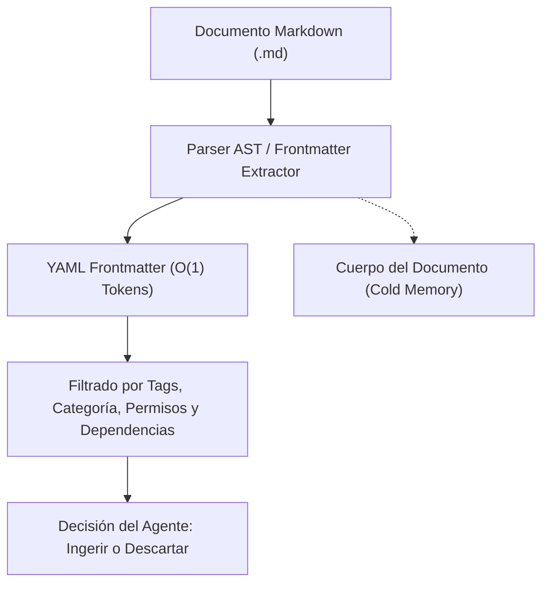

# 07 - Especificación y Plantilla Canónica de YAML Frontmatter

Este documento define la norma estricta para la estructuración de metadatos **YAML Frontmatter** en todos los archivos Markdown del repositorio, garantizando indexabilidad instantánea, control de acceso y compatibilidad con sistemas agénticos.

---

## 1. Filosofía Agent-First Metadata y Descubrimiento por Cabeceras

El encabezado YAML Frontmatter es el punto de entrada primario para sistemas autónomos. Permite que herramientas de descubrimiento (*Search, AST Parsers, RAG*) indexen las propiedades operativas del archivo sin necesidad de cargar ni procesar el cuerpo completo del documento.



---

## 2. Matriz de Campos Obligatorios vs Opcionales

| **Campo** | **Tipo** | **Requerido** | **Reglas de Formato / Validación** |
|:---|:---:|:---:|:---|
| `id` | string | **Sí** | TypeID válido (`^[a-z]{2,12}_[0-9a-hjkmnp-tv-z]{26}$`). |
| `name` | string | **Sí** | Coincidente con el basename del archivo en `snake_case`. |
| `title` | string | **Sí** | Título conciso (5 a 120 caracteres). |
| `file_path` | string | **Sí** | Ruta POSIX normalizada desde la raíz del repositorio. |
| `version` | string | **Sí** | SemVer 2.0.0 (`MAJOR.MINOR.PATCH`). |
| `category` | enum | **Sí** | Uno de los valores taxonómicos autorizados. |
| `tags` | list[string] | **Sí** | 1 a 10 etiquetas en minúsculas sin espacios. |
| `description` | string | **Sí** | Resumen operativo (10 a 300 caracteres). |
| `owner` | string | **Sí** | Equipo responsable o email de contacto. |
| `status` | enum | **Sí** | Uno de: `draft`, `active`, `deprecated`, `archived`. |
| `created_at` | string | **Sí** | ISO 8601 UTC (`YYYY-MM-DDTHH:mm:ssZ`). |
| `updated_at` | string | **Sí** | ISO 8601 UTC (`YYYY-MM-DDTHH:mm:ssZ`). |
| `schema_version` | string | **Sí** | Versión de este esquema (`1.0.0`). |
| `domain` | string | No | Subdominio funcional del archivo. |
| `dependencies` | list[string] | No | Lista de nombres de especificaciones requeridas. |
| `related_specs` | list[string] | No | Lista de especificaciones complementarias. |
| `tool_access_level` | enum | No | `read_only` \| `safe_mutation` \| `full_access`. |
| `execution_mode` | enum | No | `sync` \| `async` \| `batch` \| `event_driven`. |

---

## 3. Reglas de Ordenación Canónica y Saneamiento

1. **Delimitadores:** El bloque debe iniciar exactamente en la línea 1 con `---` y cerrar con `---`.
2. **Indentación:** 2 espacios exactos para listas y objetos anidados. Prohibido el uso de caracteres tabulador (`\t`).
3. **Escape de Caracteres Especiales:** Cadenas que contengan dos puntos (`:`), comillas o corchetes deben encerrarse entre comillas dobles.

---

## 4. Plantillas de Referencia

### 4.1 Plantilla Canónica Mínima (Obligatoria)
```yaml
---
id: spec_01j7w2b8k4r90v3ysx1pxk7y23
name: nombre_del_archivo
title: "Título Descriptivo y Claro del Documento"
file_path: docs/categoria/nombre_del_archivo.md
version: 1.0.0
category: standards
tags: [palabra1, palabra2, palabra3]
description: "Descripción concisa del contenido y utilidad del documento para agentes y humanos."
owner: AI Engineering & Architecture Team
status: active
created_at: 2026-08-27T16:00:00Z
updated_at: 2026-08-27T16:00:00Z
schema_version: 1.0.0
---
```

### 4.2 Plantilla Canónica Extendida (Módulos Ejecutables / Tareas)
```yaml
---
id: task_01j7w2b8k4r90v3ysx1pxk7y23
name: task_runner_engine
title: "Motor de Ejecución de Tareas y Herramientas"
file_path: src/engine/task_runner.md
version: 1.2.0
category: agentic
domain: core_engine
tags: [runner, tasks, execution, agentic]
description: "Orquestador determinista de herramientas con aislamiento de subprocesos."
owner: AI Engineering & Architecture Team
status: active
created_at: 2026-08-27T16:00:00Z
updated_at: 2026-08-27T16:00:00Z
tool_access_level: safe_mutation
execution_mode: async
priority: 4
timeout_seconds: 180
dependencies: [00_global_standards]
related_specs: [05_exception_handling_and_errors]
entrypoint: src/engine/task_runner.py
schema_version: 1.0.0
---
```

---

## 5. Esquema Formal JSON Schema Draft-07

```json
{
  "$schema": "http://json-schema.org/draft-07/schema#",
  "title": "AgenticFrontmatterSchema",
  "type": "object",
  "required": [
    "id",
    "name",
    "title",
    "file_path",
    "version",
    "category",
    "tags",
    "description",
    "owner",
    "status",
    "created_at",
    "updated_at",
    "schema_version"
  ],
  "properties": {
    "id": { "type": "string", "pattern": "^[a-z]{2,12}_[0-9a-hjkmnp-tv-z]{26}$" },
    "name": { "type": "string", "pattern": "^[a-z0-9_]{3,64}$" },
    "title": { "type": "string", "minLength": 5, "maxLength": 120 },
    "file_path": { "type": "string", "pattern": "^[a-zA-Z0-9_\-\./ ]+\.md$" },
    "version": { "type": "string", "pattern": "^\d+\.\d+\.\d+$" },
    "category": {
      "type": "string",
      "enum": ["standards", "architecture", "agentic", "code_standards", "metadata", "errors", "templates", "guides", "universal_principles"]
    },
    "tags": { "type": "array", "items": { "type": "string" }, "minItems": 1, "maxItems": 10 },
    "description": { "type": "string", "minLength": 10, "maxLength": 300 },
    "owner": { "type": "string" },
    "status": { "type": "string", "enum": ["draft", "active", "deprecated", "archived"] },
    "created_at": { "type": "string", "format": "date-time" },
    "updated_at": { "type": "string", "format": "date-time" },
    "schema_version": { "type": "string", "pattern": "^\d+\.\d+\.\d+$" }
  },
  "additionalProperties": true
}
```
