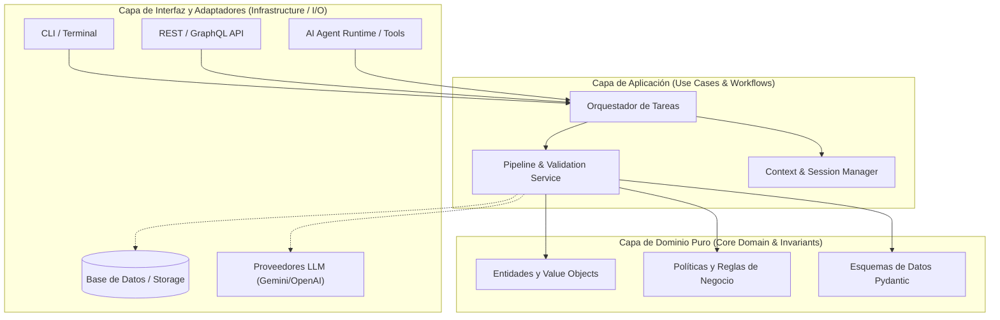
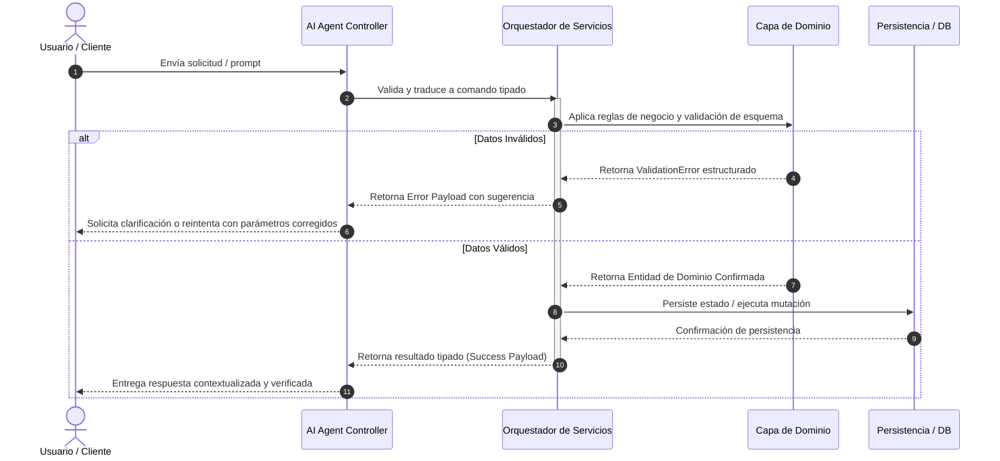
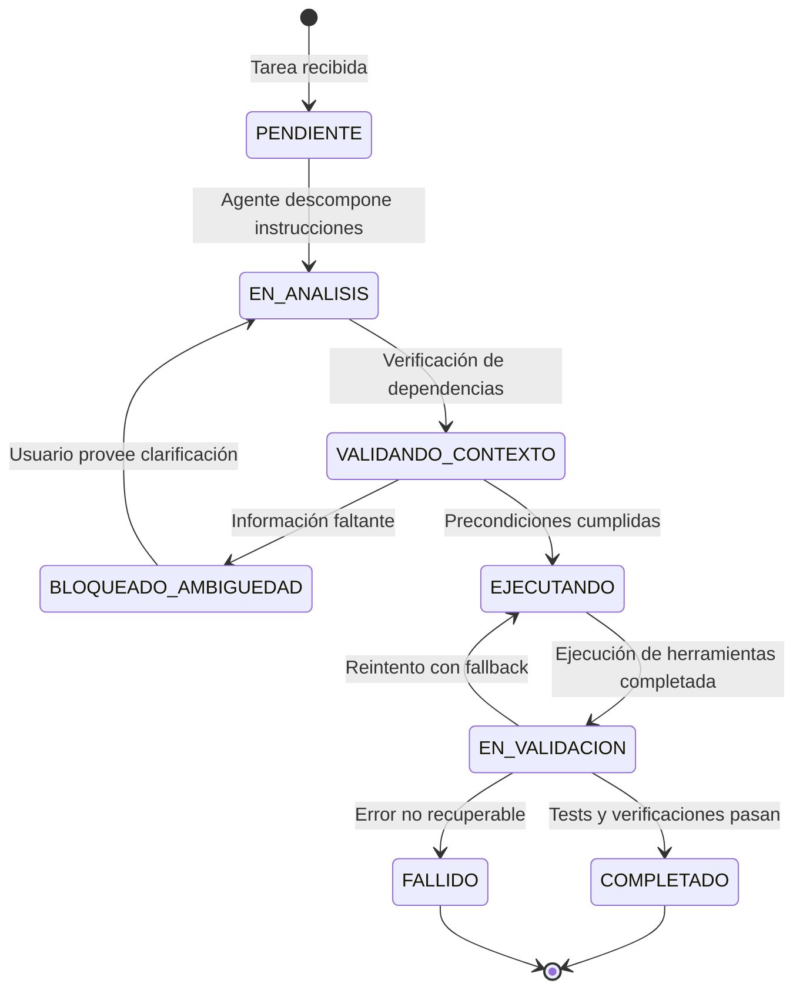

# 02 - Especificación y Plantilla Maestra de ARCHITECTURE.md

Este documento define la estructura técnica, estándares de diagramación y plantilla canónica para el archivo ARCHITECTURE.md en repositorios preparados para agentes de IA.

## 1. Función de ARCHITECTURE.md para Agentes y Humanos

El archivo ARCHITECTURE.md provee la **representación mental de alto nivel** del sistema:

- **Para Humanos:** Facilita la comprensión de límites de módulos, flujos de datos y decisiones técnicas históricas.

- **Para Agentes de IA:** Provee las restricciones estructurales y delimitaciones de capas para evitar violaciones de arquitectura (ej. importar infraestructura en el dominio puro) y guiar la generación de código contextualmente correcto.

## 2. Principios de Diseño Arquitectónico

1.  **Arquitectura Hexagonal (Puertos y Adaptadores):**

    - **Domain Core:** Modelos puros de datos, reglas de negocio e invariantes. No depende de ningún framework ni I/O.

    - **Application / Service Layer:** Orquestación de casos de uso, coordinación de pipelines y contratos de servicios.

    - **Infrastructure / Adapters:** Implementaciones concretas de I/O (bases de datos, APIs de LLMs, sistema de archivos, clientes HTTP).

    - **Agent Interface:** Capa de abstracción donde los agentes interactúan mediante herramientas (tools) y llamadas a funciones estructuradas.

2.  **Inmutabilidad y Estado Explícito:** Las transiciones de estado deben ser deterministas y serializables en JSON/Pydantic.

3.  **Diagramas Autocontenidos:** Todo flujo crítico debe representarse en sintaxis nativa de **Mermaid.js** para permitir renderizado web y parsing textual directo por LLMs.

## 3. Plantilla Maestra Canónica de ARCHITECTURE.md

# Arquitectura del Sistema

Este documento describe la topología del sistema, las fronteras modulares, los modelos de datos, la gestión de estado y los flujos de interacción entre componentes y agentes de IA.

---

## 1. Topología del Sistema y Capas

El sistema sigue una Arquitectura Limpia/Hexagonal estructurada en cuatro capas concéntricas con regla de dependencia hacia el interior:



## 2. Delimitación de Capas y Responsabilidades

| **Capa** | **Directorio** | **Responsabilidad** | **Restricciones de Dependencia** |
|:---|:---|:---|:---|
| **Dominio** | src/paquete/core/ | Lógica de negocio pura, entidades, validaciones semánticas. | **Cero dependencias externas.** Prohibido importar I/O, frameworks o APIs. |
| **Aplicación** | src/paquete/services/ | Orquestación de flujos de trabajo, casos de uso y pipelines. | Solo depende del Dominio e interfaces abstractas. |
| **Infraestructura** | src/paquete/adapters/ | Implementación de conectores externos, DBs, clientes HTTP y LLMs. | Implementa los puertos definidos en Aplicación/Dominio. |
| **Agentes e Interfaz** | src/paquete/agents/ | Definición de herramientas (tools), prompts estructurados y schemas. | Consume la capa de Aplicación a través de contratos tipados. |

## 3. Flujo de Ejecución y Secuencia de Datos

El siguiente diagrama de secuencia ilustra el flujo de una invocación de tarea agéntica con validación y manejo de estado:



## 4. Gestión de Estado y Ciclo de Vida

El estado de ejecución de cualquier proceso o sesión agéntica se modela como una máquina de estados finita determinista:



### Reglas de Invarianza de Estado:

1. **Transiciones Atómicas:** Ningún estado puede persistirse de forma parcial.
2. **Serialización Segura:** Todo snapshot de estado debe ser convertible a JSON sin pérdida de tipos.
3. **Auditoría:** Cada transición emite un evento de log estructurado con timestamp, transition_id y agent_id.

## 5. Registro de Decisiones de Arquitectura (ADR)

Las decisiones de diseño significativas se documentan bajo el formato **ADR** en docs/adr/.

### Plantilla de ADR:

```markdown
# ADR-001: [Título de la Decisión Arquitectónica]

- **Fecha:** YYYY-MM-DD
- **Estado:** [Propuesto | Aceptado | Reemplazado | Obsoleto]
- **Contexto:** [Descripción del problema o necesidad técnica].
- **Decisión:** [Solución elegida y justificación].
- **Consecuencias:**
  - Positivas: [Beneficios obtenidos].
  - Negativas / Trade-offs: [Costos o limitaciones asumidas].
```

## 6. Sincronización y Mantenimiento

- Cualquier cambio en la estructura de paquetes debe reflejarse en los diagramas Mermaid de este documento.

- Si se añaden nuevas herramientas para agentes, actualizar la capa Agent Interface y [AGENTS.md](AGENTS.md).

---

## 4. Reglas de Validación de Diagramas Mermaid para Agentes

Al generar o editar `ARCHITECTURE.md`:

1. Validar que la sintaxis de Mermaid sea compatible con el parser de GitHub (`graph TD`, `sequenceDiagram`, `stateDiagram-v2`).

2. No usar caracteres especiales o espacios sin comillas dobles en los identificadores de nodos.

3. Siempre incluir numeración automática en diagramas de secuencia (`autonumber`).