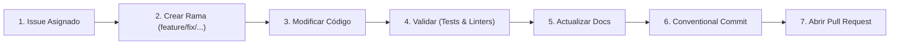

# 04 - Especificación y Plantilla Maestra de CONTRIBUTING.md

## 1. Definición y Propósito del Archivo

### ¿Qué es CONTRIBUTING.md?

CONTRIBUTING.md es el documento normativo que define el flujo de trabajo colaborativo, los estándares de contribución y las reglas de integración de cambios en el repositorio.

### ¿Por qué existe y qué problemas resuelve?

- **Para Desarrolladores Humanos:** Establece el estándar de preparación del entorno, convención de nombres de ramas, formato de commits (Conventional Commits) y el protocolo de revisión de Pull Requests.

- **Para Agentes de IA:** Funciona como la **definición del algoritmo de contribución estándar** (Issue -> Branch -> Code -> Test -> Docs -> Commit -> PR), evitando que el agente realice commits directos a main o genere mensajes de commit vagos o desestructurados.

## 2. Estructura de Secciones Recomendada

1.  Código de Conducta

2.  Flujo de Trabajo Git (Branching Strategy)

3.  Convenciones de Commits (Conventional Commits)

4.  Estándares de Código y Linters

5.  Protocolo de Pruebas Unitarias

6.  Proceso de Creación y Revisión de Pull Requests

## 3. Plantilla Maestra Canónica de CONTRIBUTING.md

# Guía de Contribución (CONTRIBUTING.md)

Agradecemos tu interés en contribuir a este proyecto. Este documento describe las pautas para asegurar que los cambios se integren de forma ordenada y verificable.

---

## 1. Flujo de Trabajo Git



1. **Crear una rama de trabajo:**
   - Nomenclatura de ramas:
     - `feature/nombre-funcionalidad`
     - `fix/descripcion-bug`
     - `refactor/modulo-afectado`
     - `docs/nombre-documento`

```bash
git checkout -b feature/nueva-herramienta-agente
```

2. **Convención de Commits (Conventional Commits):** Utilizar el formato `<tipo>(<alcance>): <descripción concisa>`:
   - `feat`: Nueva funcionalidad.
   - `fix`: Corrección de bug.
   - `docs`: Cambios en documentación.
   - `style`: Formato sin impacto funcional.
   - `refactor`: Refactorización de código.
   - `test`: Adición o corrección de pruebas.
   - `chore`: Tareas de mantenimiento o configuración.

> *Ejemplo:* `feat(core): agregar validador de invariantes de dominio`

## 2. Preparación del Entorno y Calidad de Código

Antes de confirmar cualquier cambio, ejecutar localmente:

```bash
# 1. Formateo y análisis estático
black src/ tests/
ruff check src/ tests/
mypy src/

# 2. Ejecutar suite de pruebas con cobertura
pytest --cov=src tests/
```

## 3. Protocolo de Pull Requests (PR)

1. **Título del PR:** Debe seguir la convención de commits (ej. `feat(api): soporte para streaming de respuestas`).
2. **Plantilla de PR:** Completar todas las secciones de `.github/PULL_REQUEST_TEMPLATE.md`.
3. **Checklist Obligatorio:**
   - [ ] Las pruebas pasan al 100%.
   - [ ] Se incluyeron pruebas unitarias para el código nuevo.
   - [ ] Se actualizaron los docstrings bajo estándar Google.
   - [ ] No se incluyen credenciales, tokens ni secretos.