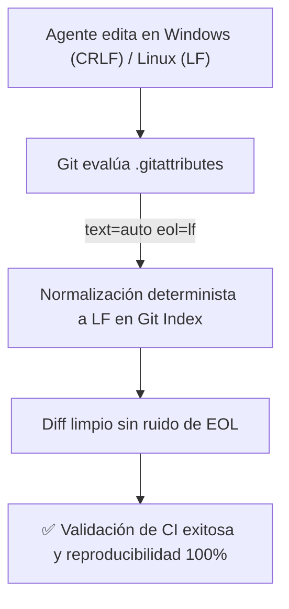

# 08 - Especificación y Plantilla Maestra de .gitattributes

Este documento establece la especificación técnica, justificación operativa y plantilla canónica para el archivo `.gitattributes` en la raíz del repositorio.

---

## 1. Propósito Dual: Prevención de Conflictos de EOL y Diffs Espurios

En repositorios operados por humanos y agentes que se ejecutan en diversos sistemas operativos (Linux en contenedores CI/CD, Windows o macOS en máquinas locales de desarrollo):

1. **Problema de Saltos de Línea (CRLF vs LF):** Si Git convierte automáticamente `LF` a `CRLF` en Windows, los parsers de diffs basados en LLM detectan alteraciones en cada línea del archivo, corrompiendo el análisis de cambios y generando commits masivos espurios.
2. **Normalización Forzada (`eol=lf`):** `.gitattributes` impone que todos los archivos de texto se almacenen y confirmen con `LF` en el repositorio, independientemente de la configuración local de Git (`core.autocrlf`).
3. **Tratamiento de Binarios y Empaquetado:** Previene corrupciones accidentales al intentar hacer merge de imágenes o binarios, y excluye archivos de configuración interna al generar tarballs (`export-ignore`).



---

## 2. Configuración Obligatoria y Extensiones Específicas

- **Regla Global:** `* text=auto eol=lf` (todos los archivos de texto normalizados a LF).
- **Archivos de Código y Datos:** Tratamiento explícito de `.py`, `.ts`, `.js`, `.json`, `.jsonc`, `.yaml`, `.yml`, `.md`, `.toml`, `.sh`, `.ps1`.
- **Scripts de Shell de Unix:** `*.sh text eol=lf` (estricto LF para evitar fallos de ejecución en Linux).
- **Scripts de PowerShell:** `*.ps1 text eol=lf` o `crlf` según necesidad multiplataforma.
- **Binarios e Imágenes:** `*.png binary`, `*.jpg binary`, `*.ico binary`, `*.pdf binary`.

---

## 3. Plantilla Maestra Canónica de `.gitattributes`

```gitattributes
# =============================================================================
# CONFIGURACIÓN GLOBAL DE NORMALIZACIÓN DE FINALES DE LÍNEA (EOL)
# =============================================================================
# Fuerza normalización a LF en repositorio para todos los archivos de texto
* text=auto eol=lf

# =============================================================================
# DOCUMENTACIÓN Y CONFIGURACIÓN ESTRUCTURADA
# =============================================================================
*.md            text eol=lf diff=markdown
*.markdown      text eol=lf diff=markdown
*.txt           text eol=lf
*.yaml          text eol=lf
*.yml           text eol=lf
*.json          text eol=lf
*.jsonc         text eol=lf
*.toml          text eol=lf
*.ini           text eol=lf
*.editorconfig  text eol=lf

# =============================================================================
# CÓDIGO FUENTE (LENGUAJES PRINCIPALES)
# =============================================================================
*.py            text eol=lf diff=python
*.pyi           text eol=lf diff=python
*.ts            text eol=lf
*.tsx           text eol=lf
*.js            text eol=lf
*.jsx           text eol=lf
*.html          text eol=lf
*.css           text eol=lf
*.sql           text eol=lf

# =============================================================================
# SCRIPTS DE EJECUCIÓN Y AUTOMATIZACIÓN
# =============================================================================
*.sh            text eol=lf
*.bash          text eol=lf
*.ps1           text eol=lf
*.bat           text eol=crlf
*.cmd           text eol=crlf

# =============================================================================
# ARCHIVOS BINARIOS (NO MODIFICAR SALTOS DE LÍNEA)
# =============================================================================
*.png           binary
*.jpg           binary
*.jpeg          binary
*.gif           binary
*.ico           binary
*.svg           text eol=lf
*.pdf           binary
*.zip           binary
*.tar.gz        binary
*.parquet       binary
*.db            binary
*.sqlite        binary

# =============================================================================
# EXCLUSIONES DE EMPAQUETADO (git archive)
# =============================================================================
.github         export-ignore
.gitignore      export-ignore
.gitattributes  export-ignore
tests           export-ignore
docs            export-ignore
```

---

## 4. Reglas de Validación para Agentes antes de Commit

1. **Verificación de EOL:** Ejecutar `git status --porcelain` para comprobar que ningún archivo ha sido marcado como modificado únicamente por saltos de línea.
2. **Re-normalización Inicial:** Si se agregan archivos existentes con saltos mixtos, ejecutar `git add --renormalize .` antes de crear el commit.
