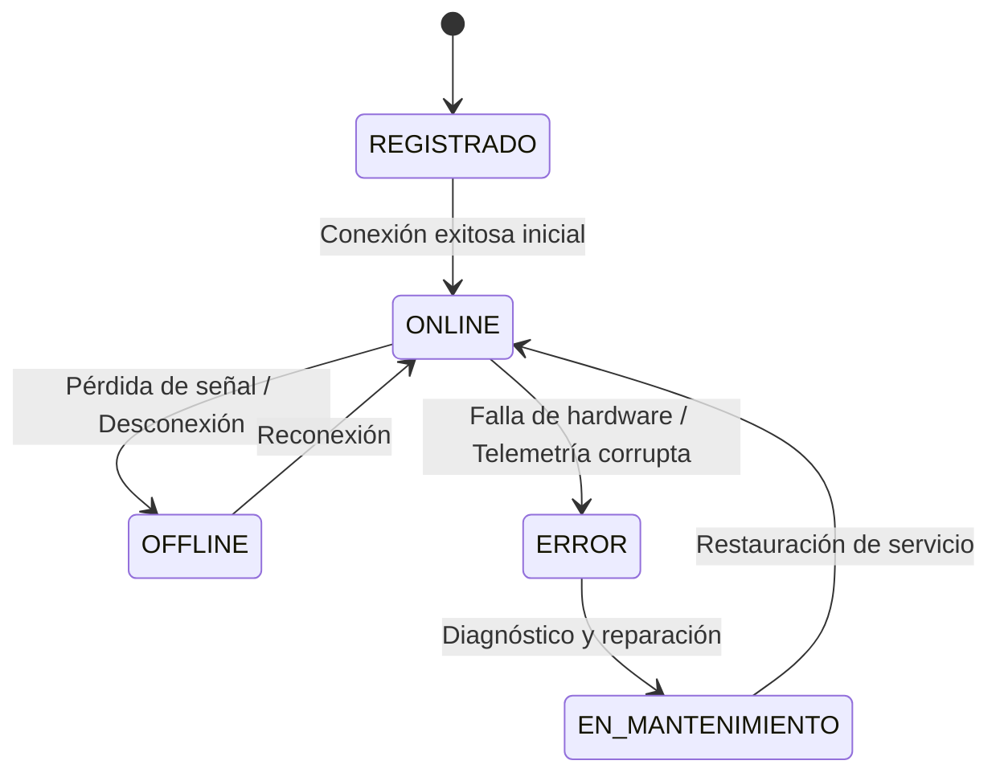

# 02 - Especificación y Plantilla Maestra de DOMAIN.md

## 1. Definición y Propósito del Archivo

### ¿Qué es DOMAIN.md?

DOMAIN.md describe la lógica de negocio pura, las entidades del dominio, las máquinas de estados, las transiciones válidas y los invariantes inquebrantables, independientemente de la tecnología o base de datos utilizada.

### ¿Por qué existe y qué problemas resuelve?

- **Desacopla Negocio de Implementación:** Evita que las reglas de negocio queden enterradas en controladores o consultas SQL.

- **Para Agentes de IA:** Impide que los modelos violen reglas de negocio críticas (ej. permitir transiciones de estado imposibles o crear entidades huérfanas).

## 2. Plantilla Maestra Canónica de DOMAIN.md

# Modelo y Reglas del Dominio (DOMAIN.md)

Este documento especifica las entidades centrales, estados, invariantes y reglas de negocio del sistema.

---

## 1. Entidades Principales

### `Dispositivo`

- `id`: Identificador único (UUID).

- `tipo`: Sensor ambiental, actuador o pasarela.

- `estado`: Estado operativo actual.

---

## 2. Máquina de Estados y Transiciones Válidas

Los dispositivos siguen el siguiente ciclo de vida:

- `REGISTRADO` -> `ONLINE`
- `ONLINE` -> `OFFLINE` | `ERROR`
- `OFFLINE` -> `ONLINE`
- `ERROR` -> `EN_MANTENIMIENTO` -> `ONLINE`

### ⛔ Transiciones Prohibidas:

- Un dispositivo **no puede pasar de `OFFLINE` a `ERROR`** sin haber registrado un intento de conexión previo.

---

## 3. Invariantes del Dominio

1. **Unicidad:** No pueden existir dos dispositivos con el mismo número de serie físico.

2. **Inmutabilidad:** El histórico de telemetría es append-only; nunca se modifica ni se elimina.