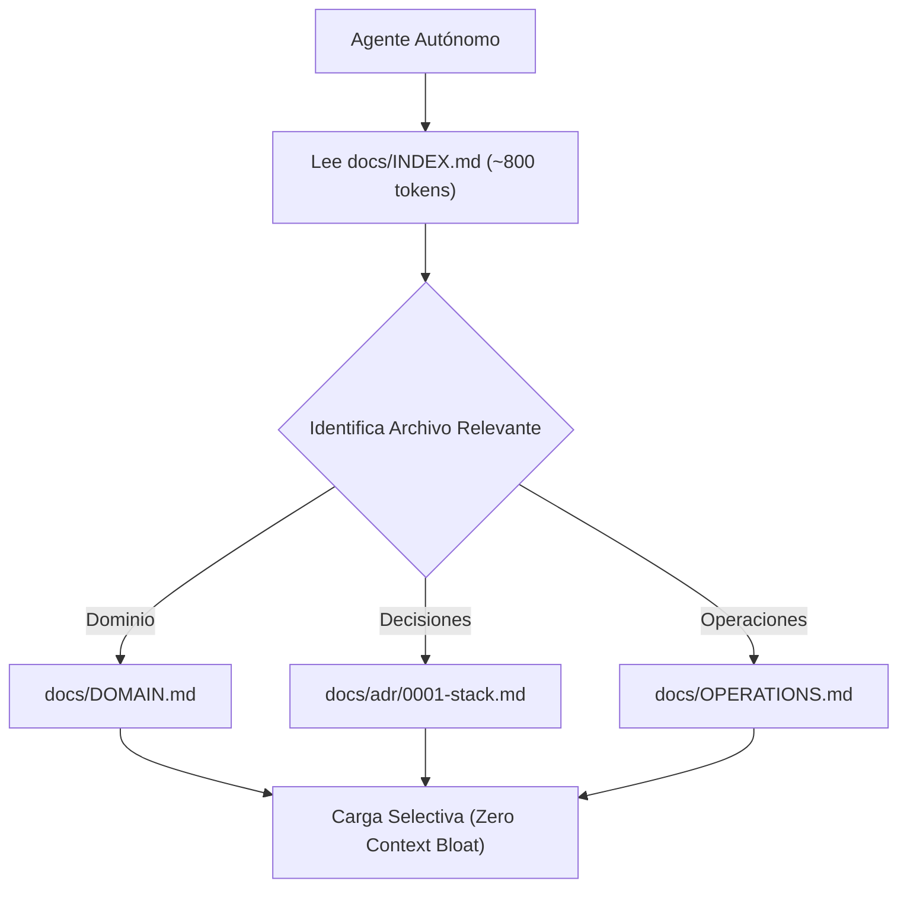

# 11 - Especificación y Plantilla Maestra de docs/INDEX.md

Este documento establece la especificación técnica y plantilla canónica para el archivo `docs/INDEX.md`, el índice semántico de bajo consumo de contexto para repositorios agénticos complejos.

---

## 1. Rol del Índice Maestro: Progressive Disclosure y Ahorro de Tokens

En repositorios con docenas de documentos técnicos, obligar al agente a inspeccionar el sistema de archivos completo o inyectar resúmenes extensos desperdicia miles de tokens de contexto.

`docs/INDEX.md` actúa como un **mapa semántico ultracompacto** (~500 a 1000 tokens) que permite al agente:
1. Localizar de forma determinista qué archivo contiene la respuesta a su necesidad operativa.
2. Evaluar el presupuesto de tokens aproximado antes de cargar el documento.
3. Descubrir relaciones entre módulos y capas del sistema.



---

## 2. Estructura Tabular Canónica Requerida

El índice maestro debe organizar los documentos en una tabla estructurada con cuatro columnas obligatorias:
- **Dominio / Categoría:** Agrupación funcional.
- **Ruta Relativa:** Enlace Markdown canónico al archivo.
- **Pregunta Clave / Propósito:** Resumen en una sola frase concisa.
- **Presupuesto Estimado:** Cantidad aproximada de tokens (~KiB/Tokens).

---

## 3. Plantilla Maestra Canónica de `docs/INDEX.md`

```markdown
# Índice Maestro de Documentación (docs/INDEX.md)

Este índice proporciona la resolución semántica de rutas y responsabilidades para navegación humana y agéntica de bajo consumo de contexto.

---

## Catálogo de Documentación del Repositorio

| **Dominio / Capa** | **Documento** | **Pregunta Clave / Propósito** | **Tokens Aprox.** |
|:---|:---|:---|:---:|
| **Entrada** | [README.md](../README.md) | ¿Qué es el proyecto y cómo iniciar rápidamente? | ~1.5k |
| **Gobernanza IA** | [AGENTS.md](../AGENTS.md) | ¿Cuáles son las reglas operativas y límites de la IA? | ~2.0k |
| **Topología** | [ARCHITECTURE.md](../ARCHITECTURE.md) | ¿Cómo interactúan las capas y servicios? | ~3.0k |
| **Operación Local** | [DEVELOPMENT.md](../DEVELOPMENT.md) | ¿Cómo preparar y ejecutar el entorno local? | ~1.2k |
| **Calidad** | [TESTING.md](../TESTING.md) | ¿Cómo ejecutar la pirámide de pruebas? | ~1.5k |
| **Seguridad** | [SECURITY.md](../SECURITY.md) | ¿Cuáles son las políticas de reporte y secretos? | ~1.0k |
| **Historial** | [CHANGELOG.md](../CHANGELOG.md) | ¿Qué cambios se han introducido por versión? | ~1.5k |
| **Dominio Puro** | [DOMAIN.md](DOMAIN.md) | ¿Cuáles son las entidades y reglas de negocio? | ~2.5k |
| **Diagnóstico** | [TROUBLESHOOTING.md](TROUBLESHOOTING.md) | ¿Cómo solucionar errores y síntomas conocidos? | ~2.0k |
| **Decisiones** | [docs/adr/](adr/) | ¿Por qué se eligieron tecnologías específicas? | ~1.0k c/u |
| **Operaciones** | [OPERATIONS.md](OPERATIONS.md) | ¿Cómo operar entornos y despliegues? | ~1.8k |
| **Glosario** | [GLOSSARY.md](GLOSSARY.md) | ¿Qué significan los términos técnicos clave? | ~1.2k |
```

---

## 4. Script de Validación en CI (Prevención de Desincronización)

Para asegurar que ningún archivo nuevo quede huérfano fuera del índice:

```python
import os
import glob
import sys

def validate_index_coverage(docs_dir: str, index_file: str) -> None:
    """Valida que todos los archivos Markdown de docs/ estén referenciados en INDEX.md."""
    with open(index_file, 'r', encoding='utf-8') as f:
        index_content = f.read()

    missing = []
    for md_file in glob.glob(os.path.join(docs_dir, "**", "*.md"), recursive=True):
        rel_path = os.path.relpath(md_file, docs_dir).replace("\\", "/")
        if rel_path != "INDEX.md" and rel_path not in index_content:
            missing.append(rel_path)

    if missing:
        print(f"❌ Error: Archivos no catalogados en docs/INDEX.md: {missing}")
        sys.exit(1)
    print("✅ docs/INDEX.md está 100% sincronizado.")
```
