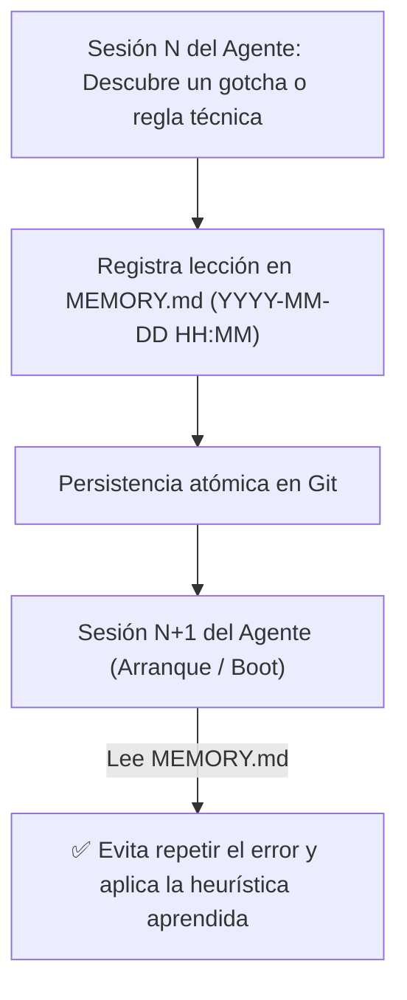

<!-- ======================================================================= -->
<!-- BP RECOMENDADA: bp_0912_knowledge_loops_and_repo_learning               -->
<!-- BP RECOMENDADA: bp_0701_context_engineering_principles                  -->
<!-- Establece la memoria semántica a largo plazo del repositorio.           -->
<!-- ======================================================================= -->

# 01 - Especificación y Plantilla Maestra de MEMORY.md

Este documento define la **especificación técnica, arquitectura cognitiva y plantilla canónica de `MEMORY.md`**, el artefacto estándar para la persistencia de memoria semántica, heurísticas descubiertas y aprendizaje continuo del repositorio entre sesiones de agentes autónomos de IA.

---

## 1. Definición y Propósito del Archivo

### ¿Qué es MEMORY.md?
`MEMORY.md` es la **memoria a largo plazo (memoria semántica y epistémica)** del repositorio. Almacena las lecciones aprendidas, trampas de librerías (*gotchas*), decisiones sutiles de diseño, reglas de sintaxis particulares y soluciones a errores recurrentes descubiertos por agentes de IA y desarrolladores humanos a lo largo del tiempo.

### ¿Por qué existe y qué problemas resuelve?
1. **Eliminación de la Amnesia Multi-Turno:** Los modelos de IA no retienen memoria nativa entre sesiones de chat o ejecuciones aisladas de CLI. `MEMORY.md` proporciona un ancla persistente en el sistema de archivos (*File-Based Memory*).
2. **Prevención de Errores Recurrentes (Trial-and-Error Loop):** Evita que un nuevo agente intente una solución fallida que ya fue descartada en una sesión anterior.
3. **Optimización del Presupuesto de Atención:** Mantiene un índice compacto de conocimientos de alto valor (menos de 200 líneas) para ser inyectado o consultado en el arranque de la sesión (*Session Boot*).



---

## 2. Plantilla Maestra Canónica de MEMORY.md

```markdown
# Memoria del Repositorio y Aprendizaje Continuo (MEMORY.md)

Este archivo almacena lecciones aprendidas, heurísticas de código, dependencias críticas y decisiones técnicas descubiertas durante la interacción con este repositorio. Todos los agentes deben consultar este archivo al iniciar una sesión y registrar nuevos aprendizajes relevantes.

---

## 1. Reglas y Heurísticas Críticas Aprendidas

<!-- ======================================================================= -->
<!-- Formato: [YYYY-MM-DD HH:MM] [Módulo/Área] Descripción de la lección     -->
<!-- ======================================================================= -->

- **[2026-08-27 18:30] [Codificación UTF-8 & Windows]:** En entornos Windows, los scripts de PowerShell y Python deben forzar `encoding='utf-8'` explícito al leer/escribir archivos para evitar corrupción de caracteres especiales en Markdown.
- **[2026-08-27 20:15] [Modelos Pydantic v2]:** Prohibido usar `@validator` en modelos nuevos; emplear obligatoriamente `@field_validator(mode='before'/'after')` y `model_validate()`.
- **[2026-08-27 21:40] [Diagramas Mermaid]:** Queda terminantemente prohibido generar flujos con flechas de texto plano (`->`, `-->`). Todo diagrama debe utilizar ` ```mermaid ` con nodos tipados y comillas dobles.

---

## 2. Trampas de Dependencias y Entorno (*Gotchas*)

- **Librería X (v2.4+):** No invocar `client.connect_sync()` dentro de un event loop asíncrono existente; genera un `RuntimeError: Event loop is closed`. Usar `await client.connect_async()`.
- **Base de Datos SQLite en Tests:** La base de datos en memoria para pruebas unitarias requiere la URI `sqlite:///:memory:?cache=shared` para evitar que las transacciones en hilos secundarios queden bloqueadas.

---

## 3. Preferencias de Estilo y Convenciones Descubiertas

- **Manejo de Errores:** Nunca emitir `except Exception: pass`. Toda captura debe transformarse en una excepción de dominio tipada con causa raíz (`raise DomainError(...) from err`).
- **Scripts Temporales:** Todo script de diagnóstico o prueba destructiva DEBE crearse en `sandbox/` y nunca en la raíz ni en `src/`.

---

## 4. Índice de Documentación Especializada

- Para arquitectura detallada y topología de capas: ver `ARCHITECTURE.md`.
- Para matriz de permisos de herramientas y guardrails: ver `AGENTS.md`.
- Para glosario de términos del dominio: ver `GLOSSARY.md`.
```

---

## 3. Protocolo de Mantenimiento y Poda (*Memory Pruning*)

1. **Alta Densidad de Señal:** `MEMORY.md` no es una bitácora de tareas (para eso existe `PROGRESS.md`). Solo debe registrar hechos y heurísticas permanentes.
2. **Poda Periódica:** Si una lección registrada en `MEMORY.md` se formaliza en el código base o en `AGENTS.md` / `ARCHITECTURE.md`, debe removerse de `MEMORY.md` para mantener el archivo por debajo de 200 líneas.
