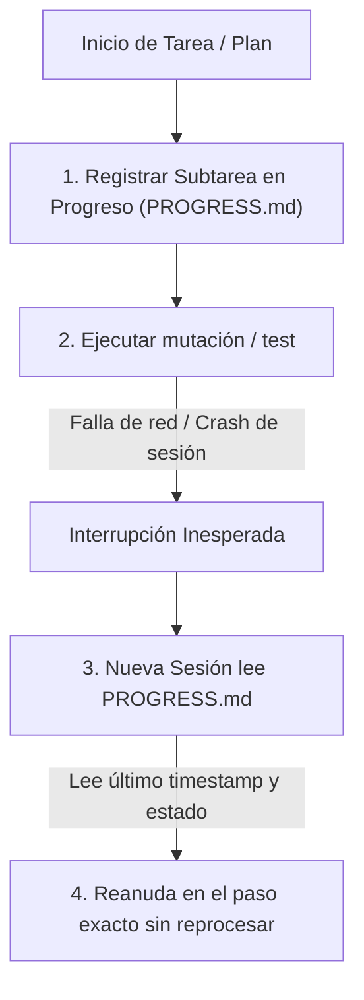

<!-- ======================================================================= -->
<!-- BP RECOMENDADA: bp_0511_checkpointing_and_rollback                      -->
<!-- BP RECOMENDADA: bp_0819_task_artifacts_and_state_retention              -->
<!-- Establece la memoria episódica y de trabajo en tiempo real del agente.  -->
<!-- ======================================================================= -->

# 02 - Especificación y Plantilla Maestra de PROGRESS.md / PROCESS.md

Este documento define la **especificación técnica, protocolo de checkpointing y plantilla canónica de `PROGRESS.md` (o `PROCESS.md`)**, el artefacto estándar para el seguimiento en tiempo real del estado de tareas, checkpoints atómicos y transferencias de sesión (*Session Handoffs*) en ingeniería agéntica.

---

## 1. Definición y Propósito del Archivo

### ¿Qué es PROGRESS.md / PROCESS.md?
`PROGRESS.md` es la **memoria episódica y libro contable de ejecución (*Execution Ledger*)** del repositorio. Registra el desglose paso a paso de las tareas activas, el estado de cada subtarea, marcas temporales de alta precisión (`YYYY-MM-DD HH:MM:SS`), bloqueos detectados y el puntero al siguiente paso inmediato.

### ¿Por qué existe y qué problemas resuelve?
1. **Resiliencia ante Caídas y Cortes de Energía:** Si la sesión se interrumpe abruptamente por corte eléctrico, reinicio de IDE o timeout de API, el agente reanuda leyendo `PROGRESS.md` sin repetir trabajo ya realizado.
2. **Transferencia Impecable de Sesiones (*Handoffs*):** Permite que un agente en un turno posterior o un subagente paralelo continúe exactamente donde se quedó el agente previo.
3. **Transparencia y Auditoría Humana:** El desarrollador puede inspeccionar con `git status` o abrir el archivo en cualquier momento para ver exactamente qué está haciendo la IA.



---

## 2. Plantilla Maestra Canónica de PROGRESS.md

```markdown
# Registro de Avance y Estado de Ejecución (PROGRESS.md)

Este documento registra el diario de trabajo en tiempo real, estado de subtareas, checkpoints de ejecución y transferencias de contexto para desarrolladores y agentes de IA.

---

## 1. Tarea Activa: [Nombre Breve del Objetivo / Feature / Bug]

- **ID de Tarea:** `task_01j7w2b8k4z0v9m1x2c3d4e5f6`
- **Estado Global:** `[EN_PROCESO | EN_VERIFICACION | COMPLETADO | BLOQUEADO]`
- **Fecha de Inicio:** `2026-08-27 22:00:00`
- **Última Actualización:** `2026-08-27 22:45:12`

---

## 2. Desglose de Subtareas y Checkpoints

- [x] **Subtarea 1: Análisis e inspección de dependencias** `[COMPLETADO: 2026-08-27 22:15:30]`
  - *Archivos leídos:* `pyproject.toml`, `src/core/config.py`.
  - *Resultado:* Se identificó la necesidad de añadir `pydantic-settings`.
- [x] **Subtarea 2: Creación de modelo de configuración inmutable** `[COMPLETADO: 2026-08-27 22:30:15]`
  - *Archivos mutados:* `src/core/settings.py`.
  - *Tests ejecutados:* `pytest tests/unit/test_settings.py` (3 passed).
- [/] **Subtarea 3: Refactorización de servicios de aplicación** `[EN_PROCESO: 2026-08-27 22:45:12]`
  - *Paso actual:* Migrando `src/services/pipeline.py` para inyectar `Settings`.
  - *Bloqueos:* Ninguno.
- [ ] **Subtarea 4: Validación integral de DoD y linting** `[PENDIENTE]`
- [ ] **Subtarea 5: Sincronización de documentación y commit atómico** `[PENDIENTE]`

---

## 3. Próximo Paso Inmediato

> Continuar la edición de `src/services/pipeline.py` en la línea 45 para reemplazar `os.environ` por el nuevo objeto `Settings.pipeline_timeout`. Ejecutar `pytest tests/unit/test_pipeline.py`.

---

## 4. Historial Reciente de Tareas Completadas

| **Fecha / Hora** | **Tarea / Feature** | **Archivos Modificados** | **Estado Final** |
|:---|:---|:---|:---:|
| `2026-08-27 21:00:00` | Creación de plantilla `AGENTS.md` | `formato_minimo/AGENTS.md` | ✅ Completado |
| `2026-08-27 21:30:00` | Estandarización de `.gitignore` | `formato_minimo/gitignore_template.md` | ✅ Completado |
```

---

## 3. Protocolo de Sincronización Pre-Push

1. **Marcas Temporales Estrictas:** Cada entrada de progreso debe incluir timestamp con segundos (`YYYY-MM-DD HH:MM:SS`).
2. **Commit Atómico de Despliegue:** Antes de ejecutar `git push`, `PROGRESS.md` debe actualizarse con el estado final de la tarea e incluirse dentro del commit para garantizar un historial consistente.
