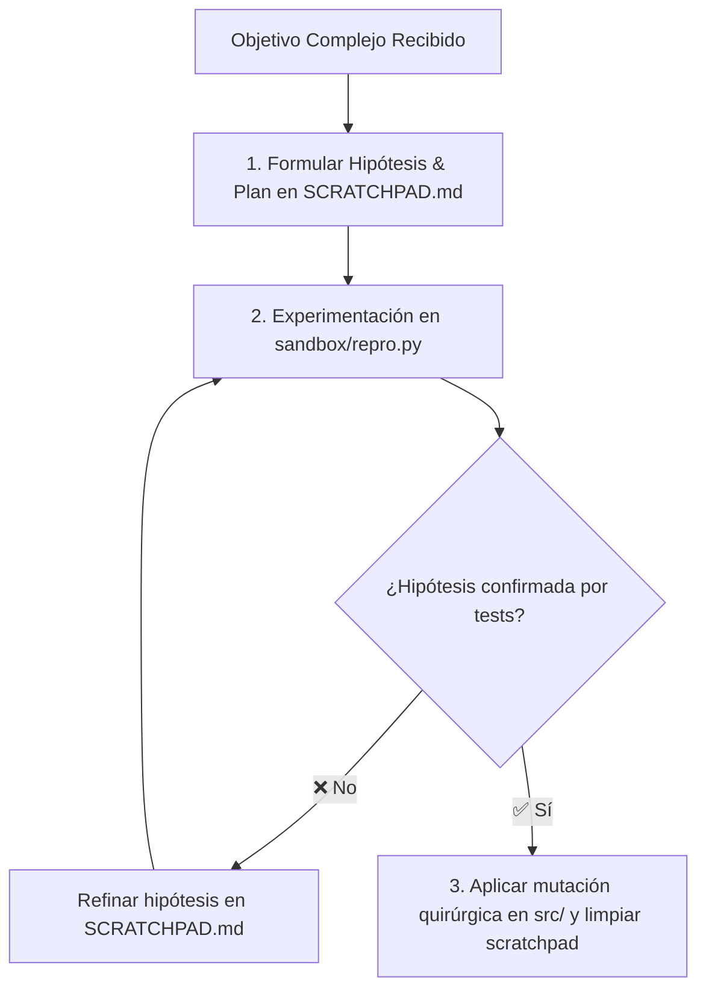

<!-- ======================================================================= -->
<!-- BP RECOMENDADA: bp_0910_worktree_isolation_and_parallel_exploration     -->
<!-- BP RECOMENDADA: bp_0703_high_signal_to_noise_ratio                      -->
<!-- Establece la memoria de trabajo transitoria y planificación activa.     -->
<!-- ======================================================================= -->

# 03 - Especificación y Plantilla Maestra de SCRATCHPAD.md / PLAN.md

Este documento define la **especificación técnica, ciclo de vida y plantilla canónica de `SCRATCHPAD.md` (o `PLAN.md`)**, el artefacto estándar para la memoria de trabajo transitoria, formulación de hipótesis y planificación estructurada antes de ejecutar mutaciones en el código fuente.

---

## 1. Definición y Propósito del Archivo

### ¿Qué es SCRATCHPAD.md / PLAN.md?
`SCRATCHPAD.md` (o `PLAN.md`) es la **memoria de trabajo temporal (*Working Memory*)** del agente. Es un espacio de borrador estructurado donde el modelo organiza sus pensamientos, descompone problemas complejos en hipótesis testeables, evalúa alternativas arquitectónicas y diseña el plan de ataque antes de tocar archivos de producción.

### ¿Por qué existe y qué problemas resuelve?
1. **Prevención de Mutaciones Precipitadas (*Look Before You Leap*):** Fuerza al agente a validar la viabilidad de un cambio antes de modificar múltiples archivos.
2. **Aislamiento de Razonamiento:** Evita que el agente contamine los archivos de documentación permanente con notas tentativas de depuración.
3. **Compatibilidad con Sandboxing:** Reside habitualmente en `sandbox/` o en un directorio efímero `.ai/` / `scratch/`.



---

## 2. Plantilla Maestra Canónica de SCRATCHPAD.md / PLAN.md

```markdown
# Memoria de Trabajo y Plan de Ejecución (SCRATCHPAD.md)

Este documento es un espacio de trabajo temporal para la planificación activa, descomposición de hipótesis y análisis de trade-offs.

---

## 1. Comprensión del Problema y Alcance

- **Objetivo:** Refactorizar el módulo de parsing de AST para soportar expresiones matemáticas anidadas sin provocar recursión infinita.
- **Archivos Involucrados:** `src/core/parser.py`, `tests/unit/test_parser.py`.
- **Restricciones:** No modificar la signatura pública de `parse_expression()`.

---

## 2. Hipótesis Técnicas y Experimentos

### Hipótesis A: Transformar recursión directa en un bucle iterativo con pila explícita (*Stack-Based Parser*).
- *Pros:* Elimina el riesgo de `RecursionError` en árboles profundos.
- *Cons:* Mayor complejidad en la gestión del estado del token actual.
- *Experimento:* Crear prototipo en `sandbox/prototype_stack_parser.py`.

### Hipótesis B: Incrementar `sys.setrecursionlimit()`.
- *Evaluación:* ⛔ **Descartado.** Viola la buena práctica `bp_0103_kiss_principle` y enmascara problemas de diseño.

---

## 3. Plan Quirúrgico de Implementación

1. [ ] Crear caso de prueba de estrés que falle actualmente en `tests/unit/test_parser.py` (TDD Red).
2. [ ] Implementar la clase `TokenStack` en `src/core/parser.py`.
3. [ ] Reemplazar la llamada recursiva por el despacho iterativo de nodos.
4. [ ] Ejecutar suite de pruebas (`pytest`) hasta obtener pase completo (TDD Green).
5. [ ] Ejecutar `mypy --strict` y `ruff check`.
```

---

## 3. Reglas de Ciclo de Vida del Scratchpad

1. **Efimeridad Intencional:** El scratchpad se crea al iniciar una tarea compleja y puede limpiarse o archivarse al completar el DoD.
2. **Prohibición en Producción:** `SCRATCHPAD.md` nunca debe contener credenciales ni código sin revisar que pretenda desplegarse directamente.
