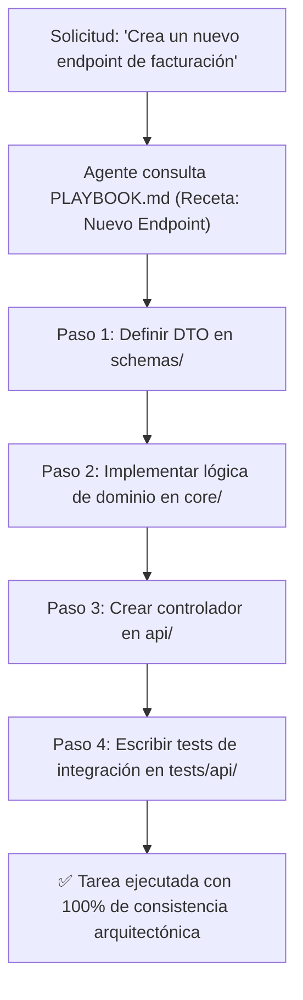

<!-- ======================================================================= -->
<!-- BP RECOMENDADA: bp_0603_runbooks_and_operational_documentation          -->
<!-- BP RECOMENDADA: bp_0607_facts_rules_and_procedures_separation           -->
<!-- Procedimientos deterministas paso a paso para tareas recurrentes.       -->
<!-- ======================================================================= -->

# 04 - Especificación y Plantilla Maestra de PLAYBOOK.md / SOP.md

Este documento define la **especificación técnica, catálogo de recetas y plantilla canónica de `PLAYBOOK.md` (o `docs/SOP.md`)**, el artefacto estándar para Procedimientos Operativos Estandarizados (*Standard Operating Procedures*) y guías deterministas de ejecución para agentes de IA.

---

## 1. Definición y Propósito del Archivo

### ¿Qué es PLAYBOOK.md / SOP.md?
`PLAYBOOK.md` es el **manual de procedimientos operativos ejecutables** del proyecto. Contiene recetas paso a paso (*Playbooks*) para tareas técnicas recurrentes (crear un nuevo microservicio, ejecutar una migración de base de datos, desplegar un hotfix, generar un nuevo endpoint de API, o benchmarkear rendimiento).

### ¿Por qué existe y qué problemas resuelve?
1. **Determinismo Procedimental (*Procedure Isolation*):** Los LLMs destacan siguiendo instrucciones paso a paso estructuradas. Un playbook previene que el agente olvide pasos intermedios críticos (ej. actualizar migraciones tras crear un modelo).
2. **Separación de Procedimientos:** Cumple con la regla de separar Hechos (Glosario), Reglas (AGENTS.md) y Procedimientos (Playbooks).
3. **Onboarding Instantáneo:** Cualquier agente o desarrollador puede ejecutar una tarea compleja simplemente invocando la receta correspondiente.



---

## 2. Plantilla Maestra Canónica de PLAYBOOK.md

```markdown
# Procedimientos Operativos Estandarizados (PLAYBOOK.md)

Este documento contiene las recetas técnicas oficiales paso a paso para la ejecución de tareas recurrentes en este repositorio.

---

## Receta 1: Creación de un Nuevo Servicio de Dominio

### Precondiciones:
- El entorno virtual está activo (`source .venv/bin/activate` o `.venv\Scripts\Activate.ps1`).
- Los tests actuales pasan (`pytest`).

### Procedimiento Paso a Paso:
1. **Definición de Tipos e Interfaces:**
   - Crear el contrato abstracto en `src/core/ports/<servicio>_port.py`.
   - Definir DTOs inmutables con Pydantic v2 en `src/schemas/<servicio>_dto.py`.
2. **Implementación de Lógica Pura:**
   - Implementar la clase concreta en `src/services/<servicio>_service.py`.
   - Asegurar tipado estricto (`mypy --strict`) y Google Docstrings completos.
3. **Suite de Pruebas:**
   - Crear `tests/unit/test_<servicio>_service.py` cubriendo casos felices y errores esperados.
4. **Verificación de Calidad:**
   - Ejecutar `pytest tests/unit/test_<servicio>_service.py -vv`.
   - Ejecutar `ruff check src/` y `ruff format --check src/`.

---

## Receta 2: Diagnóstico y Reproducción de Bugs Complejos

### Procedimiento:
1. Crear script mínimo de reproducción en `sandbox/repro_<issue>.py`.
2. Ejecutar el script y capturar la traza exacta de la excepción.
3. Formular la corrección mínima en `src/`.
4. Convertir el script de `sandbox/` en una prueba unitaria permanente en `tests/unit/`.
5. Eliminar el script de `sandbox/`.
```

---

## 3. Guía de Mantenimiento de Playbooks

1. **Atomicidad de Pasos:** Cada paso debe ser verificable mediante un comando o aserción.
2. **Inmutabilidad de Reglas:** Los playbooks deben respetar siempre los contratos de `ARCHITECTURE.md` y `AGENTS.md`.
