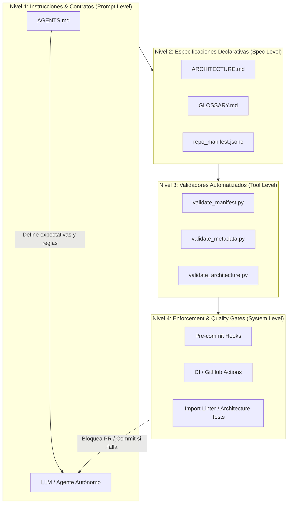
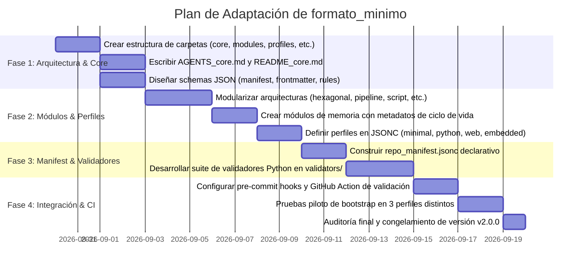

# Plan Maestro de Adaptación: Evolución de `formato_minimo` hacia un Framework Modular, Universal y Adaptativo para Repositorios Agénticos

---
id: doc_plan_adaptacion_formato_minimo_v2
name: plan_adaptacion_formato_minimo
title: "Plan Maestro de Adaptación y Universalización de formato_minimo (BASE-IA)"
file_path: PLAN_ADAPTACION_FORMATO_MINIMO.md
version: 2.0.0
category: architecture_plan
tags: [architecture, bootstrap, agentic-engineering, profiles, modularity, enforcement, validation, manifests]
description: "Hoja de ruta estratégica y especificación técnica para refactorizar formato_minimo de una plantilla estática a un ecosistema declarativo de perfiles, severidades graduadas y validación ejecutable."
owner: AI Engineering & Architecture Team
status: completed
created_at: 2026-08-29T20:48:00Z
updated_at: 2026-08-29T20:48:00Z
schema_version: 1.0.0
---

> [!NOTE]
> **Origen del Plan:** Este documento consolida el diagnóstico crítico y la estrategia de refactorización para el módulo [`formato_minimo`](file:///G:/REPOSITORIOS%20GITHUB/BASE%20IA/formato_minimo) del ecosistema `BASE-IA`. Conserva el ~85% de los fundamentos metodológicos sobresalientes (separación documental, progressive disclosure, memoria multicapa, sandboxing) mientras resuelve la rigidez monolítica, la sobre-especificación arquitectónica y la ausencia de validación automatizada.

---

## 1. Diagnóstico Ejecutivo y Objetivos de la Transformación

### 1.1 Estado Actual vs. Estado Deseado

```mermaid
flowchart LR
    subgraph Estado_Actual ["Estado Actual: Plantilla Monolítica Rígida"]
        A1["Estructura Única Fija<br/>(Hexagonal + DDD + Frontmatter Completo)"]
        A2["Reglas Binarias Absolutas<br/>(MUST / PROHIBIDO / INVIOLABLE)"]
        A3["Catálogo Pasivo<br/>(repo_minimo.jsonc informativo)"]
        A4["Enforcement Basado en Confianza<br/>(Solo prompts e instrucciones Markdown)"]
    end

    subgraph Transformacion ["Evolución Arquitectónica"]
        T1["Modularización & Perfiles"]
        T2["Graduación de Severidad RFC 2119"]
        T3["Manifest Declarativo de Composición"]
        T4["Quality Gates Ejecutables en CI"]
    end

    subgraph Estado_Futuro ["Estado Futuro: Framework Declarativo Adaptativo"]
        F1["Núcleo Mínimo + Módulos Conectables<br/>(Perfiles: minimal, python, web, embedded, etc.)"]
        F2["Taxonomía de Autoridad Graduada<br/>(MUST, SHOULD, MAY, PROJECT, AUTO)"]
        F3["Manifest Activo de Composición<br/>(requires, conflicts, generates, validates)"]
        F4["Arquitectura Ejecutable en 4 Niveles<br/>(Prompt -> Specs -> Validators -> CI/Hooks)"]
    end

    Estado_Actual --> Transformacion --> Estado_Futuro
```



### 1.2 Objetivos Estratégicos
1. **Universalidad Real:** Permitir que `formato_minimo` inicialice con precisión desde un script matemático o un firmware de microcontrolador en C++, hasta un backend distribuido o un sistema multi-agente complejo, sin imponer sobrecarga estructural ("evitar convertir una calculadora en SAP").
2. **Desacoplamiento de Arquitectura:** Convertir la Arquitectura Hexagonal en un módulo especializado y opcional, ofreciendo alternativas estándar (Capas Ligeras, Monolito Modular, Pipelines de Datos, Script/CLI, Notebooks de Investigación, Bare-Metal/Embedded).
3. **Taxonomía de Autoridad Gradual:** Reemplazar prohibiciones absolutas indistintas por una matriz formal de severidad inspirada en RFC 2119 / RFC 8174 (`MUST`, `MUST_NOT`, `SHOULD`, `SHOULD_NOT`, `MAY`, `PROJECT`, `AUTO`).
4. **Manifest Declarativo de Composición:** Evolucionar [`repo_minimo.jsonc`](file:///G:/REPOSITORIOS%20GITHUB/BASE%20IA/formato_minimo/repo_minimo.jsonc) hacia un `repo_manifest.jsonc` con dependencias, exclusiones, validadores asociados y reglas de generación automática.
5. **Arquitectura Ejecutable (De la Promesa al Validador):** Implementar scripts de validación deterministas (`validators/`) integrables con Git hooks y CI/CD para auditar la estructura, metadatos y límites de dependencias de forma programática.
6. **Refinamiento Conceptual Riguroso:**
   - Sustituir *"O(1) de tokens"* por *"Minimización del consumo de contexto mediante Progressive Disclosure e indexación estructurada"*.
   - Reemplazar *"Zero Blast Radius"* por *"Blast Radius Controlado"* con niveles de aislamiento explícitos (organizativo vs. sandbox técnico).
   - Flexibilizar la diagramación formal (Mermaid donde aporte valor; texto plano/ASCII limpio donde simplifique).
   - Calibrar `GLOSSARY.md` hacia anclaje de términos propios del proyecto y desambiguación, no diccionarios genéricos de la industria.
   - Incorporar ciclo de vida, TTL y metadatos de vigencia en el sistema de persistencia y memoria (`MEMORY.md`).

---

## 2. Nueva Topología de Directorios para `formato_minimo`

La estructura de carpetas se reorganiza bajo un patrón de **Núcleo + Módulos + Perfiles + Esquemas + Validadores**:

```yaml
formato_minimo/
├── core/                                 # 🟢 Núcleo Universal Mínimo Obligatorio (Zero Overhead)
│   ├── AGENTS_core.md                   # Constitución operativa base y reglas universales
│   ├── README_core.md                   # Estructura de presentación y disclosure progresivo
│   ├── repo_manifest.jsonc              # Manifest declarativo del ecosistema y reglas de composición
│   ├── gitignore_core                   # Exclusiones universales (secretos, temporales, SO)
│   └── editorconfig_core                # Normalización UTF-8, LF, trim trailing whitespace
│
├── modules/                              # 🧩 Módulos Funcionales Opcionales y Acoplables
│   ├── architecture/                    # Patrones topológicos seleccionables
│   │   ├── hexagonal_template.md        # Puertos y Adaptadores (Backends, APIs, Microservicios)
│   │   ├── layered_template.md          # Capas clásicas (Apps estándar)
│   │   ├── pipeline_template.md         # Flujos de datos, ETLs y simulaciones
│   │   ├── script_cli_template.md       # Utilidades simples y herramientas de línea de comandos
│   │   ├── notebook_research_template.md# Proyectos de Ciencia de Datos y Research
│   │   └── embedded_template.md         # Proyectos en C/C++/Rust para microcontroladores
│   ├── glossary/                        # Glosario y anclaje semántico de dominio
│   │   └── GLOSSARY_template.md         # Plantilla focalizada en desambiguación del proyecto
│   ├── memory/                          # Sistema de memoria agéntica estructurada
│   │   ├── MEMORY_template.md           # Memoria semántica con metadatos de vigencia (TTL/Confidence)
│   │   ├── PROGRESS_template.md         # Memoria episódica y ledger de tareas activas
│   │   ├── SCRATCHPAD_template.md       # Memoria de trabajo e hipótesis temporales
│   │   └── PLAYBOOK_template.md         # Memoria procedimental (SOPs y recetas repetibles)
│   ├── sandbox/                         # Laboratorio de experimentación aislada
│   │   ├── sandbox_guide.md             # Guía de gobernanza y ciclo de promoción
│   │   ├── sandbox_readme.md            # README interno para sandbox/
│   │   └── sandbox_gitignore            # Reglas de aislamiento de Git
│   ├── adr/                             # Registro de decisiones de arquitectura
│   │   ├── adr_template.md              # Plantilla MADR / RFC simplificada
│   │   └── adr_index_template.md        # Índice semántico de ADRs
│   ├── testing/                         # Estándares de calidad y testing
│   │   ├── pytest_template.ini          # Configuración estándar de pytest
│   │   └── conftest_template.py         # Fixtures canónicos y mocks deterministas
│   ├── ci/                              # Automatización y Quality Gates
│   │   ├── pre_commit_template.yaml     # Configuración de ganchos de commit
│   │   └── github_workflow_ci.yaml      # Pipeline canónico de CI (Linters + Tests + Audit)
│   └── security/                        # Guardrails de seguridad y gestión de secretos
│       ├── security_policy_template.md  # Política de reporte de vulnerabilidades
│       └── env_example_template         # Plantilla de variables de entorno sin secretos
│
├── profiles/                             # 🎯 Perfiles Predefinidos de Composición
│   ├── minimal/                         # Núcleo puro (Scripts, repos pequeños, POCs de 1 día)
│   │   └── profile.jsonc
│   ├── python_service/                  # APIs, Backends y Microservicios Python
│   │   └── profile.jsonc
│   ├── web_frontend/                    # Proyectos TypeScript, React, Next, Vue
│   │   └── profile.jsonc
│   ├── embedded_iot/                    # C/C++, Rust bare-metal, Arduino, ESP32
│   │   └── profile.jsonc
│   ├── library_sdk/                     # Bibliotecas públicas reutilizables
│   │   └── profile.jsonc
│   ├── research_datascience/            # Notebooks, experimentación de ML, papers
│   │   └── profile.jsonc
│   ├── documentation_only/              # Wikis técnicas, especificaciones y libros DaC
│   │   └── profile.jsonc
│   └── agentic_system/                  # Multi-agentes, entornos MCP, workflows autónomos
│       └── profile.jsonc
│
├── schemas/                              # 📐 Esquemas de Validación JSON Schema (Draft 2020-12)
│   ├── manifest.schema.json             # Esquema del manifest de composición
│   ├── frontmatter.schema.json          # Esquema de metadatos YAML
│   ├── rules.schema.json                # Esquema de reglas operativas del agente
│   └── memory_entry.schema.json         # Esquema de entradas de memoria con TTL/confianza
│
└── validators/                           # ⚙️ Suite de Validación Automática y Enforcement
    ├── validate_manifest.py             # Valida coherencia del manifest, perfiles y módulos
    ├── validate_metadata.py             # Valida frontmatter YAML de todos los documentos
    ├── validate_rules.py                # Valida que AGENTS.md cumpla la taxonomía de severidad
    └── validate_architecture.py         # Valida imports y límites arquitectónicos declarados
```

---

## 3. Taxonomía de Severidad y Niveles de Autoridad

Para evitar la saturación de términos como *"INVIOLABLE"* y *"PROHIBIDO"*, se instaura una taxonomía de 7 niveles de autoridad compatible con el estándar **RFC 2119** y adaptada al desarrollo con agentes:

| Nivel de Autoridad | Código | Definición Operativa para el Agente | Acción en Caso de Conflicto | Ejemplo Canónico |
|:---|:---:|:---|:---|:---|
| **Obligatorio Crítico** | `MUST` / `MANDATORY` | Requisito de seguridad, integridad o invariante fundamental del sistema. | **Prohibido violar.** Abortar la operación si el prompt lo solicita. | No exponer secretos en commits ni logs. |
| **Prohibición Absoluta** | `MUST_NOT` / `FORBIDDEN` | Acción que introduce riesgos de seguridad, corrupción de datos o fugas. | **Prohibido ejecutar.** Rechazar y notificar al usuario. | `core/` no debe importar `adapters/` o bases de datos directas. |
| **Recomendado** | `SHOULD` / `RECOMMENDED` | Buena práctica estándar de ingeniería o convención del repositorio. | **Seguir por defecto.** Permitido desviarse únicamente con justificación técnica explícita. | Usar diagramas Mermaid para flujos complejos de arquitectura. |
| **Desaconsejado** | `SHOULD_NOT` / `DISCOURAGED` | Antipatrión o práctica que incrementa deuda técnica o ruido. | **Evitar.** Si es necesario, documentar la razón en `SCRATCHPAD.md`. | Evitar scripts ejecutables sueltos fuera de `sandbox/` o `scripts/`. |
| **Opcional / Permitido** | `MAY` / `OPTIONAL` | Capacidad a discreción del desarrollador o del agente según conveniencia. | **Libre elección.** No requiere justificación formal. | Incluir diagramas ASCII concisos si son más claros que Mermaid. |
| **Específico del Proyecto** | `PROJECT` / `CONTEXTUAL` | Regla o preferencia propia del repositorio y del stack tecnológico elegido. | **Prevalece dentro del proyecto**, pero no es una ley universal transferible. | Usar Python 3.11+, TailwindCSS o FastAPI en este repositorio. |
| **Inferencia Autónoma** | `AUTO` / `ADAPTIVE` | Decisión delegada al agente de IA evaluando el contexto, tamaño y perfil. | **El agente evalúa** complejidad y activa/desactiva componentes. | Decidir si el repo requiere `ADR/` o basta con registrar en `MEMORY.md`. |

---

## 4. Especificación del Manifest Declarativo (`repo_manifest.jsonc`)

El archivo [`repo_minimo.jsonc`](file:///G:/REPOSITORIOS%20GITHUB/BASE%20IA/formato_minimo/repo_minimo.jsonc) evoluciona a un **manifiesto de composición declarativa** estructurado bajo el esquema [`manifest.schema.json`](file:///G:/REPOSITORIOS%20GITHUB/BASE%20IA/formato_minimo/schemas/manifest.schema.json).

### 4.1 Ejemplo de Declaración de Módulo en `repo_manifest.jsonc`:
```jsonc
{
  "$schema": "./schemas/manifest.schema.json",
  "id": "manifest_base_ia_v2",
  "version": "2.0.0",
  "core_files": [
    "core/AGENTS_core.md",
    "core/README_core.md",
    "core/repo_manifest.jsonc",
    "core/gitignore_core",
    "core/editorconfig_core"
  ],
  "modules": {
    "module_architecture_hexagonal": {
      "id": "mod_arch_hex",
      "name": "Arquitectura Hexagonal (Puertos y Adaptadores)",
      "source": "modules/architecture/hexagonal_template.md",
      "target": "ARCHITECTURE.md",
      "profiles": ["python_service", "web_frontend", "library_sdk", "agentic_system"],
      "requires": ["core"],
      "conflicts": ["module_architecture_pipeline", "module_architecture_script"],
      "validators": ["validators/validate_architecture.py"],
      "severity_rules": {
        "core_isolation": "MUST_NOT",
        "diagrams_formal": "SHOULD"
      }
    },
    "module_memory_system": {
      "id": "mod_memory",
      "name": "Sistema de Memoria Cognitiva Multicapa",
      "source_dir": "modules/memory/",
      "target_dir": ".agent/memory/",
      "profiles": ["python_service", "agentic_system", "research_datascience"],
      "requires": ["core"],
      "conflicts": [],
      "validators": ["validators/validate_metadata.py"],
      "ttl_policy_enabled": true
    },
    "module_sandbox": {
      "id": "mod_sandbox",
      "name": "Laboratorio de Pruebas con Blast Radius Controlado",
      "source_dir": "modules/sandbox/",
      "target_dir": "sandbox/",
      "profiles": ["minimal", "python_service", "web_frontend", "embedded_iot", "library_sdk", "research_datascience", "agentic_system"],
      "isolation_level": "organizational_with_escalation"
    }
  },
  "profiles_definition": {
    "minimal": {
      "description": "Núcleo ultraligero para utilidades, scripts de un archivo o prototipos rápidos.",
      "enabled_modules": ["module_sandbox"],
      "auto_modules": []
    },
    "python_service": {
      "description": "Servicios Backend, APIs y Microservicios robustos en Python.",
      "enabled_modules": [
        "module_architecture_hexagonal",
        "module_glossary",
        "module_memory_system",
        "module_sandbox",
        "module_adr",
        "module_testing",
        "module_ci"
      ]
    },
    "embedded_iot": {
      "description": "Sistemas embebidos, firmware en C/C++/Rust y código para hardware.",
      "enabled_modules": [
        "module_architecture_embedded",
        "module_sandbox",
        "module_testing"
      ]
    }
  }
}
```

---

## 5. Reajustes Específicos por Componente

### 5.1 `AGENTS.md` (Modular y Calibrado)
- **Separación de Capas:**
  - `AGENTS_core.md` contiene las **5 Reglas Universales Inviolables** (Seguridad de credenciales, límites de herramientas destructivas, confirmación ante ambigüedad crítica, cambios atómicos y verificación antes de entrega).
  - Los estándares de lenguaje (Python PEP 585/604, C++20, TypeScript) se inyectan como extensiones del perfil elegido.
- **Interoperabilidad Nativa Multi-IDE:** Generación de enlaces simbólicos o stubs ligeros para `.cursorrules`, `CLAUDE.md`, `.clinerules` y `copilot-instructions.md` que apunten a `AGENTS.md` como Single Source of Truth (SSOT).

### 5.2 `ARCHITECTURE.md` (Catálogo Plural de Patrones)
- **Eliminación del Dogma Hexagonal Único:**
  - Provisión de 6 plantillas según el perfil del proyecto.
  - Para un proyecto `minimal` o script CLI: arquitectura basada en pipeline simple de 3 etapas (`Parse -> Execute -> Output`).
  - Para `embedded_iot`: separación `Hardware Abstraction Layer (HAL) -> Drivers -> Application Logic`.
  - Para `research_datascience`: `Data Ingestion -> Processing Pipeline -> Feature Store -> Model -> Evaluation`.
  - Para `python_service` y sistemas agénticos: mantener la arquitectura hexagonal completa con diagramas Mermaid y máquinas de estado finito (FSM).

### 5.3 `GLOSSARY.md` (Anclaje Ontológico Focalizado)
- **Enfoque en Términos Específicos y Polisémicos:**
  - Eliminar definiciones de términos universales de la industria (API, JSON, REST, CRUD, HTTP).
  - Estructurar el glosario exclusivamente en:
    1. **Entidades Propias del Dominio:** ¿Qué es un `Expediente`, `Slot`, `Tenant` o `DeviceSession` en este repositorio?
    2. **Conceptos Redefinidos / Sobrecargados:** Términos con acepciones múltiples donde el proyecto adopta una interpretación estricta.
    3. **Invariantes del Negocio:** Límites de dominio que el agente debe respetar sin asumir.

### 5.4 Sistema de Persistencia y Memoria (`persistencia_y_memoria/`)
- **Incorporación de Metadatos de Ciclo de Vida y Vigencia:**
  - Cada entrada en `MEMORY.md` debe incluir metadatos estructurados para evitar obsolescencia y deuda técnica:
    ```yaml
    - id: mem_01m13x99...
      timestamp: "2026-08-29T20:50:00Z"
      scope: "database_drivers"
      confidence: "high"         # high | medium | low
      source: "empirical_test"    # empirical_test | user_instruction | documentation
      last_validated: "2026-08-29"
      expires_at: "2027-02-28"    # Opcional (TTL de 6 meses para dependencias volátiles)
      rule: "En SQLite in-memory multihilo, usar URI sqlite:///:memory:?cache=shared."
    ```
- **Protocolo de Poda Automatizable:**
  - Mantener `MEMORY.md` por debajo de 150 líneas activas mediante purga de memorias expiradas o consolidadas en el código permanente.

### 5.5 `sandbox/` (Aislamiento Calibrado: *Blast Radius Controlado*)
- **Precisión Técnica en las Garantías:**
  - Sustituir la afirmación de "Zero Blast Radius" por **Blast Radius Controlado**.
  - Documentar las 3 capas de aislamiento:
    1. **Nivel 1 (Aislamiento Organizativo - Default):** Directorio `sandbox/` en `.gitignore`, `src/` no importa desde `sandbox/`.
    2. **Nivel 2 (Aislamiento de Control de Versiones):** `git worktree` o rama efímera `agent/scratch-*`.
    3. **Nivel 3 (Aislamiento de Entorno de Ejecución - Avanzado):** Contenedores Docker temporales, subprocesos sin acceso a red y variables de entorno mockeadas.

### 5.6 Precisión en Context Engineering y Diagramación
- **Sustitución de "O(1) de tokens":** Documentar formalmente como: *"Minimización del consumo de ventana de contexto mediante Progressive Disclosure (Índice -> Frontmatter -> Cuerpo Focalizado)"*.
- **Flexibilización de Diagramas:**
  - `SHOULD`: Utilizar Mermaid para diagramas de arquitectura, secuencias complejas y máquinas de estado en entornos con soporte de renderizado.
  - `MAY`: Utilizar diagramas de texto plano o ASCII en scripts simples, comentarios de código o terminales donde Mermaid resulte inaccesible o excesivo.

---

## 6. Sistema de Ejecución y Enforcement en 4 Niveles



### 6.1 Catálogo de Validadores Python (`validators/`)
1. **`validate_manifest.py`:**
   - Comprueba que todos los archivos declarados en `repo_manifest.jsonc` existan físicamente.
   - Valida coherencia de perfiles (que no existan conflictos como `hexagonal` y `pipeline` simultáneos).
2. **`validate_metadata.py`:**
   - Parsea el Frontmatter YAML de todos los `.md` y valida que cumplan con `frontmatter.schema.json`.
   - Verifica unicidad de `id` (TypeID / Slugs) y formato ISO 8601 en timestamps.
3. **`validate_rules.py`:**
   - Audita que las directivas en `AGENTS.md` utilicen la taxonomía de severidad estandarizada (`MUST`, `SHOULD`, `MAY`, `PROJECT`, `AUTO`).
4. **`validate_architecture.py`:**
   - Utiliza el AST de Python para verificar que ningún módulo dentro de `src/**/core/` o `src/**/domain/` importe módulos de `adapters/`, `infra/` o librerías externas de E/S.

---

## 7. Plan de Implementación y Fases de Ejecución

### 🗓️ Cronograma de Ejecución



### Detalle de Tareas por Fase:

#### Fase 1: Descomposición Estructural y Creación del Core
- [x] Crear la estructura de carpetas: `formato_minimo/core/`, `formato_minimo/modules/`, `formato_minimo/profiles/`, `formato_minimo/schemas/`, `formato_minimo/validators/`.
- [x] Extraer el núcleo universal en `core/AGENTS_core.md` y `core/README_core.md`.
- [x] Implementar los esquemas JSON Schema (`schemas/manifest.schema.json`, `schemas/frontmatter.schema.json`, `schemas/memory_entry.schema.json`).

#### Fase 2: Modularización de Componentes y Perfiles
- [x] Descomponer [`ARCHITECTURE_template.md`](file:///G:/REPOSITORIOS%20GITHUB/BASE%20IA/formato_minimo/ARCHITECTURE_template.md) en 6 plantillas de arquitectura bajo `modules/architecture/`.
- [x] Actualizar [`MEMORY.md`](file:///G:/REPOSITORIOS%20GITHUB/BASE%20IA/formato_minimo/persistencia_y_memoria/MEMORY.md) para soportar `confidence`, `source`, `last_validated` y `expires_at`.
- [x] Calibrar [`sandbox_guide.md`](file:///G:/REPOSITORIOS%20GITHUB/BASE%20IA/formato_minimo/sandbox_guide.md) eliminando afirmaciones absolutas y formalizando los 3 niveles de aislamiento.
- [x] Crear los 8 perfiles JSONC bajo `profiles/` (`minimal`, `python_service`, `web_frontend`, `embedded_iot`, `library_sdk`, `research_datascience`, `documentation_only`, `agentic_system`).

#### Fase 3: Manifest Declarativo y Suite de Validación
- [x] Escribir `core/repo_manifest.jsonc` con la matriz completa de composición.
- [x] Crear scripts de validación deterministas en `validators/`:
  - `validate_manifest.py`
  - `validate_metadata.py`
  - `validate_rules.py`
  - `validate_architecture.py`

#### Fase 4: Automatización, Quality Gates y Pruebas Piloto
- [x] Diseñar `modules/ci/pre_commit_template.yaml` y `modules/ci/github_workflow_ci.yaml`.
- [x] Ejecutar 3 pruebas piloto de inicialización:
  1. *Piloto A (Minimal):* Script de cálculo numérico de un solo archivo.
  2. *Piloto B (Embedded):* Firmware bare-metal en C++ con HAL.
  3. *Piloto C (Agentic System):* API Backend en Python con herramientas MCP y memoria persistente.
- [x] Verificar que cada piloto genere únicamente los archivos requeridos sin dependencias superfluas.

---

## 8. Criterios de Aceptación y Definición de Terminado (DoD)

Para considerar completada la adaptación de `formato_minimo`, se deben satisfacer los siguientes criterios:

1. **Determinismo en Inicialización:** Un agente o script puede leer `repo_manifest.jsonc`, recibir un perfil (ej. `minimal` o `embedded_iot`) y generar el repositorio exacto sin intervención humana.
2. **Cero Violaciones de Esquema:** El 100% de los documentos Markdown y archivos JSONC pasan `validate_metadata.py` y `validate_manifest.py` con 0 errores.
3. **Desacoplamiento Verificado:** Ninguna regla específica de Python o Arquitectura Hexagonal reside dentro de `core/AGENTS_core.md`.
4. **Validación de Arquitectura Ejecutable:** El validador `validate_architecture.py` detecta y bloquea imports cruzados no permitidos entre capas.
5. **Precisión Conceptual:** Toda la documentación elimina reclamos de "O(1) de tokens" y "Zero Blast Radius absoluto", adoptando términos técnicamente exactos.

---
*Fin del Plan Maestro de Adaptación.*
