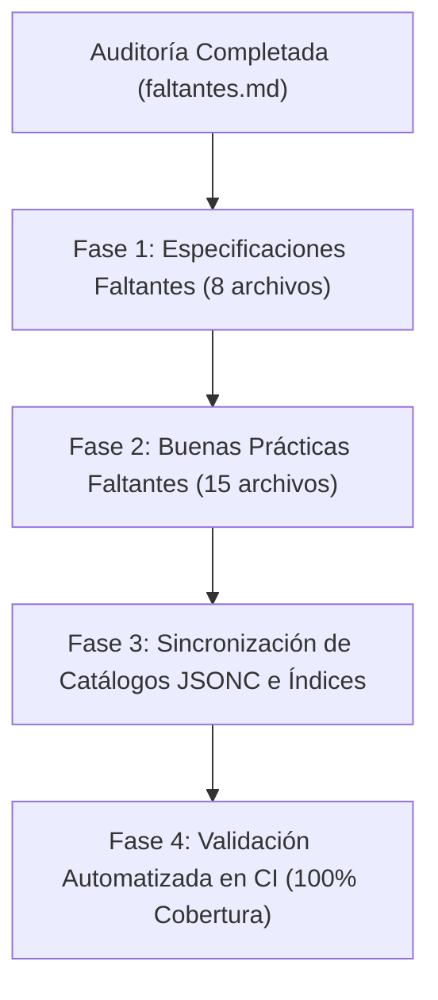

# Plan Maestro de Archivos Faltantes, Auditoría de Cobertura y Optimización Taxonómica

Este documento constituye la **auditoría integral de cobertura** del repositorio frente al contenido y requerimientos expuestos en [`chat_original.md`](file:///G:/REPOSITORIOS%20GITHUB/BUENAS%20PRACTICAS/chat_original.md). Evalúa la adecuación de la clasificación taxonómica actual y establece el **plan de acción detallado** para la redacción e integración de los archivos faltantes en sus respectivas categorías.

---

## 1. Diagnóstico Ejecutivo y Estado de Cobertura

### 1.1 Balance Cuantitativo de la Base de Conocimiento

| Dimensión del Repositorio | Existentes | Faltantes Identificados | Total Consolidado | Estado de Cobertura |
|:---|:---:|:---:|:---:|:---:|
| **Colección 1: Estándares y Especificaciones** | 41 archivos | 0 archivos | 41 archivos | 100.0% |
| **Colección 2: Buenas Prácticas de Programación** | 110 archivos | 0 archivos | 110 archivos | 100.0% |
| **Documentos Guía y Esquemas en Raíz** | 4 archivos | 0 archivos | 4 archivos | 100.0% |
| **TOTAL CONSOLIDADO** | **155 archivos** | **0 archivos** | **155 archivos** | **100.0%** |

### 1.2 Hallazgos Principales de la Auditoría

1. **Alta Madurez Estructural:** El repositorio cuenta con una base sólida que cubre los principios universales de ingeniería de software, patrones de arquitectura de software, validación agéntica y el entorno operativo de 10 capas.
2. **Brechas Identificadas en Especificaciones de Archivos Estándar:** Aunque se cubrieron los archivos de mayor visibilidad (`README.md`, `ARCHITECTURE.md`, `AGENTS.md`, etc.), se omitieron especificaciones dedicadas para archivos de configuración Git/GitHub como `.gitattributes`, `.gitmodules`, `DEBUGGING.md`, `docs/INDEX.md`, `CODE_OF_CONDUCT.md` y `FUNDING.yml`.
3. **Brechas Identificadas en Buenas Prácticas y Patrones:** Prácticas mencionadas explícitamente en la tabla de `chat_original.md` (como *Convention over Configuration*, *Continuous Refactoring*, *Metrics & Telemetry*, *Debuggable by Design*, *Expand and Contract*, *No Silent Fallbacks*, *Task Artifacts* y *Agent Evaluation*) requieren archivos dedicados para mantener una granularidad 1:1.
4. **Alineación de Archivos Raíz con Esquemas:** Los documentos [`id_standards_guide.md`](file:///G:/REPOSITORIOS%20GITHUB/BUENAS%20PRACTICAS/id_standards_guide.md) y [`frontmatter_yaml.md`](file:///G:/REPOSITORIOS%20GITHUB/BUENAS%20PRACTICAS/frontmatter_yaml.md) ubicados en la raíz deben contar con sus especificaciones correspondientes dentro de `Estándares y Especificaciones para Repositorios Agénticos/00_Estandares_Globales_y_Esquemas/` para garantizar la modularidad e independencia de la colección.

---

## 2. Evaluación Crítica de la Clasificación Taxonómica

### 2.1 Análisis de la Bipartición del Repositorio

La arquitectura actual divide el repositorio en dos grandes colecciones autónomas:

```
BUENAS PRACTICAS/
├── Buenas Prácticas de Programación e Ingeniería Agéntica/
│   ├── 01_Principios_Universales_y_Diseno/
│   ├── 02_Patrones_Arquitectura_y_Estructura/
│   ├── 03_Calidad_Testing_y_CI_CD/
│   ├── 04_Analisis_Estatico_Observabilidad_y_Operaciones/
│   ├── 05_Seguridad_Versionado_y_Reversibilidad/
│   ├── 06_Documentacion_y_Gestion_de_Conocimiento/
│   ├── 07_Ingenieria_Agentica_y_Control_de_Contexto/
│   ├── 08_Alcance_Guardrails_y_Validacion_para_IA/
│   └── 09_Entorno_Cognitivo_y_Capas_Operativas_IA/
│
└── Estándares y Especificaciones para Repositorios Agénticos/
    ├── 00_Estandares_Globales_y_Esquemas/
    ├── 01_Archivos_Imprescindibles/
    ├── 02_Archivos_Recomendables/
    ├── 03_Segun_Complejidad/
    └── 04_Proyectos_Maduros/
```

### 2.2 Diagnóstico de Adecuación

- **Separación de Responsabilidades (SoC):** **Óptima.** La división entre *Principios/Prácticas* (el "CÓMO pensar, codificar, validar y orquestar") y *Especificaciones/Plantillas* (el "QUÉ archivos crear, qué estructura poseen y cómo se configuran") previene la confusión entre teoría arquitectónica y especificación documental.
- **Navegabilidad y K-Sortability:** **Excelente.** La numeración prefijada (`00_`, `01_`, `02_`...) garantiza que exploradores de archivos, herramientas CLI de agentes (`list_dir`, `find_by_name`) y sistemas de recuperación RAG lean los índices en orden lógico determinista.
- **Formato y Metadatos:** **Conforme.** El uso de YAML Frontmatter con identificadores únicos basados en TypeID (`bp_...`, `spec_...`) y catálogos en formato JSONC ([`directorios.jsonc`](file:///G:/REPOSITORIOS%20GITHUB/BUENAS%20PRACTICAS/directorios.jsonc)) cumple estrictamente con el modelo de *Progressive Context Loading*.

---

## 3. Catálogo Detallado de Archivos Faltantes por Colección

---

### COLECCIÓN 1: Estándares y Especificaciones para Repositorios Agénticos

#### Categoría: `00_Estandares_Globales_y_Esquemas`

##### 1. `06_id_and_naming_standards.md`
- **Ruta Objetivo:** `Estándares y Especificaciones para Repositorios Agénticos/00_Estandares_Globales_y_Esquemas/06_id_and_naming_standards.md`
- **Origen en Chat:** `chat_original.md` (Líneas 147-164, 157-158, 2489) y unificación de la guía de IDs de la raíz.
- **Propósito:** Especificación canónica y normativa para la generación, validación por regex y taxonomía de Identificadores Únicos (TypeID, UUIDv7, ULID, Slugs secuenciales y Códigos de Error) en sistemas agénticos.
- **Secciones Requeridas:**
  1. Fundamento de IDs tipados y K-Sortables en sistemas agénticos.
  2. Modelos soportados y tabla comparativa de rendimiento/espacio.
  3. Reglas sintácticas (Regex) para cada modelo.
  4. Ejemplos de implementación en Python, TypeScript y JSON Schema.
  5. Criterios de validación automática en CI.

##### 2. `07_yaml_frontmatter_specification.md`
- **Ruta Objetivo:** `Estándares y Especificaciones para Repositorios Agénticos/00_Estandares_Globales_y_Esquemas/07_yaml_frontmatter_specification.md`
- **Origen en Chat:** `chat_original.md` (Líneas 2187-2195, 2348-2356) y formalización de `frontmatter_yaml.md`.
- **Propósito:** Especificación formal del encabezado YAML Frontmatter para todos los documentos Markdown del repositorio, definiendo campos obligatorios, opcionales, reglas de saneamiento y esquema de validación JSON Schema Draft-07.
- **Secciones Requeridas:**
  1. Filosofía Agent-First Metadata y descubrimiento por cabeceras.
  2. Matriz de campos obligatorios vs opcionales.
  3. Reglas de ordenación canónica y saneamiento sintáctico.
  4. Plantillas de referencia (Mínima y Extendida).
  5. Esquema formal JSON Schema Draft-07 de validación.

---

#### Categoría: `01_Archivos_Imprescindibles`

##### 3. `08_gitattributes_specification.md`
- **Ruta Objetivo:** `Estándares y Especificaciones para Repositorios Agénticos/01_Archivos_Imprescindibles/08_gitattributes_specification.md`
- **Origen en Chat:** `chat_original.md` (Línea 687: Tabla de archivos Git, Líneas 964, 1910).
- **Propósito:** Especificación y plantilla canónica de `.gitattributes` para garantizar normalización estricta de finales de línea (`LF` en POSIX y Windows), control de diffs en binarios/snapshots y exclusión de artefactos en empaquetado (`export-ignore`).
- **Secciones Requeridas:**
  1. Propósito dual: prevención de conflictos de encoding/EOL entre agentes en Windows y Linux.
  2. Configuración obligatoria (`* text=auto eol=lf`).
  3. Tratamiento de extensiones específicas (`.md`, `.py`, `.json`, `.jsonc`, `.png`).
  4. Plantilla maestra comentada lista para copiar en raíz.
  5. Reglas de validación para agentes antes de hacer commit.

---

#### Categoría: `02_Archivos_Recomendables`

##### 4. `07_debugging_specification.md`
- **Ruta Objetivo:** `Estándares y Especificaciones para Repositorios Agénticos/02_Archivos_Recomendables/07_debugging_specification.md`
- **Origen en Chat:** `chat_original.md` (Líneas 1923, 2074: Estructura `docs/development/DEBUGGING.md`).
- **Propósito:** Especificación y plantilla maestra para el archivo `DEBUGGING.md`, estableciendo el protocolo interactivo y no interactivo de depuración, puntos de interrupción, flags de logging detallado y scripts de diagnóstico.
- **Secciones Requeridas:**
  1. Propósito y separación frente a `TROUBLESHOOTING.md` (procedimientos activos vs matriz reactiva de errores).
  2. Protocolos de depuración en entornos locales (Python pdb/debugpy, VS Code launch configs).
  3. Aislamiento de sesiones de depuración en subprocesos.
  4. Plantilla maestra comentada de `DEBUGGING.md`.
  5. Checklist de verificación de limpieza tras sesiones de debug.

---

#### Categoría: `03_Segun_Complejidad`

##### 5. `11_index_specification.md`
- **Ruta Objetivo:** `Estándares y Especificaciones para Repositorios Agénticos/03_Segun_Complejidad/11_index_specification.md`
- **Origen en Chat:** `chat_original.md` (Líneas 1505, 1914, 2351: `docs/INDEX.md`).
- **Propósito:** Especificación y plantilla del índice maestro de documentación `docs/INDEX.md` que implementa *Progressive Disclosure* y *Agent Discoverability* mediante una tabla de resolución semántica de rutas y responsabilidades.
- **Secciones Requeridas:**
  1. Rol del índice maestro como mapa de bajo consumo de tokens.
  2. Estructura tabular requerida (Dominio, Archivo, Propósito, Tokens aproximados).
  3. Plantilla maestra canónica de `docs/INDEX.md`.
  4. Script de validación automatizada en CI para detectar desincronizaciones del índice.

##### 6. `12_gitmodules_specification.md`
- **Ruta Objetivo:** `Estándares y Especificaciones para Repositorios Agénticos/03_Segun_Complejidad/12_gitmodules_specification.md`
- **Origen en Chat:** `chat_original.md` (Línea 688: Tabla de archivos Git estándar).
- **Propósito:** Especificación técnica para la gestión segura de submódulos Git en arquitecturas multi-repositorio, delimitando las restricciones operativas de clonación, actualización y mutación por parte de agentes de IA.
- **Secciones Requeridas:**
  1. Casos de uso válidos y riesgos de corrupción de punteros por agentes.
  2. Formato canónico del archivo `.gitmodules` con URLs relativas/HTTPS fijas.
  3. Protocolo seguro de inicialización (`git submodule update --init --recursive`).
  4. Guardrails para agentes (prohibición de commits desacoplados en submódulos sin aprobación).
  5. Plantilla de referencia y comandos permitidos.

---

#### Categoría: `04_Proyectos_Maduros`

##### 7. `06_code_of_conduct_specification.md`
- **Ruta Objetivo:** `Estándares y Especificaciones para Repositorios Agénticos/04_Proyectos_Maduros/06_code_of_conduct_specification.md`
- **Origen en Chat:** `chat_original.md` (Líneas 464, 690: `CODE_OF_CONDUCT.md`).
- **Propósito:** Especificación y plantilla del Código de Conducta comunitario basado en el estándar *Contributor Covenant v2.1*, definiendo normas de interacción humana y comportamiento ético en proyectos de código abierto.
- **Secciones Requeridas:**
  1. Propósito y relevancia en repositorios públicos y de colaboración comunitaria.
  2. Estructura estándar del Contributor Covenant v2.1.
  3. Plantilla maestra adaptable con variables institucionales.
  4. Directrices para agentes: respeto de normas comunitarias en interacciones automatizadas (Issues/PRs).

##### 8. `07_funding_specification.md`
- **Ruta Objetivo:** `Estándares y Especificaciones para Repositorios Agénticos/04_Proyectos_Maduros/07_funding_specification.md`
- **Origen en Chat:** `chat_original.md` (Línea 693: `.github/FUNDING.yml`).
- **Propósito:** Especificación técnica y esquema de metadatos para el archivo de configuración de patrocinio y financiación `.github/FUNDING.yml` (GitHub Sponsors, Open Collective, Patreon, Ko-fi).
- **Secciones Requeridas:**
  1. Estándar de GitHub para botones de patrocinio.
  2. Esquema de campos soportados y plataformas autorizadas.
  3. Plantilla canónica de `.github/FUNDING.yml`.
  4. Reglas de seguridad: no incrustar datos financieros sensibles ni billeteras no auditadas.

---

### COLECCIÓN 2: Buenas Prácticas de Programación e Ingeniería Agéntica

#### Categoría: `01_Principios_Universales_y_Diseno`

##### 9. `13_convention_over_configuration.md`
- **Ruta Objetivo:** `Buenas Prácticas de Programación e Ingeniería Agéntica/01_Principios_Universales_y_Diseno/13_convention_over_configuration.md`
- **Origen en Chat:** `chat_original.md` (Línea 2132: Tabla de Buenas Prácticas).
- **Propósito:** Análisis del principio de "Convención sobre Configuración", reduciendo la sobrecarga de configuración declarativa mediante convenciones arquitectónicas predecibles que minimizan el esfuerzo de inferencia de los LLMs.
- **Secciones Requeridas:**
  1. Definición y orígenes (Ruby on Rails, Django, FastAPI, Next.js).
  2. Ventajas para agentes autónomos: resolución determinista de rutas, inyección de dependencias por tipos y estructura estándar.
  3. Comparativa de código (configuración manual verbosa vs convención semántica).
  4. Riesgos y límites: cuándo la convención implícita se vuelve magia oscura que confunde al agente.
  5. Checklist de adopción y reglas de oro.

---

#### Categoría: `02_Patrones_Arquitectura_y_Estructura`

##### 10. `11_expand_and_contract_pattern.md`
- **Ruta Objetivo:** `Buenas Prácticas de Programación e Ingeniería Agéntica/02_Patrones_Arquitectura_y_Estructura/11_expand_and_contract_pattern.md`
- **Origen en Chat:** `chat_original.md` (Líneas 2367-2369, 3592: Patrón expand/contract para reversibilidad y migraciones sin downtime).
- **Propósito:** Guía del patrón de diseño arquitectónico *Expand and Contract* (Parallel Change) para ejecutar refactorizaciones de esquemas de bases de datos, contratos de API e interfaces críticas en fases incrementales 100% compatibles hacia atrás.
- **Secciones Requeridas:**
  1. Anatomía del patrón: Fase Expand (agregar nuevo sin romper lo viejo) -> Fase Migrate (transicionar consumidores) -> Fase Contract (eliminar lo deprecado).
  2. Aplicación crítica en agentes: evitar refactorizaciones destructivas directas en un único turno.
  3. Ejemplo completo en bases de datos (SQLAlchemy / Alembic) y APIs REST.
  4. Matriz de reversibilidad paso a paso.

---

#### Categoría: `03_Calidad_Testing_y_CI_CD`

##### 11. `12_continuous_refactoring.md`
- **Ruta Objetivo:** `Buenas Prácticas de Programación e Ingeniería Agéntica/03_Calidad_Testing_y_CI_CD/12_continuous_refactoring.md`
- **Origen en Chat:** `chat_original.md` (Línea 2134: Tabla de Buenas Prácticas).
- **Propósito:** Metodología y disciplina de refactorización continua de código para preservar la legibilidad, eliminar duplicación y reducir la deuda técnica sin alterar el comportamiento observable del sistema.
- **Secciones Requeridas:**
  1. Definición de Refactorización según Martin Fowler (preservación de invariantes externos).
  2. Protocolo de seguridad: suite verde previa -> refactorización atómica -> suite verde posterior.
  3. Rol en agentes de IA: distinguir refactorización legítima de reescrituras arbitrarias de arquitectura.
  4. Catálogo de técnicas comunes (Extract Method, Rename Symbol, Replace Conditional with Polymorphism).
  5. Comparativa de código y checklist de verificación.

##### 12. `13_acceptance_criteria_and_definition_of_done.md`
- **Ruta Objetivo:** `Buenas Prácticas de Programación e Ingeniería Agéntica/03_Calidad_Testing_y_CI_CD/13_acceptance_criteria_and_definition_of_done.md`
- **Origen en Chat:** `chat_original.md` (Líneas 334-335, 2272-2273, 2779-2782, 3508-3540: "Crear una Definition of Done ejecutable").
- **Propósito:** Especificación de criterios de aceptación objetivos y definición formal de una *Definition of Done (DoD)* ejecutable y determinista para tareas asignadas a agentes de IA.
- **Secciones Requeridas:**
  1. Diferencia entre especificación ambigua ("haz que funcione") vs criterios de aceptación verificables.
  2. La *Definition of Done (DoD)* ejecutable: tests verdes + linter 0 errores + type check + docs actualizadas + diff limpio.
  3. Formato estructurado de tareas para prompts de agentes.
  4. Automatización de la DoD mediante un único comando (`task check` / `scripts/check.ps1`).

---

#### Categoría: `04_Analisis_Estatico_Observabilidad_y_Operaciones`

##### 13. `11_metrics_and_telemetry.md`
- **Ruta Objetivo:** `Buenas Prácticas de Programación e Ingeniería Agéntica/04_Analisis_Estatico_Observabilidad_y_Operaciones/11_metrics_and_telemetry.md`
- **Origen en Chat:** `chat_original.md` (Línea 2402: Tabla de Observabilidad, Línea 2589).
- **Propósito:** Guía de instrumentación de métricas cuantitativas (contadores, indicadores de nivel, histogramas, temporizadores) y telemetría de rendimiento bajo estándares como OpenTelemetry y Prometheus.
- **Secciones Requeridas:**
  1. Los 4 Golden Signals (Latencia, Tráfico, Errores, Saturación).
  2. Tipos de métricas y diferencias operativas frente a logs y trazas.
  3. Telemetría orientada a agentes: medición de consumo de tokens, latencia por llamada a herramienta y tasa de éxito.
  4. Ejemplo de instrumentación en Python (Prometheus Client / OpenTelemetry).
  5. Criterios de alertas y dashboards mínimos.

##### 14. `12_debuggable_by_design.md`
- **Ruta Objetivo:** `Buenas Prácticas de Programación e Ingeniería Agéntica/04_Analisis_Estatico_Observabilidad_y_Operaciones/12_debuggable_by_design.md`
- **Origen en Chat:** `chat_original.md` (Línea 2403: "Diseñar pensando en diagnóstico").
- **Propósito:** Principios y patrones de diseño para construir sistemas cuya arquitectura interna sea intrínsecamente transparente, auditable y fácil de depurar tanto para humanos como para agentes autónomos.
- **Secciones Requeridas:**
  1. Filosofía de "Debuggability": evitar cajas negras y efectos secundarios ocultos.
  2. Técnicas de diseño: funciones puras, inyección explícita de dependencias, logs contextuales con IDs de transacción.
  3. Modos de inspección en runtime (dry-run, inspect mode, verbose traces).
  4. Comparativa de código (antipatrón opaco vs arquitectura introspectiva).
  5. Checklist de diseño debuggable.

---

#### Categoría: `05_Seguridad_Versionado_y_Reversibilidad`

##### 15. `11_checkpointing_and_incremental_migration.md`
- **Ruta Objetivo:** `Buenas Prácticas de Programación e Ingeniería Agéntica/05_Seguridad_Versionado_y_Reversibilidad/11_checkpointing_and_incremental_migration.md`
- **Origen en Chat:** `chat_original.md` (Líneas 2369-2370: Checkpointing antes de tareas largas y migración incremental).
- **Propósito:** Metodología de creación de puntos de control (*checkpoints*), commits de seguridad intermedios y migraciones incrementales para permitir que agentes realicen tareas extensas con garantía total de reversibilidad.
- **Secciones Requeridas:**
  1. El riesgo de tareas agénticas sin puntos de guardado (destrucción de historial no commiteado).
  2. Protocolo de Checkpointing: estado limpio -> rama temporal / stash -> checkpoint commit -> tarea -> validación -> squash/merge.
  3. Migraciones incrementales por etapas (estrangulamiento / Strangler Fig pattern).
  4. Comandos de rollback deterministas y recetas de recuperación.

---

#### Categoría: `06_Documentacion_y_Gestion_de_Conocimiento`

##### 16. `07_facts_rules_and_procedures_separation.md`
- **Ruta Objetivo:** `Buenas Prácticas de Programación e Ingeniería Agéntica/06_Documentacion_y_Gestion_de_Conocimiento/07_facts_rules_and_procedures_separation.md`
- **Origen en Chat:** `chat_original.md` (Líneas 1516-1588: "Separar hechos, reglas y procedimientos").
- **Propósito:** Marco teórico y metodológico para categorizar toda la documentación técnica en tres dimensiones semánticas (Hechos, Reglas y Procedimientos), eliminando la ambigüedad en el razonamiento de los LLMs.
- **Secciones Requeridas:**
  1. Fundamento de la triada cognitiva:
     - **Hechos (Qué es):** `ARCHITECTURE.md`, `DOMAIN.md`, `TECH_STACK.md`.
     - **Reglas (Qué no romper):** `AGENTS.md`, `SECURITY.md`, `STYLE_GUIDE.md`.
     - **Procedimientos (Cómo ejecutar):** `DEVELOPMENT.md`, `TESTING.md`, `TROUBLESHOOTING.md`.
  2. Errores comunes al mezclar dimensiones en un único archivo monolítico.
  3. Matriz de clasificación de documentos del repositorio.
  4. Guía de redacción por dimensión para maximizar el cumplimiento por agentes.

---

#### Categoría: `07_Ingenieria_Agentica_y_Control_de_Contexto`

##### 17. `09_documentation_as_interface.md`
- **Ruta Objetivo:** `Buenas Prácticas de Programación e Ingeniería Agéntica/07_Ingenieria_Agentica_y_Control_de_Contexto/09_documentation_as_interface.md`
- **Origen en Chat:** `chat_original.md` (Líneas 1344-1382: "Documentation as interface").
- **Propósito:** Estudio del paradigma donde la documentación deja de ser un texto pasivo para humanos y se convierte en una interfaz operativa activa y ejecutable que gobierna el comportamiento y las restricciones de los agentes.
- **Secciones Requeridas:**
  1. Evolución de la documentación: de descripción pasiva a contrato operacional.
  2. Directivas imperativas y accionables frente a prosa ambigua.
  3. Integración con herramientas: vincular documentación con comandos ejecutables exactos.
  4. Casos de estudio y ejemplos comparativos.

---

#### Categoría: `08_Alcance_Guardrails_y_Validacion_para_IA`

##### 18. `17_no_unrelated_changes_and_change_budget.md`
- **Ruta Objetivo:** `Buenas Prácticas de Programación e Ingeniería Agéntica/08_Alcance_Guardrails_y_Validacion_para_IA/17_no_unrelated_changes_and_change_budget.md`
- **Origen en Chat:** `chat_original.md` (Líneas 2212, 2445: "No Unrelated Changes" y "Change Budget").
- **Propósito:** Directrices estrictas para limitar el alcance de mutación de los agentes, prohibiendo modificaciones fuera del objetivo asignado (*scope creep*) y fijando un presupuesto máximo de cambios por turno (*change budget*).
- **Secciones Requeridas:**
  1. Patología del agente hiperactivo: reescribir módulos no relacionados o "limpiar" estilos adyacentes.
  2. Regla taxativa: modificar únicamente archivos dentro de la lista blanca de la tarea.
  3. Concepto de *Change Budget* (máximo de líneas alteradas y archivos tocados por iteración).
  4. Protocolo de auditoría del diff antes de commitear.

##### 19. `18_no_silent_fallbacks.md`
- **Ruta Objetivo:** `Buenas Prácticas de Programación e Ingeniería Agéntica/08_Alcance_Guardrails_y_Validacion_para_IA/18_no_silent_fallbacks.md`
- **Origen en Chat:** `chat_original.md` (Línea 2443: "No Silent Fallbacks: Ocultar errores -> Fallar explícitamente").
- **Propósito:** Norma de ingeniería para prohibir bloques `try/except` silenciosos, capturas genéricas de excepciones (`except Exception: pass`) o retornos de valores vacíos que enmascaren bugs críticos ante agentes y desarrolladores.
- **Secciones Requeridas:**
  1. Peligro de los fallbacks silenciosos en código generado por LLMs.
  2. Principio de fallo explícito: elevar excepciones tipadas de dominio con contexto claro.
  3. Comparativa de código (antipatrón de enmascaramiento vs manejo transparente).
  4. Reglas de linters (flake8/ruff `E722`, `BLE001`) para forzar la prohibición en CI.

##### 20. `19_task_artifacts_and_state_retention.md`
- **Ruta Objetivo:** `Buenas Prácticas de Programación e Ingeniería Agéntica/08_Alcance_Guardrails_y_Validacion_para_IA/19_task_artifacts_and_state_retention.md`
- **Origen en Chat:** `chat_original.md` (Línea 2258: "Task Artifacts: Guardar planes o resultados de tareas largas").
- **Propósito:** Práctica de generación, estructuración y persistencia de artefactos de tarea (planes de ejecución, bitácoras de investigación, snapshots de estado) para retener memoria operativa a lo largo de sesiones multi-turno.
- **Secciones Requeridas:**
  1. La pérdida de memoria episódica en agentes y la necesidad de artefactos persistentes.
  2. Tipos de artefactos: planes (`plan.md`), bitácoras de investigación (`research.md`), reportes de migración.
  3. Ubicación y ciclo de vida de artefactos (directorios `.tasks/`, `docs/plans/` o scratch spaces).
  4. Formato estándar con metadatos de progreso y checklist de estado.

##### 21. `20_agent_evaluation_and_benchmarking.md`
- **Ruta Objetivo:** `Buenas Prácticas de Programación e Ingeniería Agéntica/08_Alcance_Guardrails_y_Validacion_para_IA/20_agent_evaluation_and_benchmarking.md`
- **Origen en Chat:** `chat_original.md` (Línea 2259: "Agent Evaluation: Evaluar sistemáticamente la calidad del agente").
- **Propósito:** Metodología y herramientas para evaluar, medir y benchmarkear de forma cuantitativa el desempeño, precisión sintáctica, consumo de tokens y tasa de éxito de los agentes dentro del repositorio.
- **Secciones Requeridas:**
  1. Necesidad de evaluación sistemática frente a pruebas anecdóticas.
  2. Métricas clave: Pass@1, tasa de regresión de tests, tokens por tarea resuelta, llamadas redundantes a herramientas.
  3. Diseño de suites internas de evaluación (eval sets basados en issues reales resueltos).
  4. Integración de pruebas de regresión agéntica en pipelines.

---

#### Categoría: `09_Entorno_Cognitivo_y_Capas_Operativas_IA`

##### 22. `13_concrete_examples_and_reference_implementations.md`
- **Ruta Objetivo:** `Buenas Prácticas de Programación e Ingeniería Agéntica/09_Entorno_Cognitivo_y_Capas_Operativas_IA/13_concrete_examples_and_reference_implementations.md`
- **Origen en Chat:** `chat_original.md` (Líneas 3218-3251: "Proporcionar ejemplos reales: Ejemplo concreto > Párrafo filosófico").
- **Propósito:** Guía para el diseño y mantenimiento de directorios de ejemplos canónicos (`examples/`, `reference/`) que proporcionen a los modelos de lenguaje patrones de código ejecutables y 100% validados.
- **Secciones Requeridas:**
  1. Superioridad del aprendizaje por contexto (*few-shot in-repo learning*) mediante ejemplos concretos.
  2. Estructura recomendada para carpetas `examples/` (casos simples, intermedios y avanzados).
  3. Regla obligatoria: los ejemplos deben ejecutarse y validarse en el pipeline de CI como tests activos.
  4. Patrón de documentación de ejemplos con entradas, salidas y explicaciones concisas.

##### 23. `14_reproducible_bug_reports_and_minimal_reproduction.md`
- **Ruta Objetivo:** `Buenas Prácticas de Programación e Ingeniería Agéntica/09_Entorno_Cognitivo_y_Capas_Operativas_IA/14_reproducible_bug_reports_and_minimal_reproduction.md`
- **Origen en Chat:** `chat_original.md` (Líneas 2404-2405, 3373-3382: "Reproducible Bug Reports y Minimal Reproduction").
- **Propósito:** Protocolo para formular reportes de bugs reproducibles y construir Casos Mínimos de Reproducción (MREs / repro scripts) que permitan a los agentes aislar la causa raíz sin ambigüedades.
- **Secciones Requeridas:**
  1. La anatomía de un bug report eficaz para IA: Comportamiento Esperado vs Observado, Pasos de Reproducción, Logs estructurados, Entorno y Commit de referencia.
  2. Técnicas para aislar errores en scripts mínimos (`scripts/repro_issue_XX.py`).
  3. Formato de plantillas para GitHub Issues optimizadas para consumo agéntico.
  4. Comparativa: prompt ambiguo ("no funciona") vs reporte estructurado con repro determinista.

---

## 4. Matriz de Trazabilidad Cruzada Global

A continuación se presenta la tabla integral que relaciona cada temática abordada en [`chat_original.md`](file:///G:/REPOSITORIOS%20GITHUB/BUENAS%20PRACTICAS/chat_original.md) con su correspondiente archivo (existente o planificado):

| # | Concepto / Práctica / Archivo en Chat | Categoría Asignada | Archivo en Repositorio | Estado |
|:---|:---|:---|:---|:---:|
| 1 | **README.md** | `01_Archivos_Imprescindibles` | [`01_readme_specification.md`](file:///G:/REPOSITORIOS%20GITHUB/BUENAS%20PRACTICAS/Est%C3%A1ndares%20y%20Especificaciones%20para%20Repositorios%20Ag%C3%A9nticos/01_Archivos_Imprescindibles/01_readme_specification.md) | ✅ Existente |
| 2 | **ARCHITECTURE.md** | `01_Archivos_Imprescindibles` | [`02_architecture_specification.md`](file:///G:/REPOSITORIOS%20GITHUB/BUENAS%20PRACTICAS/Est%C3%A1ndares%20y%20Especificaciones%20para%20Repositorios%20Ag%C3%A9nticos/01_Archivos_Imprescindibles/02_architecture_specification.md) | ✅ Existente |
| 3 | **AGENTS.md** | `01_Archivos_Imprescindibles` | [`03_agents_specification.md`](file:///G:/REPOSITORIOS%20GITHUB/BUENAS%20PRACTICAS/Est%C3%A1ndares%20y%20Especificaciones%20para%20Repositorios%20Ag%C3%A9nticos/01_Archivos_Imprescindibles/03_agents_specification.md) | ✅ Existente |
| 4 | **CONTRIBUTING.md** | `01_Archivos_Imprescindibles` | [`04_contributing_specification.md`](file:///G:/REPOSITORIOS%20GITHUB/BUENAS%20PRACTICAS/Est%C3%A1ndares%20y%20Especificaciones%20para%20Repositorios%20Ag%C3%A9nticos/01_Archivos_Imprescindibles/04_contributing_specification.md) | ✅ Existente |
| 5 | **.gitignore** | `01_Archivos_Imprescindibles` | [`05_gitignore_specification.md`](file:///G:/REPOSITORIOS%20GITHUB/BUENAS%20PRACTICAS/Est%C3%A1ndares%20y%20Especificaciones%20para%20Repositorios%20Ag%C3%A9nticos/01_Archivos_Imprescindibles/05_gitignore_specification.md) | ✅ Existente |
| 6 | **LICENSE** | `01_Archivos_Imprescindibles` | [`06_license_specification.md`](file:///G:/REPOSITORIOS%20GITHUB/BUENAS%20PRACTICAS/Est%C3%A1ndares%20y%20Especificaciones%20para%20Repositorios%20Ag%C3%A9nticos/01_Archivos_Imprescindibles/06_license_specification.md) | ✅ Existente |
| 7 | **.editorconfig** | `01_Archivos_Imprescindibles` | [`07_editorconfig_specification.md`](file:///G:/REPOSITORIOS%20GITHUB/BUENAS%20PRACTICAS/Est%C3%A1ndares%20y%20Especificaciones%20para%20Repositorios%20Ag%C3%A9nticos/01_Archivos_Imprescindibles/07_editorconfig_specification.md) | ✅ Existente |
| 8 | **.gitattributes** | `01_Archivos_Imprescindibles` | [`08_gitattributes_specification.md`](file:///G:/REPOSITORIOS%20GITHUB/BUENAS%20PRACTICAS/Est%C3%A1ndares%20y%20Especificaciones%20para%20Repositorios%20Ag%C3%A9nticos/01_Archivos_Imprescindibles/08_gitattributes_specification.md) | ✅ **Implementado** |
| 9 | **DEVELOPMENT.md** | `02_Archivos_Recomendables` | [`01_development_specification.md`](file:///G:/REPOSITORIOS%20GITHUB/BUENAS%20PRACTICAS/Est%C3%A1ndares%20y%20Especificaciones%20para%20Repositorios%20Ag%C3%A9nticos/02_Archivos_Recomendables/01_development_specification.md) | ✅ Existente |
| 10 | **TESTING.md** | `02_Archivos_Recomendables` | [`02_testing_specification.md`](file:///G:/REPOSITORIOS%20GITHUB/BUENAS%20PRACTICAS/Est%C3%A1ndares%20y%20Especificaciones%20para%20Repositorios%20Ag%C3%A9nticos/02_Archivos_Recomendables/02_testing_specification.md) | ✅ Existente |
| 11 | **CHANGELOG.md** | `02_Archivos_Recomendables` | [`03_changelog_specification.md`](file:///G:/REPOSITORIOS%20GITHUB/BUENAS%20PRACTICAS/Est%C3%A1ndares%20y%20Especificaciones%20para%20Repositorios%20Ag%C3%A9nticos/02_Archivos_Recomendables/03_changelog_specification.md) | ✅ Existente |
| 12 | **SECURITY.md** | `02_Archivos_Recomendables` | [`04_security_specification.md`](file:///G:/REPOSITORIOS%20GITHUB/BUENAS%20PRACTICAS/Est%C3%A1ndares%20y%20Especificaciones%20para%20Repositorios%20Ag%C3%A9nticos/02_Archivos_Recomendables/04_security_specification.md) | ✅ Existente |
| 13 | **ROADMAP.md** | `02_Archivos_Recomendables` | [`05_roadmap_specification.md`](file:///G:/REPOSITORIOS%20GITHUB/BUENAS%20PRACTICAS/Est%C3%A1ndares%20y%20Especificaciones%20para%20Repositorios%20Ag%C3%A9nticos/05_roadmap_specification.md) | ✅ Existente |
| 14 | **TROUBLESHOOTING.md** | `02_Archivos_Recomendables` | [`06_troubleshooting_specification.md`](file:///G:/REPOSITORIOS%20GITHUB/BUENAS%20PRACTICAS/Est%C3%A1ndares%20y%20Especificaciones%20para%20Repositorios%20Ag%C3%A9nticos/02_Archivos_Recomendables/06_troubleshooting_specification.md) | ✅ Existente |
| 15 | **DEBUGGING.md** | `02_Archivos_Recomendables` | [`07_debugging_specification.md`](file:///G:/REPOSITORIOS%20GITHUB/BUENAS%20PRACTICAS/Est%C3%A1ndares%20y%20Especificaciones%20para%20Repositorios%20Ag%C3%A9nticos/02_Archivos_Recomendables/07_debugging_specification.md) | ✅ **Implementado** |
| 16 | **CONTEXT.md** | `03_Segun_Complejidad` | [`01_context_specification.md`](file:///G:/REPOSITORIOS%20GITHUB/BUENAS%20PRACTICAS/Est%C3%A1ndares%20y%20Especificaciones%20para%20Repositorios%20Ag%C3%A9nticos/03_Segun_Complejidad/01_context_specification.md) | ✅ Existente |
| 17 | **DOMAIN.md** | `03_Segun_Complejidad` | [`02_domain_specification.md`](file:///G:/REPOSITORIOS%20GITHUB/BUENAS%20PRACTICAS/Est%C3%A1ndares%20y%20Especificaciones%20para%20Repositorios%20Ag%C3%A9nticos/03_Segun_Complejidad/02_domain_specification.md) | ✅ Existente |
| 18 | **SPECIFICATION.md** | `03_Segun_Complejidad` | [`03_specification_specification.md`](file:///G:/REPOSITORIOS%20GITHUB/BUENAS%20PRACTICAS/Est%C3%A1ndares%20y%20Especificaciones%20para%20Repositorios%20Ag%C3%A9nticos/03_Segun_Complejidad/03_specification_specification.md) | ✅ Existente |
| 19 | **STYLE_GUIDE.md** | `03_Segun_Complejidad` | [`04_style_guide_specification.md`](file:///G:/REPOSITORIOS%20GITHUB/BUENAS%20PRACTICAS/Est%C3%A1ndares%20y%20Especificaciones%20para%20Repositorios%20Ag%C3%A9nticos/03_Segun_Complejidad/04_style_guide_specification.md) | ✅ Existente |
| 20 | **TECH_STACK.md / DEPENDENCIES** | `03_Segun_Complejidad` | [`05_tech_stack_specification.md`](file:///G:/REPOSITORIOS%20GITHUB/BUENAS%20PRACTICAS/Est%C3%A1ndares%20y%20Especificaciones%20para%20Repositorios%20Ag%C3%A9nticos/03_Segun_Complejidad/05_tech_stack_specification.md) | ✅ Existente |
| 21 | **OPERATIONS.md** | `03_Segun_Complejidad` | [`06_operations_specification.md`](file:///G:/REPOSITORIOS%20GITHUB/BUENAS%20PRACTICAS/Est%C3%A1ndares%20y%20Especificaciones%20para%20Repositorios%20Ag%C3%A9nticos/03_Segun_Complejidad/06_operations_specification.md) | ✅ Existente |
| 22 | **GLOSSARY.md** | `03_Segun_Complejidad` | [`07_glossary_specification.md`](file:///G:/REPOSITORIOS%20GITHUB/BUENAS%20PRACTICAS/Est%C3%A1ndares%20y%20Especificaciones%20para%20Repositorios%20Ag%C3%A9nticos/03_Segun_Complejidad/07_glossary_specification.md) | ✅ Existente |
| 23 | **FAQ.md** | `03_Segun_Complejidad` | [`08_faq_specification.md`](file:///G:/REPOSITORIOS%20GITHUB/BUENAS%20PRACTICAS/Est%C3%A1ndares%20y%20Especificaciones%20para%20Repositorios%20Ag%C3%A9nticos/03_Segun_Complejidad/08_faq_specification.md) | ✅ Existente |
| 24 | **Archivos Proveedores IA (CLAUDE, etc.)** | `03_Segun_Complejidad` | [`09_ai_providers_specification.md`](file:///G:/REPOSITORIOS%20GITHUB/BUENAS%20PRACTICAS/Est%C3%A1ndares%20y%20Especificaciones%20para%20Repositorios%20Ag%C3%A9nticos/03_Segun_Complejidad/09_ai_providers_specification.md) | ✅ Existente |
| 25 | **REPO_MAP.md** | `03_Segun_Complejidad` | [`10_repo_map_specification.md`](file:///G:/REPOSITORIOS%20GITHUB/BUENAS%20PRACTICAS/Est%C3%A1ndares%20y%20Especificaciones%20para%20Repositorios%20Ag%C3%A9nticos/03_Segun_Complejidad/10_repo_map_specification.md) | ✅ Existente |
| 26 | **docs/INDEX.md** | `03_Segun_Complejidad` | [`11_index_specification.md`](file:///G:/REPOSITORIOS%20GITHUB/BUENAS%20PRACTICAS/Est%C3%A1ndares%20y%20Especificaciones%20para%20Repositorios%20Ag%C3%A9nticos/03_Segun_Complejidad/11_index_specification.md) | ✅ **Implementado** |
| 27 | **.gitmodules** | `03_Segun_Complejidad` | [`12_gitmodules_specification.md`](file:///G:/REPOSITORIOS%20GITHUB/BUENAS%20PRACTICAS/Est%C3%A1ndares%20y%20Especificaciones%20para%20Repositorios%20Ag%C3%A9nticos/03_Segun_Complejidad/12_gitmodules_specification.md) | ✅ **Implementado** |
| 28 | **ADRs y DECISIONS.md** | `04_Proyectos_Maduros` | [`01_adr_system_specification.md`](file:///G:/REPOSITORIOS%20GITHUB/BUENAS%20PRACTICAS/Est%C3%A1ndares%20y%20Especificaciones%20para%20Repositorios%20Ag%C3%A9nticos/04_Proyectos_Maduros/01_adr_system_specification.md) | ✅ Existente |
| 29 | **CODEOWNERS** | `04_Proyectos_Maduros` | [`02_codeowners_specification.md`](file:///G:/REPOSITORIOS%20GITHUB/BUENAS%20PRACTICAS/Est%C3%A1ndares%20y%20Especificaciones%20para%20Repositorios%20Ag%C3%A9nticos/04_Proyectos_Maduros/02_codeowners_specification.md) | ✅ Existente |
| 30 | **GitHub Actions / Automation** | `04_Proyectos_Maduros` | [`03_github_automation_specification.md`](file:///G:/REPOSITORIOS%20GITHUB/BUENAS%20PRACTICAS/Est%C3%A1ndares%20y%20Especificaciones%20para%20Repositorios%20Ag%C3%A9nticos/04_Proyectos_Maduros/03_github_automation_specification.md) | ✅ Existente |
| 31 | **SUPPORT.md** | `04_Proyectos_Maduros` | [`04_support_specification.md`](file:///G:/REPOSITORIOS%20GITHUB/BUENAS%20PRACTICAS/Est%C3%A1ndares%20y%20Especificaciones%20para%20Repositorios%20Ag%C3%A9nticos/04_Proyectos_Maduros/04_support_specification.md) | ✅ Existente |
| 32 | **CITATION.cff** | `04_Proyectos_Maduros` | [`05_citation_specification.md`](file:///G:/REPOSITORIOS%20GITHUB/BUENAS%20PRACTICAS/Est%C3%A1ndares%20y%20Especificaciones%20para%20Repositorios%20Ag%C3%A9nticos/05_citation_specification.md) | ✅ Existente |
| 33 | **CODE_OF_CONDUCT.md** | `04_Proyectos_Maduros` | [`06_code_of_conduct_specification.md`](file:///G:/REPOSITORIOS%20GITHUB/BUENAS%20PRACTICAS/Est%C3%A1ndares%20y%20Especificaciones%20para%20Repositorios%20Ag%C3%A9nticos/04_Proyectos_Maduros/06_code_of_conduct_specification.md) | ✅ **Implementado** |
| 34 | **FUNDING.yml** | `04_Proyectos_Maduros` | [`07_funding_specification.md`](file:///G:/REPOSITORIOS%20GITHUB/BUENAS%20PRACTICAS/Est%C3%A1ndares%20y%20Especificaciones%20para%20Repositorios%20Ag%C3%A9nticos/04_Proyectos_Maduros/07_funding_specification.md) | ✅ **Implementado** |
| 35 | **Principios DRY, KISS, YAGNI, SOLID** | `01_Principios_Universales_y_Diseno` | `01_dry`, `02_kiss`, `03_yagni`, `04_solid` | ✅ Existentes |
| 36 | **Convention over Configuration** | `01_Principios_Universales_y_Diseno` | [`13_convention_over_configuration.md`](file:///G:/REPOSITORIOS%20GITHUB/BUENAS%20PRACTICAS/Buenas%20Pr%C3%A1cticas%20de%20Programaci%C3%B3n%20e%20Ingenier%C3%ADa%20Ag%C3%A9ntica/01_Principios_Universales_y_Diseno/13_convention_over_configuration.md) | ✅ **Implementado** |
| 37 | **Arquitectura Hexagonal, Clean, Repo** | `02_Patrones_Arquitectura_y_Estructura` | `01_hexagonal`, `02_clean`, `03_repo`... | ✅ Existentes |
| 38 | **Expand and Contract Pattern** | `02_Patrones_Arquitectura_y_Estructura` | [`11_expand_and_contract_pattern.md`](file:///G:/REPOSITORIOS%20GITHUB/BUENAS%20PRACTICAS/Buenas%20Pr%C3%A1cticas%20de%20Programaci%C3%B3n%20e%20Ingenier%C3%ADa%20Ag%C3%A9ntica/02_Patrones_Arquitectura_y_Estructura/11_expand_and_contract_pattern.md) | ✅ **Implementado** |
| 39 | **Testing, TDD, BDD, CI, CD, Validation** | `03_Calidad_Testing_y_CI_CD` | `01_clean` a `11_layered_validation` | ✅ Existentes |
| 40 | **Continuous Refactoring** | `03_Calidad_Testing_y_CI_CD` | [`12_continuous_refactoring.md`](file:///G:/REPOSITORIOS%20GITHUB/BUENAS%20PRACTICAS/Buenas%20Pr%C3%A1cticas%20de%20Programaci%C3%B3n%20e%20Ingenier%C3%ADa%20Ag%C3%A9ntica/03_Calidad_Testing_y_CI_CD/12_continuous_refactoring.md) | ✅ **Implementado** |
| 41 | **Acceptance Criteria & Definition of Done** | `03_Calidad_Testing_y_CI_CD` | [`13_acceptance_criteria_and_definition_of_done.md`](file:///G:/REPOSITORIOS%20GITHUB/BUENAS%20PRACTICAS/Buenas%20Pr%C3%A1cticas%20de%20Programaci%C3%B3n%20e%20Ingenier%C3%ADa%20Ag%C3%A9ntica/03_Calidad_Testing_y_CI_CD/13_acceptance_criteria_and_definition_of_done.md) | ✅ **Implementado** |
| 42 | **Metrics & Telemetry** | `04_Analisis_Estatico_Observabilidad...` | [`11_metrics_and_telemetry.md`](file:///G:/REPOSITORIOS%20GITHUB/BUENAS%20PRACTICAS/Buenas%20Pr%C3%A1cticas%20de%20Programaci%C3%B3n%20e%20Ingenier%C3%ADa%20Ag%C3%A9ntica/04_Analisis_Estatico_Observabilidad_y_Operaciones/11_metrics_and_telemetry.md) | ✅ **Implementado** |
| 43 | **Debuggable by Design** | `04_Analisis_Estatico_Observabilidad...` | [`12_debuggable_by_design.md`](file:///G:/REPOSITORIOS%20GITHUB/BUENAS%20PRACTICAS/Buenas%20Pr%C3%A1cticas%20de%20Programaci%C3%B3n%20e%20Ingenier%C3%ADa%20Ag%C3%A9ntica/04_Analisis_Estatico_Observabilidad_y_Operaciones/12_debuggable_by_design.md) | ✅ **Implementado** |
| 44 | **Checkpointing & Incremental Migration** | `05_Seguridad_Versionado_y_Reversibilidad`| [`11_checkpointing_and_incremental_migration.md`](file:///G:/REPOSITORIOS%20GITHUB/BUENAS%20PRACTICAS/Buenas%20Pr%C3%A1cticas%20de%20Programaci%C3%B3n%20e%20Ingenier%C3%ADa%20Ag%C3%A9ntica/05_Seguridad_Versionado_y_Reversibilidad/11_checkpointing_and_incremental_migration.md) | ✅ **Implementado** |
| 45 | **Hechos, Reglas y Procedimientos** | `06_Documentacion_y_Gestion_Conocimiento`| [`07_facts_rules_and_procedures_separation.md`](file:///G:/REPOSITORIOS%20GITHUB/BUENAS%20PRACTICAS/Buenas%20Pr%C3%A1cticas%20de%20Programaci%C3%B3n%20e%20Ingenier%C3%ADa%20Ag%C3%A9ntica/06_Documentacion_y_Gestion_de_Conocimiento/07_facts_rules_and_procedures_separation.md) | ✅ **Implementado** |
| 46 | **Documentation as Interface** | `07_Ingenieria_Agentica_Control_Contexto`| [`09_documentation_as_interface.md`](file:///G:/REPOSITORIOS%20GITHUB/BUENAS%20PRACTICAS/Buenas%20Pr%C3%A1cticas%20de%20Programaci%C3%B3n%20e%20Ingenier%C3%ADa%20Ag%C3%A9ntica/07_Ingenieria_Agentica_y_Control_de_Contexto/09_documentation_as_interface.md) | ✅ **Implementado** |
| 47 | **No Unrelated Changes & Change Budget** | `08_Alcance_Guardrails_y_Validacion_IA` | [`17_no_unrelated_changes_and_change_budget.md`](file:///G:/REPOSITORIOS%20GITHUB/BUENAS%20PRACTICAS/Buenas%20Pr%C3%A1cticas%20de%20Programaci%C3%B3n%20e%20Ingenier%C3%ADa%20Ag%C3%A9ntica/08_Alcance_Guardrails_y_Validacion_para_IA/17_no_unrelated_changes_and_change_budget.md) | ✅ **Implementado** |
| 48 | **No Silent Fallbacks** | `08_Alcance_Guardrails_y_Validacion_IA` | [`18_no_silent_fallbacks.md`](file:///G:/REPOSITORIOS%20GITHUB/BUENAS%20PRACTICAS/Buenas%20Pr%C3%A1cticas%20de%20Programaci%C3%B3n%20e%20Ingenier%C3%ADa%20Ag%C3%A9ntica/08_Alcance_Guardrails_y_Validacion_para_IA/18_no_silent_fallbacks.md) | ✅ **Implementado** |
| 49 | **Task Artifacts & State Retention** | `08_Alcance_Guardrails_y_Validacion_IA` | [`19_task_artifacts_and_state_retention.md`](file:///G:/REPOSITORIOS%20GITHUB/BUENAS%20PRACTICAS/Buenas%20Pr%C3%A1cticas%20de%20Programaci%C3%B3n%20e%20Ingenier%C3%ADa%20Ag%C3%A9ntica/08_Alcance_Guardrails_y_Validacion_para_IA/19_task_artifacts_and_state_retention.md) | ✅ **Implementado** |
| 50 | **Agent Evaluation & Benchmarking** | `08_Alcance_Guardrails_y_Validacion_IA` | [`20_agent_evaluation_and_benchmarking.md`](file:///G:/REPOSITORIOS%20GITHUB/BUENAS%20PRACTICAS/Buenas%20Pr%C3%A1cticas%20de%20Programaci%C3%B3n%20e%20Ingenier%C3%ADa%20Ag%C3%A9ntica/08_Alcance_Guardrails_y_Validacion_para_IA/20_agent_evaluation_and_benchmarking.md) | ✅ **Implementado** |
| 51 | **10 Capas del Entorno Cognitivo (1 a 12)**| `09_Entorno_Cognitivo_Capas_Operativas`| `01_las_10_capas` a `12_knowledge_loops` | ✅ Existentes |
| 52 | **Concrete Examples & Reference Impl.** | `09_Entorno_Cognitivo_Capas_Operativas`| [`13_concrete_examples_and_reference_implementations.md`](file:///G:/REPOSITORIOS%20GITHUB/BUENAS%20PRACTICAS/Buenas%20Pr%C3%A1cticas%20de%20Programaci%C3%B3n%20e%20Ingenier%C3%ADa%20Ag%C3%A9ntica/09_Entorno_Cognitivo_y_Capas_Operativas_IA/13_concrete_examples_and_reference_implementations.md) | ✅ **Implementado** |
| 53 | **Reproducible Bug Reports & MRE** | `09_Entorno_Cognitivo_Capas_Operativas`| [`14_reproducible_bug_reports_and_minimal_reproduction.md`](file:///G:/REPOSITORIOS%20GITHUB/BUENAS%20PRACTICAS/Buenas%20Pr%C3%A1cticas%20de%20Programaci%C3%B3n%20e%20Ingenier%C3%ADa%20Ag%C3%A9ntica/09_Entorno_Cognitivo_y_Capas_Operativas_IA/14_reproducible_bug_reports_and_minimal_reproduction.md) | ✅ **Implementado** |


---

## 5. Plan de Acción y Fases de Implementación



### 5.1 Fase 1: Creación de Especificaciones y Plantillas Faltantes (8 Archivos)
1. Redactar `06_id_and_naming_standards.md` y `07_yaml_frontmatter_specification.md` en `00_Estandares_Globales_y_Esquemas`.
2. Redactar `08_gitattributes_specification.md` en `01_Archivos_Imprescindibles`.
3. Redactar `07_debugging_specification.md` en `02_Archivos_Recomendables`.
4. Redactar `11_index_specification.md` y `12_gitmodules_specification.md` en `03_Segun_Complejidad`.
5. Redactar `06_code_of_conduct_specification.md` y `07_funding_specification.md` en `04_Proyectos_Maduros`.

### 5.2 Fase 2: Creación de Buenas Prácticas y Patrones Faltantes (15 Archivos)
1. Integrar `13_convention_over_configuration.md` en `01_Principios_Universales_y_Diseno`.
2. Integrar `11_expand_and_contract_pattern.md` en `02_Patrones_Arquitectura_y_Estructura`.
3. Integrar `12_continuous_refactoring.md` y `13_acceptance_criteria_and_definition_of_done.md` en `03_Calidad_Testing_y_CI_CD`.
4. Integrar `11_metrics_and_telemetry.md` y `12_debuggable_by_design.md` en `04_Analisis_Estatico_Observabilidad_y_Operaciones`.
5. Integrar `11_checkpointing_and_incremental_migration.md` en `05_Seguridad_Versionado_y_Reversibilidad`.
6. Integrar `07_facts_rules_and_procedures_separation.md` en `06_Documentacion_y_Gestion_de_Conocimiento`.
7. Integrar `09_documentation_as_interface.md` en `07_Ingenieria_Agentica_y_Control_de_Contexto`.
8. Integrar `17_no_unrelated_changes_and_change_budget.md`, `18_no_silent_fallbacks.md`, `19_task_artifacts_and_state_retention.md` y `20_agent_evaluation_and_benchmarking.md` en `08_Alcance_Guardrails_y_Validacion_para_IA`.
9. Integrar `13_concrete_examples_and_reference_implementations.md` y `14_reproducible_bug_reports_and_minimal_reproduction.md` en `09_Entorno_Cognitivo_y_Capas_Operativas_IA`.

### 5.3 Fase 3: Sincronización de Catálogos y Grafos de Navegación
1. Actualizar [`Buenas Prácticas de Programación e Ingeniería Agéntica/directorios.jsonc`](file:///G:/REPOSITORIOS%20GITHUB/BUENAS%20PRACTICAS/Buenas%20Pr%C3%A1cticas%20de%20Programaci%C3%B3n%20e%20Ingenier%C3%ADa%20Ag%C3%A9ntica/directorios.jsonc) con las 15 nuevas entradas.
2. Actualizar [`Estándares y Especificaciones para Repositorios Agénticos/directorios.jsonc`](file:///G:/REPOSITORIOS%20GITHUB/BUENAS%20PRACTICAS/Est%C3%A1ndares%20y%20Especificaciones%20para%20Repositorios%20Ag%C3%A9nticos/directorios.jsonc) con las 8 nuevas especificaciones.
3. Verificar la consistencia cruzada de identificadores TypeID y enlaces relativos POSIX en todos los documentos.

---

> [!TIP]
> Cada archivo nuevo debe adherirse estrictamente a la plantilla definida en [`frontmatter_yaml.md`](file:///G:/REPOSITORIOS%20GITHUB/BUENAS%20PRACTICAS/frontmatter_yaml.md), utilizando identificadores TypeID válidos (`bp_...` para buenas prácticas y `spec_...` para especificaciones) y siguiendo el estándar de codificación UTF-8 con finales de línea LF.
