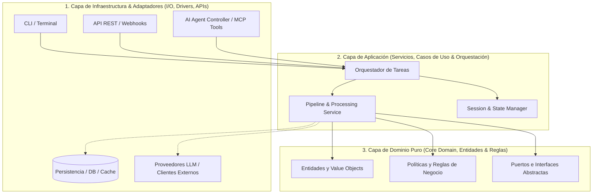
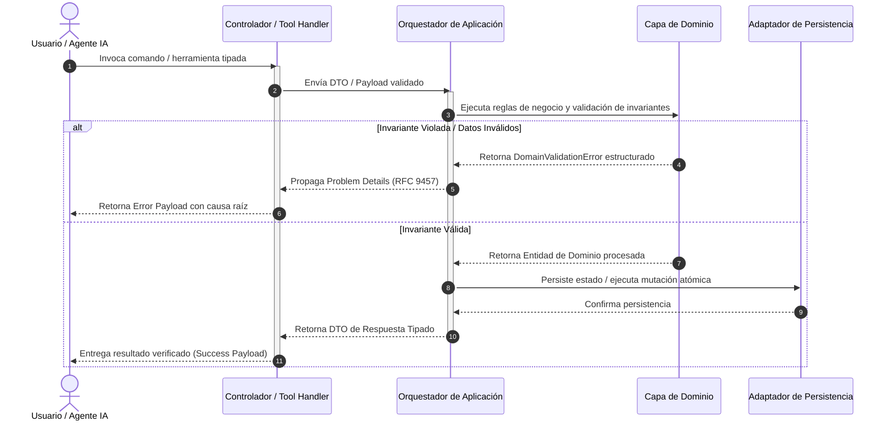
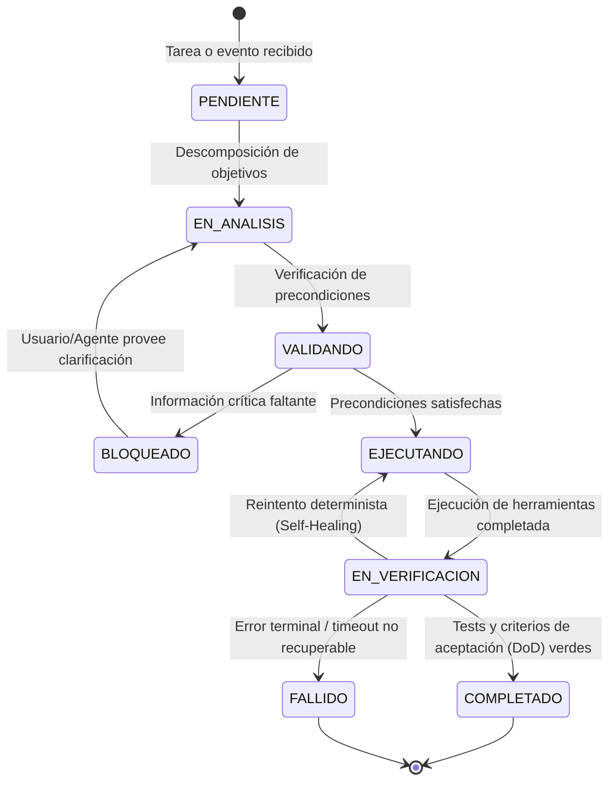

<!-- ======================================================================= -->
<!-- SECCIÓN 1: HEADER Y VISIÓN ARQUITECTÓNICA GLOBAL                        -->
<!-- BP RECOMENDADA: bp_0607_facts_rules_and_procedures_separation           -->
<!-- Establecer la ontología técnica del sistema: principios fundamentales   -->
<!-- de diseño y marco arquitectónico rector (Limpia / Hexagonal).           -->
<!-- LÍMITES: 1 a 2 párrafos concisos de declaración de principios.          -->
<!-- ======================================================================= -->

# Arquitectura del Sistema (ARCHITECTURE.md)

Este documento define la **topología técnica, fronteras modulares, modelos de datos, gestión de estado y flujos de ejecución** del sistema, sirviendo como contrato estructural inmutable para desarrolladores humanos y agentes autónomos de IA.

---

## 1. Topología del Sistema y Capas Arquitectónicas

<!-- ======================================================================= -->
<!-- BP RECOMENDADA: bp_0201_layered_architecture & bp_0202_hexagonal        -->
<!-- Seguir la Regla de Dependencia hacia el Interior (Dependency Rule):     -->
<!-- Las capas externas dependen de las internas; el Dominio no depende de   -->
<!-- ningún framework, librería de persistencia ni cliente de red.           -->
<!-- ======================================================================= -->

El sistema adopta una **Arquitectura Hexagonal (Puertos y Adaptadores)** desacoplada en cuatro capas concéntricas con regla de dependencia unidireccional hacia el núcleo:



> [!IMPORTANT]
> **Regla Inviolable de Diagramación Formal:** Queda terminantemente prohibido construir diagramas de flujo, procesos, mapas o secuencias mediante flechas de texto plano (`->`, `-->`, `==>`, `|`, `/`, `\`), caracteres ASCII o símbolos informales sujetos a interpretación ambigua. Todo flujo o relación visual DEBE modelarse obligatoriamente en formato **Mermaid** (` ```mermaid `) con nodos tipados y direcciones formales.

---

<!-- ======================================================================= -->
<!-- SECCIÓN 2: DELIMITACIÓN DE CAPAS Y RESPONSABILIDADES                    -->
<!-- BP RECOMENDADA: bp_0102_solid_principles & bp_0903_contract_driven      -->
<!-- Mapear rutas de código con responsabilidades e invariantes de import.   -->
<!-- LÍMITES: Tabla clara y exhaustiva sin código fuente en bruto.           -->
<!-- ======================================================================= -->

## 2. Delimitación de Capas y Responsabilidades

| **Capa Arquitectónica** | **Directorio Físico** | **Responsabilidad Principal** | **Reglas de Dependencia e Importación** |
|:---|:---|:---|:---|
| **Dominio Puro (*Core*)** | `src/paquete/core/` | Entidades puras, Value Objects, reglas de negocio e invariantes. | **Cero dependencias externas.** Prohibido importar `requests`, frameworks, DBs o módulos de E/S. |
| **Aplicación (*Services*)** | `src/paquete/services/` | Casos de uso, orquestación de pipelines, transacciones y coordinación. | Solo depende de `core/` y de interfaces/puertos abstractos. |
| **Infraestructura (*Adapters*)** | `src/paquete/adapters/` | Implementación concreta de puertos: clientes de DB, APIs externas y LLMs. | Implementa interfaces de `services/` o `core/`. No contiene reglas de negocio. |
| **Interfaz & Agentes (*Agents*)** | `src/paquete/agents/` | Definición de herramientas (MCP tools), schemas de función y CLI. | Consume `services/` mediante DTOs tipados. Prohibido saltar directamente a DB. |

---

<!-- ======================================================================= -->
<!-- SECCIÓN 3: FLUJO DE EJECUCIÓN Y SECUENCIA DE DATOS                      -->
<!-- BP RECOMENDADA: bp_0703_high_signal_to_noise_ratio                      -->
<!-- Diagrama de secuencia formal que modela el ciclo completo de ejecución  -->
<!-- incluyendo caminos felices (happy path) y ramas de error / validación. -->
<!-- ======================================================================= -->

## 3. Flujo de Ejecución y Secuencia de Datos

El siguiente diagrama de secuencia ilustra el flujo de una invocación de servicio o tarea agéntica con validación estricta y manejo determinista de errores:



---

<!-- ======================================================================= -->
<!-- SECCIÓN 4: GESTIÓN DE ESTADO Y CICLO DE VIDA                            -->
<!-- BP RECOMENDADA: bp_0511_checkpointing & bp_0818_no_silent_fallbacks     -->
<!-- Máquina de Estados Finita determinista para trazas de ejecución.        -->
<!-- Invariantes: Estados atómicos, serialización pura JSON/Pydantic.        -->
<!-- ======================================================================= -->

## 4. Gestión de Estado y Ciclo de Vida

El ciclo de vida de cualquier proceso, tarea agéntica o sesión de trabajo se modela mediante una **Máquina de Estados Finita (FSM)** determinista:



### Invariantes de Estado:
1. **Atomicidad:** Las mutaciones de estado se consolidan en transacciones unitarias; prohibido el estado persistido parcial.
2. **Serialización Segura:** Todo snapshot de estado debe ser convertible a JSON sin pérdida de fidelidad de tipos (vía Pydantic v2).
3. **Auditoría de Transiciones:** Cada transición genera un evento estructurado con `state_id`, `previous_state`, `new_state` y `timestamp` ISO 8601.

---

<!-- ======================================================================= -->
<!-- SECCIÓN 5: MODELOS DE DATOS Y CONTRATOS DE DOMINIO                      -->
<!-- BP RECOMENDADA: bp_0207_domain_driven_design                            -->
<!-- Modelos inmutables en Python con Pydantic v2 y @dataclass(frozen=True). -->
<!-- ======================================================================= -->

## 5. Modelos de Datos y Contratos de Dominio

Los datos del sistema se dividen en dos categorías según su frontera de aplicación:

1. **Modelos de Dominio Internos:** Inmutables, centrados en el negocio y decorados con `@dataclass(frozen=True)`:
```python
from dataclasses import dataclass

@dataclass(frozen=True)
class IdentificadorEntidad:
    valor: str

@dataclass(frozen=True)
class ConfiguracionSistema:
    timeout_segundos: int = 60
    modo_estricto: bool = True
```

2. **Esquemas de Frontera de Entrada/Salida (DTOs):** Validados estrictamente con Pydantic v2 en controladores y adaptadores:
```python
from pydantic import BaseModel, Field

class SolicitudEjecucionDTO(BaseModel):
    tarea_id: str = Field(..., pattern=r"^[a-z]{2,12}_[0-9a-hjkmnp-tv-z]{26}$")
    parametros: dict[str, str] = Field(default_factory=dict)
```

---

<!-- ======================================================================= -->
<!-- SECCIÓN 6: REGISTRO DE DECISIONES DE ARQUITECTURA (ADR)                 -->
<!-- BP RECOMENDADA: bp_0604_architecture_decision_records                   -->
<!-- Los ADRs protegen contra regresiones y bucles de amnesia en LLMs.       -->
<!-- ======================================================================= -->

## 6. Registro de Decisiones de Arquitectura (ADR)

Toda decisión arquitectónica estructural, cambio de framework o trade-off de diseño significativo DEBE registrarse como un documento inmutable en `docs/adr/` siguiendo el estándar `ADR-XXXX.md`:

```markdown
# ADR-0001: [Título Conciso de la Decisión Arquitectónica]

- **Fecha:** YYYY-MM-DD
- **Estado:** [Propuesto | Aceptado | Reemplazado por ADR-XXXX | Obsoleto]
- **Contexto:** [Problema técnico, restricciones o fuerzas que motivan la decisión].
- **Decisión:** [Solución técnica adoptada y justificación de por qué se eligió sobre alternativas].
- **Consecuencias:**
  - ✅ **Positivas:** [Beneficios directos obtenidos].
  - ⚠️ **Trade-offs / Negativas:** [Costos, complejidad añadida o limitaciones asumidas].
```

---

<!-- ======================================================================= -->
<!-- SECCIÓN 7: SINCRONIZACIÓN Y MANTENIMIENTO                               -->
<!-- BP RECOMENDADA: bp_0907_architectural_testing & bp_0709_doc_as_interface -->
<!-- ======================================================================= -->

## 7. Sincronización y Mantenimiento de la Arquitectura

1. **Sincronización Código-Diagramas:** Toda adición o refactorización de capas (`src/paquete/...`) debe reflejarse inmediatamente en los diagramas Mermaid de este archivo.
2. **Validación Automatizada de Fronteras:** Se recomienda incluir pruebas arquitectónicas en la suite de tests (`tests/architecture/`) para verificar mediante análisis estático que ningún módulo de `core/` importe módulos de `adapters/` o librerías de infraestructura externa.
3. **Plano de Control para Agentes:** Los agentes deben consultar este documento para resolver dónde alojar nuevas funcionalidades sin violar la separación de responsabilidades.

---

<!-- ======================================================================= -->
<!-- GUÍA DE LÍMITES Y FRONTERAS OPERATIVAS DEL ARCHITECTURE.md              -->
<!-- ======================================================================= -->

## Guía de Límites y Fronteras Operativas del ARCHITECTURE.md

Para mantener el archivo `ARCHITECTURE.md` con alta densidad de señal y evitar que se degrade con información impropia de la arquitectura, seguir la siguiente matriz de delimitación:

| **Contenido / Información** | **¿Debe estar en ARCHITECTURE.md?** | **Ubicación Correcta Designada** |
|:---|:---:|:---|
| Topología de capas, fronteras modulares y diagramas Mermaid | ✅ **SÍ** | `ARCHITECTURE.md` (Sección 1 y 2). |
| Diagramas de secuencia de flujos críticos (`sequenceDiagram`) | ✅ **SÍ** | `ARCHITECTURE.md` (Sección 3). |
| Máquinas de estados y reglas de invarianza (`stateDiagram-v2`) | ✅ **SÍ** | `ARCHITECTURE.md` (Sección 4). |
| Índice y plantilla de ADRs | ✅ **SÍ** | `ARCHITECTURE.md` (Sección 6) y `docs/adr/`. |
| Comandos de instalación, configuración rápida o badges | ❌ **NO** | `README.md`. |
| Matriz de permisos de herramientas, sandboxing o guardrails de IA | ❌ **NO** | `AGENTS.md`. |
| Código fuente completo de implementaciones o controladores | ❌ **NO** | `src/`. |
| Especificación detallada de campos OpenAPI / JSON Schema | ❌ **NO** | `docs/API.md` o esquemas Pydantic inline. |
| Bitácoras de sesión, diarios de trabajo o marcas temporales | ❌ **NO** | `PROGRESS.md` o `MEMORY.md`. |
| Guías de contribución para humanos o ciclo de Pull Requests | ❌ **NO** | `CONTRIBUTING.md`. |
