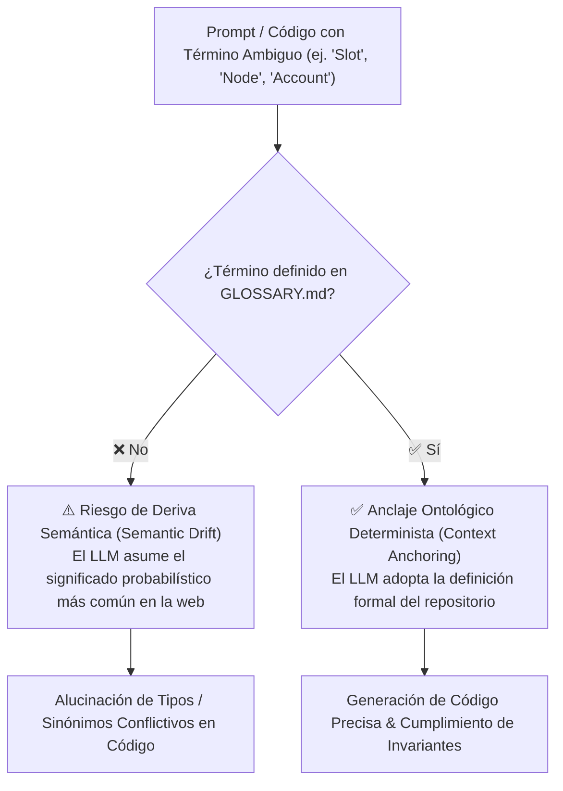

<!-- ======================================================================= -->
<!-- SECCIÓN 1: CABECERA Y PROPÓSITO DEL GLOSARIO TÉCNICO                    -->
<!-- BP RECOMENDADA: bp_0607_facts_rules_and_procedures_separation           -->
<!-- Aislar hechos ontológicos (definiciones) de reglas operativas.          -->
<!-- LÍMITES: 1 a 2 párrafos concisos declarando la ontología del proyecto.  -->
<!-- ======================================================================= -->

# Glosario Técnico y Lenguaje Ubicuo (GLOSSARY.md)

Este documento constituye el **diccionario terminológico oficial, marco ontológico y fuente única de verdad léxica** del proyecto. Su propósito es garantizar la consistencia semántica absoluta entre desarrolladores humanos y modelos de Inteligencia Artificial (LLMs), previniendo la deriva semántica (*Semantic Drift*), la proliferación caótica de sinónimos y la asunción errónea de conceptos polisémicos.

---

<!-- ======================================================================= -->
<!-- SECCIÓN 2: ARQUITECTURA DE ANCLAJE CONTEXTUAL                           -->
<!-- BP RECOMENDADA: bp_0701_context_engineering_principles                  -->
<!-- Visualización formal del flujo de resolución léxica para agentes.       -->
<!-- ======================================================================= -->

## 1. Arquitectura de Anclaje Contextual para Agentes



> [!IMPORTANT]
> **Regla Inviolable de Diagramación Formal:** Queda terminantemente prohibido construir diagramas de flujo, procesos, mapas o secuencias mediante flechas de texto plano (`->`, `-->`, `==>`, `|`, `/`, `\`), caracteres ASCII o símbolos informales sujetos a interpretación ambigua. Todo flujo o relación visual DEBE modelarse obligatoriamente en formato **Mermaid** (` ```mermaid `) con nodos tipados y direcciones formales.

---

<!-- ======================================================================= -->
<!-- SECCIÓN 3: TÉRMINOS Y CONCEPTOS DEL DOMINIO DE NEGOCIO                  -->
<!-- BP RECOMENDADA: bp_0207_domain_driven_design                            -->
<!-- Entidades del Core Domain, Value Objects y conceptos propios.           -->
<!-- ======================================================================= -->

## 2. Términos y Conceptos del Dominio de Negocio (Core Domain)

Esta sección define las entidades nucleares, reglas de dominio y conceptos específicos del problema que resuelve este repositorio:

- **[Entidad Principal del Dominio] (*Domain Entity*):** Objeto nuclear del sistema que posee una identidad única y mutable a lo largo de su ciclo de vida (ej. `Expediente`, `Poliza`, `CasillaMatematica`).
- **[Objeto de Valor] (*Value Object*):** Estructura inmutable definida exclusivamente por sus atributos y sin identidad conceptual propia (ej. `Coordenada`, `RangoFechas`, `Moneda`).
- **[Invariante de Negocio] (*Domain Invariant*):** Regla o condición lógica que debe cumplirse siempre de forma estricta e inquebrantable en cualquier estado válido del sistema.
- **[Evento de Dominio] (*Domain Event*):** Suceso inmutable relevante que ya ha ocurrido en el negocio y que otros módulos o agentes pueden consumir para reaccionar.
- **[Contexto Delimitado] (*Bounded Context*):** Frontera conceptual y técnica explícita dentro de la cual un término del glosario tiene un significado único y libre de contradicciones.

---

<!-- ======================================================================= -->
<!-- SECCIÓN 4: TÉRMINOS DE ARQUITECTURA Y PATRONES TÉCNICOS                 -->
<!-- BP RECOMENDADA: bp_0201_layered_architecture & bp_0903_contract_driven  -->
<!-- Patrones estructurales, interfaces y contratos de comunicación.         -->
<!-- ======================================================================= -->

## 3. Términos de Arquitectura y Patrones Técnicos

- **ADR (*Architecture Decision Record*):** Documento técnico estructurado e inmutable (`docs/adr/ADR-XXXX.md`) que registra una decisión arquitectónica significativa, su contexto y sus consecuencias.
- **AST (*Abstract Syntax Tree*):** Estructura de datos en forma de árbol que representa la estructura sintáctica abstracta de código fuente o expresiones parseadas.
- **DTO (*Data Transfer Object*):** Objeto o esquema tipado (Pydantic / Dataclass) diseñado exclusivamente para transportar datos entre capas sin contener lógica de negocio.
- **FSM (*Finite State Machine* / Máquina de Estados Finita):** Modelo computacional determinista compuesto por un conjunto finito de estados, transiciones atómicas y acciones.
- **Idempotencia (*Idempotency*):** Propiedad de una operación que produce exactamente el mismo resultado y estado del sistema independientemente de cuántas veces se ejecute con los mismos parámetros.
- **Puerto (*Port*):** Interfaz o contrato abstracto definido en el núcleo del dominio que declara una necesidad de comunicación externa.
- **Adaptador (*Adapter*):** Implementación técnica concreta de un puerto (ej. cliente de base de datos, conector HTTP, driver de archivo).

---

<!-- ======================================================================= -->
<!-- SECCIÓN 5: CONCEPTOS DE INGENIERÍA AGÉNTICA E INTELIGENCIA ARTIFICIAL    -->
<!-- BP RECOMENDADA: bp_0801_operational_boundaries & bp_0904_agent_readable -->
<!-- Términos que rigen el comportamiento, contexto y ejecución de la IA.    -->
<!-- ======================================================================= -->

## 4. Conceptos de Ingeniería Agéntica e Inteligencia Artificial

- **Agent Operational Contract (*Contrato Operativo de Agente*):** Constitución técnica (`AGENTS.md`) que rige la jerarquía de instrucciones, permisos de herramientas y límites de actuación para agentes de IA.
- **Change Budget (*Presupuesto de Modificación*):** Límite máximo estricto de archivos y líneas de código que un agente puede alterar en una única tarea para evitar dispersión de cambios (*Scope Creep*).
- **Context Anchoring (*Anclaje de Contexto*):** Técnica de inyección de definiciones y restricciones formales para forzar al LLM a converger en la ontología del proyecto.
- **DoD (*Definition of Done* / Criterio de Aceptación):** Lista de verificación obligatoria (tests verdes, tipado estricto, linter limpio) que certifica la conclusión de una tarea.
- **Frontmatter:** Bloque de metadatos estructurados en formato YAML ubicado al inicio de archivos Markdown (`--- ... ---`) delimitado para indexación por AST.
- **Guardrail (*Barrera de Seguridad*):** Regla o restricción operativa inviolable (ej. cero secretos hardcodeados, no mutación de infraestructura) impuesta al runtime del agente.
- **Progressive Disclosure (*Divulgación Progresiva*):** Estrategia de diseño de documentación que organiza la información por capas jerárquicas para consumir la mínima cantidad de tokens de contexto.
- **Self-Healing (*Auto-Reparación Determinista*):** Capacidad del agente para diagnosticar fallas de pruebas o linters, aislar la causa raíz en `sandbox/` y corregir el código sin intervención humana.
- **Tool Call (*Invocación de Herramienta*):** Ejecución estructurada de una función o comando del sistema operativo intermediada por el runtime del agente.
- **TypeID:** Identificador unívoco ordenable cronológicamente (*K-Sortable*) compuesto por un prefijo semántico de tipo y un UUIDv7 codificado en Base32 (`^[a-z]{2,12}_[0-9a-hjkmnp-tv-z]{26}$`).

---

<!-- ======================================================================= -->
<!-- SECCIÓN 6: ACRÓNIMOS, PROTOCOLOS Y ESTÁNDARES                           -->
<!-- BP RECOMENDADA: bp_0113_convention_over_configuration                   -->
<!-- Diccionario de siglas y estándares internacionales referenciados.        -->
<!-- ======================================================================= -->

## 5. Acrónimos, Protocolos y Estándares de la Industria

- **CI/CD (*Continuous Integration / Continuous Deployment*):** Práctica de automatización de pruebas, análisis estático y despliegue continuo de software.
- **CRUD (*Create, Read, Update, Delete*):** Las cuatro operaciones básicas de persistencia de datos.
- **EOL (*End of Line*):** Carácter o secuencia de control que indica el final de una línea de texto (`LF` en Linux/macOS, `CRLF` en Windows).
- **JSONC (*JSON with Comments*):** Formato JSON extendido que permite comentarios en línea (`//`) y comas finales para documentación legible.
- **K-Sortable (*K-Ordenable*):** Propiedad de identificadores cuyo orden lexicográfico equivale a su orden cronológico de creación.
- **REST (*Representational State Transfer*):** Estilo de arquitectura de software para sistemas hipermedia distribuidos mediante HTTP.
- **RFC 9457 (*Problem Details for HTTP APIs*):** Estándar de especificación para representar errores y excepciones de forma estructurada.
- **SemVer (*Semantic Versioning 2.0.0*):** Estándar de versionado de software en formato `MAYOR.MENOR.PARCHE`.
- **SPDX (*Software Package Data Exchange*):** Estándar internacional para comunicar metadatos de licencias de software (ej. `MIT`, `Apache-2.0`).

---

<!-- ======================================================================= -->
<!-- SECCIÓN 7: GUÍA DE MANTENIMIENTO Y BÚSQUEDA RÁPIDA PARA AGENTES         -->
<!-- BP RECOMENDADA: bp_0703_high_signal_to_noise_ratio                      -->
<!-- Comandos grep/ripgrep para consultar términos en O(1) de tokens.        -->
<!-- ======================================================================= -->

## 6. Comandos de Consulta Rápida para Agentes

Para inspeccionar la definición exacta de un término sin necesidad de volcar el archivo completo en la ventana de contexto:

```bash
# 1. Buscar la definición exacta de un término en GLOSSARY.md
grep -i -A 2 "**[Término]**" GLOSSARY.md
# Ejemplo:
grep -i -A 2 "**TypeID**" GLOSSARY.md

# 2. Verificar si un nuevo término de negocio ya tiene nombre estándar en el glosario
rg -i "concepto_buscado" GLOSSARY.md
```

---

<!-- ======================================================================= -->
<!-- GUÍA DE LÍMITES Y FRONTERAS OPERATIVAS DEL GLOSSARY.md                  -->
<!-- ======================================================================= -->

## Guía de Límites y Fronteras Operativas del GLOSSARY.md

Para mantener el archivo `GLOSSARY.md` con máxima densidad de señal y evitar que se degenere en documentación redundante:

| **Contenido / Información** | **¿Debe estar en GLOSSARY.md?** | **Ubicación Correcta Designada** |
|:---|:---:|:---|
| Definiciones concisas de términos de negocio y conceptos del dominio | ✅ **SÍ** | `GLOSSARY.md` (Sección 2). |
| Términos arquitectónicos y patrones técnicos del proyecto | ✅ **SÍ** | `GLOSSARY.md` (Sección 3). |
| Conceptos de IA, guardrails y gobernanza agéntica | ✅ **SÍ** | `GLOSSARY.md` (Sección 4). |
| Acrónimos estándar y protocolos de la industria | ✅ **SÍ** | `GLOSSARY.md` (Sección 5). |
| Reglas de precedencia de instrucciones y permisos de herramientas | ❌ **NO** | `AGENTS.md`. |
| Topología de componentes, capas y diagramas de secuencia | ❌ **NO** | `ARCHITECTURE.md`. |
| Guías de instalación, inicio rápido o badges | ❌ **NO** | `README.md`. |
| Especificación detallada de esquemas de base de datos o endpoints | ❌ **NO** | `docs/API.md` o modelos Pydantic inline. |
| Bitácoras de cambios o diarios de sesión | ❌ **NO** | `PROGRESS.md` o `MEMORY.md`. |
| Texto legal de derechos de autor y licencias | ❌ **NO** | `LICENSE`. |
