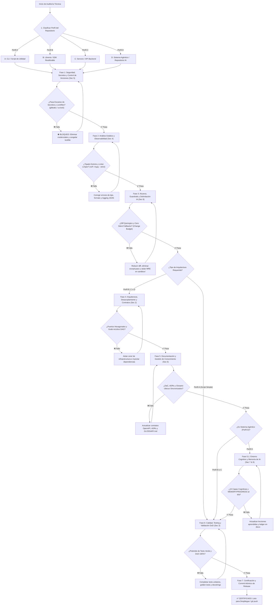

# Flujo y Metodología Integral de Auditoría de Buenas Prácticas

Este documento establece el **marco metodológico, el orden secuencial y el árbol de decisión** para auditar y certificar el cumplimiento de las **97 buenas prácticas de ingeniería de software y desarrollo asistido por IA** detalladas en [`guia_rapida_buenas_practicas.md`](../guia_rapida_buenas_practicas.md).

Está estructurado en **7 Fases Progresivas de Calidad** y adaptado a cuatro perfiles de proyecto para maximizar el retorno de inversión técnica, optimizar el consumo de tokens y garantizar sistemas tolerantes a fallos.

---

## 1. Diagrama de Flujo Maestro de Auditoría en 7 Fases



> [!IMPORTANT]
> **Regla Inviolable de Diagramación Formal:** Queda terminantemente prohibido construir diagramas de flujo, procesos, mapas o secuencias mediante flechas de texto plano (`->`, `-->`, `==>`, `|`, `/`, `\`), caracteres ASCII o símbolos informales sujetos a interpretación ambigua. Todo flujo o relación visual DEBE modelarse obligatoriamente en formato **Mermaid** (` ```mermaid `) con nodos tipados y direcciones formales.

---

## 2. Matriz de Adaptabilidad por Perfil de Repositorio

La siguiente matriz clasifica las 8 áreas temáticas según el nivel de rigor exigido para cada tipología de software:

| **Área Temática de Buenas Prácticas** | **Perfil A: Script / CLI** | **Perfil B: Librería / SDK** | **Perfil C: Backend / API** | **Perfil D: Repositorio IA / Agéntico** |
|:---|:---:|:---:|:---:|:---:|
| **1. Seguridad y Versionado (Sec 5)** | 🔴 **Obligatorio** | 🔴 **Obligatorio** | 🔴 **Obligatorio** | 🔴 **Obligatorio** |
| **2. Análisis Estático y Tipado (Sec 4)** | 🔴 **Obligatorio** | 🔴 **Obligatorio** | 🔴 **Obligatorio** | 🔴 **Obligatorio** |
| **3. Observabilidad y Logging JSON (Sec 4)** | ⚪ Opcional | 🟡 Básico (telemetry) | 🔴 **Obligatorio** (RED/USE) | 🔴 **Obligatorio** (Traces) |
| **4. Guardrails y No Silent Fallbacks (Sec 8)** | 🟡 Recomendado | 🔴 **Obligatorio** | 🔴 **Obligatorio** | 🔴 **Obligatorio** (Inviolable) |
| **5. Arquitectura Hexagonal y Puertos (Sec 2)** | ⚪ No aplica | 🟡 Si maneja E/S | 🔴 **Obligatorio** | 🔴 **Obligatorio** |
| **6. Documentación DaC, ADRs y Glosario (Sec 6)** | 🟡 README básico | 🔴 **Obligatorio** (API-First)| 🔴 **Obligatorio** (OpenAPI) | 🔴 **Obligatorio** (Ubiquitous) |
| **7. Testing: TDD, Fakes y Pirámide (Sec 3)** | 🟡 Smoke tests | 🔴 **Obligatorio** (100%) | 🔴 **Obligatorio** (>80%) | 🔴 **Obligatorio** (Golden) |
| **8. Entorno Cognitivo y Memoria (Sec 7 & 9)** | ⚪ Opcional | ⚪ Opcional | 🟡 Recomendado | 🔴 **Obligatorio** (10 Capas) |

*Leyenda:* 🔴 **Obligatorio (Quality Gate crítico)** | 🟡 **Recomendado (Evaluar según alcance)** | ⚪ **Opcional / No recomendado (Evitar sobre-ingeniería)**.

---

## 3. Protocolo de Auditoría Paso a Paso en 7 Fases

---

### Fase 1: Seguridad, Secretos y Gestión de Dependencias (Sección 5)
*Objetivo:* Blindar la integridad criptográfica y prevenir fugas de información antes de compilar o probar.
1. **Gestión de Secretos (5.1):** Escaneo con `gitleaks` o regex para certificar cero API keys, passwords o tokens en el diff.
2. **Lockfiles Reproducibles (5.3):** Verificar que `uv.lock` o `poetry.lock` esté sincronizado y versionado en Git.
3. **Auditoría de Vulnerabilidades (4.9 / 5.10):** Ejecutar `pip-audit` para validar ausencia de CVEs críticos.
4. **Sanitización de Entradas (5.5):** Validar que toda invocación al sistema operativo use listas de argumentos (`shell=False`).
- *Criterio de Aprobación:* 0 secretos detectados, lockfile inmutable y 0 vulnerabilidades críticas.

---

### Fase 2: Análisis Estático, Formato y Observabilidad (Sección 4)
*Objetivo:* Garantizar código determinista, libre de ambigüedades y preparado para observabilidad en runtime.
1. **Formateo y Linters (4.1):** `ruff check src/ tests/` y `ruff format --check src/ tests/` con 0 errores.
2. **Tipado Estático Estricto (4.2):** `mypy --strict src/` sin `# type: ignore` no justificados.
3. **Logging Estructurado (4.3):** Uso de `logging` en JSON estructurado con `trace_id`; cero llamadas a `print()`.
4. **Configuración Declarativa (4.6):** Variables de entorno gobernadas por modelos inmutables de configuración (*Fail Fast*).
- *Criterio de Aprobación:* Pipeline de análisis estático 100% verde y configuración tipada al arranque.

---

### Fase 3: Alcance, Guardrails y Delimitación Agéntica (Sección 8)
*Objetivo:* Prevenir el desvío de agentes, mutaciones no autorizadas y fallos silenciosos.
1. **Tareas Delimitadas y Change Budget (8.1, 8.2, 8.17):** El diff respeta el presupuesto máximo de líneas (<150 líneas) y no toca archivos fuera de alcance (*No Unrelated Changes*).
2. **No Silent Fallbacks (8.18):** Cero bloques `except: pass` o retornos nulos que oculten errores; excepciones tipadas de dominio.
3. **Archivos Protegidos (8.15):** No se han mutado archivos de infraestructura (`Dockerfile`, `.github/`) sin instrucción explícita.
4. **Sandboxing Obligatorio (8.8, 9.14):** Pruebas de concepto, repros y throwaways ubicados estrictamente en `sandbox/`.
- *Criterio de Aprobación:* Diff quirúrgico, cero fallos silenciosos y aislamiento de experimentos en sandbox.

---

### Fase 4: Arquitectura, Desacoplamiento y Contratos (Sección 2)
*Objetivo (Para Perfiles B, C y D):* Garantizar modularidad, mantenibilidad y desacoplamiento de infraestructura.
1. **Aislamiento de Dominio (2.1, 2.2):** El paquete `core/` no contiene importaciones de FastAPI, SQLAlchemy ni librerías de red.
2. **Puertos y Protocolos (2.1, 9.3):** Dependencias de almacenamiento o servicios externos abstraídas mediante `typing.Protocol`.
3. **Inyección de Dependencias (2.4):** Suministro de dependencias a través del constructor (`__init__`) sin variables globales.
4. **Grafo Acíclico de Dependencias (2.10, 9.7):** Cero importaciones circulares en el árbol del proyecto.
- *Criterio de Aprobación:* Núcleo de dominio puro e inversión de dependencias verificada.

---

### Fase 5: Documentación y Gestión de Conocimiento (Sección 6)
*Objetivo:* Convertir la documentación en un plano de control ejecutable y sincronizado con el código.
1. **Documentation as Code (6.1):** Documentación técnica en Markdown versionada en el mismo repositorio.
2. **Lenguaje Ubicuo (6.8):** Nomenclatura alineada con las definiciones formales de `GLOSSARY.md`.
3. **Registros ADR (6.4):** Cambios de arquitectura o decisiones de diseño registradas en `docs/adr/ADR-XXXX.md`.
4. **Separación de Hechos, Reglas y Procedimientos (6.7):** Hechos en `GLOSSARY.md`, Reglas en `AGENTS.md`, Procedimientos en `PLAYBOOK.md`.
- *Criterio de Aprobación:* Glosario, ADRs y especificaciones 100% consistentes con el código.

---

### Fase 5.1: Entorno Cognitivo y Memoria Agéntica (Secciones 7 y 9 - Perfil D)
*Objetivo:* Garantizar la retención de contexto, aprendizaje continuo y resiliencia multi-turno para agentes de IA.
1. **Las 10 Capas del Entorno Cognitivo (9.1):** Presencia de contratos, herramientas diagnósticas (`doctor.py`), guardrails y memoria.
2. **Memoria Semántica (7.4, 9.12):** Registro de *gotchas*, heurísticas y lecciones permanentes en `MEMORY.md`.
3. **Memoria Episódica en Tiempo Real (8.19):** Actualización de subtareas activas y timestamps en `PROGRESS.md`.
4. **Protocolo de Feedback Estructurado (9.9):** Mensajes de error estructurados (*Expected vs Actual*, traza y línea exacta).
- *Criterio de Aprobación:* Memoria persistente sincronizada en disco y herramientas de diagnóstico operativas.

---

### Fase 6: Calidad, Testing y Certificación DoD (Sección 3)
*Objetivo:* Validación programática exhaustiva antes de fusionar o desplegar.
1. **TDD y Pirámide de Pruebas (3.2, 3.4):** Cobertura unitaria en memoria para el camino feliz y excepciones de dominio.
2. **Dobles de Prueba Adecuados (3.8):** Uso de fakes en memoria para repositorios en lugar de mocks excesivos de implementación.
3. **Golden Tests (9.8):** Comparación determinista contra archivos dorados en parsers y serializadores.
4. **Definition of Done (3.13, 8.11):** Verificación integral del checklist DoD con evidencia de ejecución adjunta.
- *Criterio de Aprobación:* Suite `pytest` verde, pruebas de regresión agregadas y DoD 100% aprobado.

---

### Fase 7: Certificación y Commit Atómico de Release
*Objetivo:* Empaquetado final y persistencia atómica en el árbol de Git.
1. **Commit Atómico (5.2):** Mensaje bajo convención Conventional Commits (`feat:`, `fix:`, `refactor:`).
2. **Versionado Semántico (5.7):** Incremento de versión SemVer coherente con los cambios introducidos.
3. **Sincronización Pre-Push (7.4):** Inclusión de `MEMORY.md` y `PROGRESS.md` en el commit atómico antes de realizar `git push`.
- *Criterio de Aprobación:* Árbol de trabajo limpio, commit único atómico y sincronización remota exitosa.

---

## 4. Checklist Maestro de Auditoría Pre-Merge (Quality Gate)

Antes de aprobar cualquier Pull Request o dar por concluida una tarea agéntica, certificar el pase de los 7 Quality Gates:

- [ ] **Gate 1 (Seguridad):** Cero secretos hardcodeados, lockfile inmutable (`uv.lock`) y `pip-audit` limpio.
- [ ] **Gate 2 (Análisis Estático):** `ruff check` sin errores, `mypy --strict` 100% verde y logging estructurado en JSON.
- [ ] **Gate 3 (Guardrails):** Diff menor a 150 líneas, cero bloques `except: pass` y `sandbox/` limpio.
- [ ] **Gate 4 (Arquitectura):** `core/` puro sin dependencias de infraestructura, interfaces tipadas con `Protocol` y grafo DAG.
- [ ] **Gate 5 (Documentación):** Docstrings Google completos, términos del `GLOSSARY.md` respetados y ADRs registrados si aplica.
- [ ] **Gate 5.1 (Memoria IA):** `MEMORY.md` actualizado con lecciones aprendidas y `PROGRESS.md` con el próximo paso inmediato.
- [ ] **Gate 6 (Testing & DoD):** Suite `pytest` 100% verde con evidencia de ejecución adjunta y golden tests aprobados.
- [ ] **Gate 7 (Release Atómico):** Mensaje Conventional Commit atómico y sincronización de memoria previa al push.
