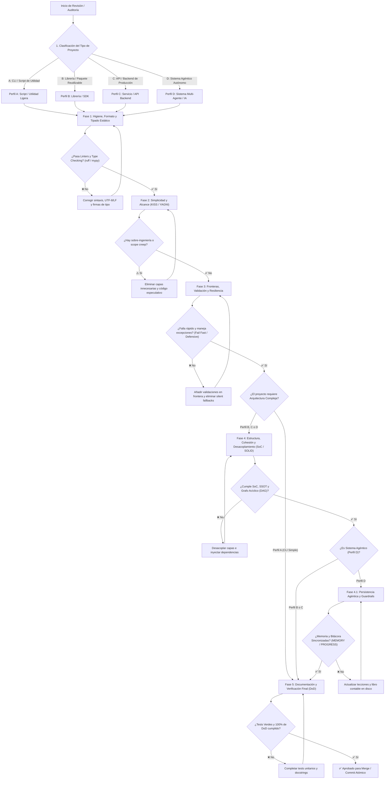

# Orden de Revisión y Auditoría de Buenas Prácticas Adaptable

Este documento define la **metodología secuencial y el diagrama de flujo de decisión** para auditar y revisar el cumplimiento de buenas prácticas y principios universales de diseño en proyectos de software y sistemas agénticos de IA. 

El proceso está diseñado para ser **adaptable según la naturaleza y complejidad del proyecto**, evitando tanto la falta de rigor en sistemas críticos como la sobre-ingeniería innecesaria en utilidades ligeras.

---

## 1. Diagrama de Flujo Maestro de Auditoría Adaptable



> [!IMPORTANT]
> **Regla Inviolable de Diagramación Formal:** Queda terminantemente prohibido construir diagramas de flujo, procesos, mapas o secuencias mediante flechas de texto plano (`->`, `-->`, `==>`, `|`, `/`, `\`), caracteres ASCII o símbolos informales sujetos a interpretación ambigua. Todo flujo o relación visual DEBE modelarse obligatoriamente en formato **Mermaid** (` ```mermaid `) con nodos tipados y direcciones formales.

---

## 2. Matriz de Adaptabilidad de Buenas Prácticas por Tipo de Proyecto

No todos los proyectos exigen el mismo nivel de complejidad arquitectónica. La siguiente matriz establece el nivel de obligatoriedad según el perfil del sistema:

| **Principio / Buena Práctica** | **Perfil A: CLI / Script de Utilidad** | **Perfil B: Librería / SDK Reutilizable** | **Perfil C: Servicio Backend / API** | **Perfil D: Sistema Agéntico Autónomo** |
|:---|:---:|:---:|:---:|:---:|
| **Codificación UTF-8 / LF / `snake_case`** | 🔴 **Obligatorio** | 🔴 **Obligatorio** | 🔴 **Obligatorio** | 🔴 **Obligatorio** |
| **Tipado Estricto Inline (`mypy --strict`)** | 🔴 **Obligatorio** | 🔴 **Obligatorio** | 🔴 **Obligatorio** | 🔴 **Obligatorio** |
| **KISS (Simplicidad Máxima)** | 🔴 **Obligatorio** | 🔴 **Obligatorio** | 🔴 **Obligatorio** | 🔴 **Obligatorio** |
| **YAGNI (Cero Código Especulativo)** | 🔴 **Obligatorio** | 🔴 **Obligatorio** | 🔴 **Obligatorio** | 🔴 **Obligatorio** |
| **Fail Fast & No Silent Fallbacks** | 🟡 Recomendado | 🔴 **Obligatorio** | 🔴 **Obligatorio** | 🔴 **Obligatorio** |
| **Programación Defensiva en Fronteras** | 🟡 Ligero (args) | 🔴 **Obligatorio** (APIs) | 🔴 **Obligatorio** (JSON/DB) | 🔴 **Obligatorio** (Tools) |
| **Separation of Concerns (SoC)** | ⚪ Opcional / Simple | 🔴 **Obligatorio** | 🔴 **Obligatorio** | 🔴 **Obligatorio** |
| **SOLID e Inyección de Dependencias** | ⚪ No recomendado | 🔴 **Obligatorio** | 🔴 **Obligatorio** | 🔴 **Obligatorio** |
| **Arquitectura Hexagonal / Puertos** | ⚪ No aplica | 🟡 Si hay múltiples I/O | 🔴 **Obligatorio** | 🔴 **Obligatorio** |
| **Memoria Agéntica (`MEMORY` / `PROGRESS`)** | ⚪ Opcional | ⚪ Opcional | 🟡 Recomendado | 🔴 **Obligatorio** |
| **Sandboxing (`sandbox/`) y Guardrails** | 🟡 Recomendado | 🟡 Recomendado | 🔴 **Obligatorio** | 🔴 **Obligatorio** |
| **Tests Unitarios y Cobertura DoD** | 🟡 Básico (smoke) | 🔴 **Obligatorio** (100%) | 🔴 **Obligatorio** (>80%) | 🔴 **Obligatorio** |

*Leyenda:* 🔴 **Obligatorio (Falla de auditoría si falta)** | 🟡 **Recomendado (Evaluar según alcance)** | ⚪ **Opcional / No recomendado (Evitar sobre-ingeniería)**.

---

## 3. Fases Secuenciales de Auditoría Técnica

### Fase 1: Higiene, Formato y Tipado Estático (Capa Base)
*Objetivo:* Asegurar que el código sea limpio, determinista y comprensible por máquinas antes de evaluar lógica de negocio.
1. **Codificación:** Verificar UTF-8 sin BOM y finales de línea `LF`.
2. **Nomenclatura:** Archivos y variables en `snake_case` estricto en minúsculas.
3. **Tipos:** Firmas con Type Hints nativos (Python 3.10+ PEP 585/604) validados con `mypy --strict`.
4. **Linters:** Ejecutar `ruff check` y `ruff format --check` con 0 errores.

---

### Fase 2: Simplicidad y Delimitación de Alcance (KISS & YAGNI)
*Objetivo:* Eliminar sobre-ingeniería, código especulativo y mutaciones no solicitadas.
1. **Presupuesto de Modificación (*Change Budget*):** Verificar que el diff no toque archivos ajenos a la tarea (*No Unrelated Changes*).
2. **KISS:** Comprobar si la lógica puede resolverse con funciones estándar y estructuras directas sin introducir jerarquías de clases redundantes.
3. **YAGNI:** Confirmar que no existan parámetros booleanos no utilizados, métodos "por si acaso" ni adaptadores para tecnologías no requeridas.

---

### Fase 3: Fronteras, Validación y Resiliencia (Fail Fast & Defensive)
*Objetivo:* Blindar el sistema contra entradas hostiles o datos malformados y garantizar diagnósticos claros.
1. **Validación en Fronteras:** Esquemas Pydantic v2 o validadores estrictos en toda entrada externa (HTTP, CLI, archivos).
2. **Fail Fast:** Comprobar la existencia de cláusulas de guardia (*Guard Clauses*) al inicio de métodos y constructores.
3. **No Silent Fallbacks:** Prohibición absoluta de bloques `except: pass` o retornos nulos silenciosos; elevación de excepciones tipadas enriquecidas (RFC 9457).
4. **Cero Secretos:** Escaneo de diff para certificar que no existan tokens, credenciales o contraseñas hardcodeadas.

---

### Fase 4: Estructura, Cohesión y Desacoplamiento (SoC & SOLID)
*Objetivo (Para Perfiles B, C y D):* Asegurar la sostenibilidad arquitectónica a largo plazo.
1. **Separation of Concerns:** Verificar que el núcleo de dominio (`core/`) esté 100% aislado de frameworks y clientes de base de datos.
2. **Grafo Acíclico (DAG):** Comprobar que no existan importaciones circulares entre módulos.
3. **Single Source of Truth (SSOT):** Confirmar que no haya duplicación de esquemas, constantes o configuraciones.
4. **Persistencia Agéntica (Perfil D):** Verificar que las lecciones técnicas permanentes estén en `MEMORY.md` y las subtareas en curso en `PROGRESS.md`.

---

### Fase 5: Documentación, Evidencia y Definition of Done (DoD)
*Objetivo:* Certificar formalmente que el entregable cumple con todos los requisitos de calidad antes del commit/merge.
1. **Google Style Docstrings:** Todas las funciones y clases públicas documentan `Args:`, `Returns:`, `Raises:` y `Attributes:`.
2. **Tests Verdes:** Ejecución de `pytest` con 100% de aserciones aprobadas.
3. **Representación Visual:** Árboles de carpetas exclusivamente en YAML y diagramas en Mermaid (sin flechas de texto plano como `->` o caracteres ASCII ambiguos).
4. **Commit Atómico:** Mensaje estructurado bajo el estándar *Conventional Commits* (`feat:`, `fix:`, `refactor:`, `chore:`).

---

## 4. Checklist de Certificación de Auditoría para Agentes

Antes de aprobar o commitear cualquier entrega, el auditor (humano o agente) debe certificar:

- [ ] **Fase 1 Superada:** UTF-8/LF verificado, `ruff check` limpio y `mypy --strict` con 0 errores.
- [ ] **Fase 2 Superada:** No hay archivos ajenos modificados ni código especulativo (YAGNI validado).
- [ ] **Fase 3 Superada:** Validación de entradas en frontera activa y cero bloques `except: pass`.
- [ ] **Fase 4 Superada:** Responsabilidades desacopladas, sin imports circulares y sin secretos filtrados.
- [ ] **Fase 5 Superada:** Suite de pruebas verde (`pytest`), docstrings Google completos y commit atómico preparado.
