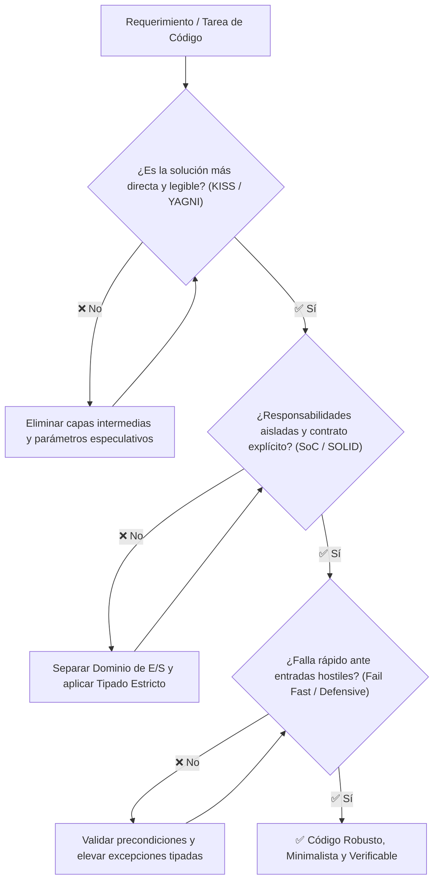

# Guía Universal de Principios de Diseño y Buenas Prácticas para IA Agéntica

Esta guía constituye un **marco de referencia universal, portable y autocontenido** que define los **13 Principios Universales de Programación y Diseño de Software**. Ha sido diseñada para asistir a desarrolladores y agentes autónomos de IA en la toma de decisiones arquitectónicas, refactorización limpia y generación determinista de código sin dependencias de entornos locales.

---

## 1. Marco de Razonamiento y Toma de Decisiones para Agentes

Los modelos LLM tienden naturalmente a **sobre-abstraer** (crear jerarquías complejas innecesarias) o a **duplicar lógica** por falta de visión global del repositorio. La siguiente jerarquía orienta la evaluación de trade-offs en cada turno operativo:



> [!IMPORTANT]
> **Regla Inviolable de Diagramación Formal:** Queda terminantemente prohibido construir diagramas de flujo, procesos, mapas o secuencias mediante flechas de texto plano (`->`, `-->`, `==>`, `|`, `/`, `\`), caracteres ASCII o símbolos informales sujetos a interpretación ambigua. Todo flujo o relación visual DEBE modelarse obligatoriamente en formato **Mermaid** (` ```mermaid `) con nodos tipados y direcciones formales.

---

## 2. Catálogo Universal de los 13 Principios de Diseño

---

### 1. DRY: Don't Repeat Yourself
- **Definición:** Toda pieza de conocimiento, lógica de negocio o regla computacional debe tener una **representación única, inequívoca y autoritativa** dentro del sistema.
- **Casos de Uso:**
  1. Centralización de algoritmos de cálculo, hashing o formateo en servicios o utilidades compartidas.
  2. Unificación de esquemas DTO y contratos de serialización en un único módulo fuente.
  3. Reutilización de fixtures de prueba y configuraciones de entorno comunes.
- **Límites de Uso y Anti-Patrones (*Cuándo NO forzarlo*):**
  - **Duplicación Coincidental:** Dos bloques de código que lucen idénticos hoy pero pertenecen a dominios diferentes y evolucionarán por razones distintas NO deben unificarse. Unificarlos genera **acoplamiento espurio**.
  - **Regla de Tres (*Rule of Three*):** No crear una abstracción compartida al primer duplicado; esperar a que el patrón se repita tres veces de forma idéntica en el mismo contexto de dominio.
- **Directiva para el Agente:** *Antes de extraer una función común, verifica si ambos módulos cambian por la misma razón de negocio.*
- **Checklist de Verificación Mínima:**
  - [ ] ¿La lógica compartida extraída pertenece al mismo contexto de dominio y cambia por la misma razón de negocio?
  - [ ] ¿Se verificó que no es una duplicación coincidental antes de crear una abstracción?
  - [ ] ¿Existe una única fuente autoritativa para este cálculo, esquema o regla en todo el proyecto?

---

### 2. KISS: Keep It Simple, Stupid
- **Definición:** La simplicidad debe ser un objetivo primordial de diseño. El código más fácil de mantener, auditar y testear es aquel que resuelve el problema con la menor cantidad de capas, clases y conceptos abstractos posibles.
- **Casos de Uso:**
  1. Preferir funciones puras y estructuras de datos simples (`dict`, `dataclass`, `list`) sobre patrones de diseño complejos (Abstract Factory, Decorator) cuando no se requiere polimorfismo dinámico.
  2. Implementar algoritmos directos e iterativos antes que metaprogramación o reflexiones complejas.
  3. Redacción de docstrings concisos y directos enfocados en el *por qué*.
- **Límites de Uso y Anti-Patrones:**
  - **Simplicidad Ingenua (*Naive Oversimplification*):** No confundir simplicidad con omitir manejo de errores, ignorar validaciones de seguridad o escribir scripts monolíticos gigantescos.
- **Directiva para el Agente:** *Elige siempre la solución con menor carga cognitiva para un lector humano o una IA en turnos futuros.*
- **Checklist de Verificación Mínima:**
  - [ ] ¿La solución utiliza las estructuras de datos y funciones más directas posibles sin capas innecesarias?
  - [ ] ¿El código puede ser comprendido y auditado rápidamente sin requerir diagramas de diseño complejos?
  - [ ] ¿Se evitó la sobre-ingeniería de patrones de diseño donde un flujo secuencial o iterativo era suficiente?

---

### 3. YAGNI: You Aren't Gonna Need It
- **Definición:** Prohibición de implementar funcionalidades, parámetros, interfaces genéricas o capas de abstracción basadas en supuestas necesidades futuras que no han sido solicitadas explícitamente en la tarea actual.
- **Casos de Uso:**
  1. Diseñar APIs con los parámetros estrictamente necesarios para los casos de uso actuales.
  2. Evitar la creación de motores de plugins o adaptadores para tecnologías no utilizadas (ej. crear adaptador MongoDB cuando el sistema solo usa PostgreSQL).
  3. Descartar métodos "por si acaso" en clases y repositorios.
- **Límites de Uso y Anti-Patrones:**
  - No aplica a **puntos de extensión arquitectónica planificados** (ej. dejar interfaces desacopladas para pruebas unitarias) ni a la observabilidad básica y manejo de errores.
- **Directiva para el Agente:** *Implementa únicamente lo requerido para satisfacer los criterios de aceptación (DoD) de la tarea actual.*
- **Checklist de Verificación Mínima:**
  - [ ] ¿Todo método, clase o parámetro creado responde a un requerimiento explícito actual?
  - [ ] ¿Se eliminaron argumentos "por si acaso", configuraciones no usadas y adaptadores especulativos?
  - [ ] ¿El presupuesto de cambios (*Change Budget*) se mantuvo estrictamente ajustado a la tarea asignada?

---

### 4. Principios SOLID
- **Definición:** Conjunto de 5 principios fundamentales para el diseño orientado a objetos y la modularidad:
  - **S (Single Responsibility):** Una clase/módulo debe tener una única razón para cambiar.
  - **O (Open/Closed):** Abierto a la extensión, cerrado a la modificación directa.
  - **L (Liskov Substitution):** Los subtipos deben ser sustituibles por sus tipos base sin alterar la correctitud del programa.
  - **I (Interface Segregation):** Interfaces pequeñas y específicas en lugar de interfaces monolíticas gordas.
  - **D (Dependency Inversion):** Depender de abstracciones (puertos/protocolos), no de implementaciones concretas.
- **Casos de Uso:**
  1. Arquitectura Hexagonal y diseño de puertos con `typing.Protocol` o `abc.ABC`.
  2. Desacoplamiento de clientes de base de datos, APIs de terceros y proveedores de LLM.
  3. Refactorización de clases monolíticas en componentes especializados.
- **Límites de Uso y Anti-Patrones:**
  - **Sobre-ingeniería SOLID:** Crear una interfaz y una factoría para clases que solo tienen y tendrán una única implementación trivial añade fricción innecesaria.
- **Directiva para el Agente:** *Aplica SOLID en las fronteras arquitectónicas (E/S, persistencia, APIs externas); mantén el dominio interno simple.*
- **Checklist de Verificación Mínima:**
  - [ ] **SRP:** ¿Cada clase o módulo tiene una única responsabilidad y una sola razón de cambio?
  - [ ] **OCP:** ¿Es posible extender el comportamiento sin modificar código de producción probado?
  - [ ] **LSP:** ¿Las subclases o implementaciones respetan el contrato sin romper el comportamiento esperado?
  - [ ] **ISP:** ¿Las interfaces son pequeñas y no fuerzan a implementar métodos vacíos o innecesarios?
  - [ ] **DIP:** ¿Los módulos de alto nivel dependen de abstracciones/protocolos y no de infraestructura concreta?

---

### 5. Separation of Concerns (SoC)
- **Definición:** Separación del sistema en secciones diferenciadas, donde cada sección aborda una preocupación o aspecto exclusivo (Presentación, Dominio, Persistencia, Infraestructura).
- **Casos de Uso:**
  1. Aislamiento estricto de entidades de negocio respecto a frameworks web o clientes de bases de datos.
  2. Separación de controladores de entrada (CLI/HTTP), orquestadores de servicios y adaptadores de datos.
  3. Desacoplamiento de lógica de renderizado y lógica de cómputo.
- **Límites de Uso y Anti-Patrones:**
  - Fragmentar excesivamente módulos diminutos que pertenecen conceptualmente al mismo flujo transaccional.
- **Directiva para el Agente:** *Nunca importes librerías de infraestructura (`requests`, `sqlite3`, frameworks) dentro del núcleo de dominio puro (`core/`).*
- **Checklist de Verificación Mínima:**
  - [ ] ¿La capa de Dominio (`core/`) está completamente libre de dependencias de frameworks web, SQL o clientes HTTP?
  - [ ] ¿La lógica de presentación/CLI está desacoplada de la orquestación de servicios y del almacenamiento?
  - [ ] ¿Cada módulo resuelve una única preocupación conceptual en la arquitectura?

---

### 6. Single Source of Truth (SSOT)
- **Definición:** Toda constante, esquema de datos, configuración o estado operativo debe originarse en un **único punto autorizado**, evitando estados duplicados desincronizados.
- **Casos de Uso:**
  1. Modelos de datos definidos en un único esquema Pydantic/dataclass y compartidos mediante importación.
  2. Variables de entorno y configuraciones centralizadas en una clase `@dataclass(frozen=True)`.
  3. Esquemas de base de datos gobernados por migraciones deterministas.
- **Límites de Uso y Anti-Patrones:**
  - Cachés locales o copias temporales optimizadas en memoria deben invalidarse explícitamente para no violar el SSOT.
- **Directiva para el Agente:** *Si necesitas un valor o esquema existente, impórtalo desde su fuente canónica; jamás lo redefinas localmente.*
- **Checklist de Verificación Mínima:**
  - [ ] ¿Las constantes, configuraciones y esquemas residen en un único archivo autorizado y se comparten mediante importación?
  - [ ] ¿No existen estados duplicados o modelos redundantes desincronizados en el repositorio?
  - [ ] ¿Toda mutación de estado se propaga o invalida cachés de forma determinista?

---

### 7. Encapsulamiento y Ocultamiento de Información
- **Definición:** Ocultar los detalles internos y el estado mutable de un objeto o módulo, exponiendo únicamente métodos e interfaces públicas controladas que garanticen la preservación de invariantes.
- **Casos de Uso:**
  1. Uso de atributos privados/protegidos (`_atributo`) en Python para impedir mutaciones descontroladas desde el exterior.
  2. Métodos de negocio explícitos (ej. `cuenta.depositar(monto)`) en lugar de mutación directa de atributos (`cuenta.saldo += monto`).
  3. Módulos con archivo `__init__.py` que expone mediante `__all__` únicamente los símbolos públicos.
- **Límites de Uso y Anti-Patrones:**
  - Encapsular estructuras de datos puramente pasivas (DTOs, Value Objects) con getters y setters triviales que añaden ruido sintáctico sin aportar validación.
- **Directiva para el Agente:** *Protege el estado interno; toda mutación debe pasar por métodos que validen las reglas de negocio.*
- **Checklist de Verificación Mínima:**
  - [ ] ¿Los atributos y estados mutables internos están protegidos (`_atributo`) contra manipulación externa directa?
  - [ ] ¿Toda alteración de estado ocurre a través de métodos de negocio que validan las invariantes del objeto?
  - [ ] ¿Los módulos exponen exclusivamente los símbolos públicos necesarios mediante `__all__` o interfaces limpias?

---

### 8. Modularidad y Descomposición de Sistemas
- **Definición:** División del software en módulos o paquetes independientes y cohesivos que pueden desarrollarse, probarse y reemplazarse de forma autónoma.
- **Casos de Uso:**
  1. Organización del código en paquetes con responsabilidades claras (`auth/`, `billing/`, `reports/`).
  2. Paquetes con contratos claros de importación y dependencias unidireccionales sin ciclos.
  3. Microservicios o monolitos modulares con límites bien definidos.
- **Límites de Uso y Anti-Patrones:**
  - Dependencias circulares entre módulos (`modulo_a` importa `modulo_b` y viceversa), síntoma de una mala delimitación conceptual.
- **Directiva para el Agente:** *Asegura que el grafo de dependencias del repositorio sea estrictamente acíclico (DAG).*
- **Checklist de Verificación Mínima:**
  - [ ] ¿El sistema está dividido en paquetes autónomos con fronteras modulares claras?
  - [ ] ¿El grafo de dependencias es estrictamente acíclico (DAG) sin imports circulares?
  - [ ] ¿Cada paquete puede ser probado de forma aislada mediante tests unitarios?

---

### 9. Alta Cohesión y Bajo Acoplamiento
- **Definición:**
  - **Alta Cohesión:** Los elementos dentro de un mismo módulo o clase deben estar estrechamente relacionados y colaborar hacia un propósito único.
  - **Bajo Acoplamiento:** Los módulos independientes deben tener un conocimiento mínimo y dependencias mínimas entre sí.
- **Casos de Uso:**
  1. Agrupar funciones y métodos que operan sobre las mismas estructuras de datos en una misma clase/módulo.
  2. Comunicación entre módulos mediante DTOs e interfaces abstractas, no mediante estructuras internas expuestas.
  3. Reducción de parámetros en constructores y llamadas a métodos.
- **Límites de Uso y Anti-Patrones:**
  - Buscar un acoplamiento cero absoluto a costa de crear cientos de eventos o capas de mediación innecesarias que oscurecen el flujo de control.
- **Directiva para el Agente:** *Mantén juntas las cosas que cambian juntas; separa las que cambian por razones distintas.*
- **Checklist de Verificación Mínima:**
  - [ ] ¿Los elementos dentro de cada clase o módulo colaboran estrechamente hacia un único objetivo funcional?
  - [ ] ¿Las dependencias entre módulos independientes se comunican a través de contratos/DTOs y no estructuras internas?
  - [ ] ¿El número de dependencias inyectadas por componente es reducido y manejable?

---

### 10. Fail Fast (Fallo Temprano y Explícito)
- **Definición:** El sistema debe detectar anomalías, entradas inválidas o precondiciones rotas lo más rápido posible y detener la ejecución inmediatamente con un error descriptivo, en lugar de continuar en un estado corrupto.
- **Casos de Uso:**
  1. Validación de precondiciones al inicio de funciones y métodos (*Guard Clauses*).
  2. Fallo en el arranque de la aplicación si faltan variables de entorno requeridas (`.env`).
  3. Elevación inmediata de excepciones ante tipos inesperados o estados no alcanzables.
- **Límites de Uso y Anti-Patrones:**
  - No debe confundirse con la falta de tolerancia a fallos transitorios de red (donde aplica *Exponential Backoff* y *Circuit Breaker*).
- **Directiva para el Agente:** *Valida las entradas en la primera línea de la función; si algo es inválido, eleva una excepción tipada inmediatamente.*
- **Checklist de Verificación Mínima:**
  - [ ] ¿Las precondiciones y tipos de entrada se validan en la primera línea de cada función (*Guard Clauses*)?
  - [ ] ¿Se elevan excepciones tipadas inmediatamente con mensajes descriptivos en lugar de continuar con datos corruptos?
  - [ ] ¿La aplicación falla durante el arranque si faltan configuraciones o variables críticas de entorno?

---

### 11. Programación Defensiva en Fronteras
- **Definición:** Asumir que toda entrada proveniente del exterior (usuarios, APIs de red, archivos, bases de datos o agentes externos) es potencialmente hostil, malformada o nula, y validarla estrictamente antes de procesarla.
- **Casos de Uso:**
  1. Validación estricta de esquemas JSON entrantes con Pydantic v2 en controladores de API.
  2. Sanitización y validación de rutas de archivo para evitar vulnerabilidades de *Path Traversal*.
  3. Manejo de timeouts y límites de tamaño de payload en peticiones HTTP.
- **Límites de Uso y Anti-Patrones:**
  - **Paranoia Interna:** Validar defensivamente parámetros en llamadas internas entre módulos de confianza donde el tipado estático ya garantiza la corrección, duplicando validaciones y degradando el rendimiento.
- **Directiva para el Agente:** *Sé ultra-estricto en las fronteras externas del sistema; confía en los tipos estáticos en el dominio interno.*
- **Checklist de Verificación Mínima:**
  - [ ] ¿Todas las entradas externas (JSON de APIs, archivos, argumentos CLI) se validan estrictamente con schemas (Pydantic)?
  - [ ] ¿Se sanitizan las rutas de archivo contra *Path Traversal* y se establecen límites de tamaño en payloads?
  - [ ] ¿Se evita la validación paranoica redundante en llamadas internas de confianza entre módulos ya tipados?

---

### 12. Explicit over Implicit (Lo Explícito sobre lo Implícito)
- **Definición:** El código, los contratos y las dependencias deben ser claros y manifiestos. La "magia oculta", la inyección invisible de variables globales, los imports comodín (`from module import *`) y los efectos secundarios no declarados deben ser erradicados.
- **Casos de Uso:**
  1. Declaración explícita de tipos de retorno (`-> None` en `__init__`, `-> list[str]` en funciones).
  2. Inyección explícita de dependencias a través de constructores (`__init__`) en lugar de variables globales.
  3. Argumentos nombrados (*Keyword-Only Arguments*) en funciones con múltiples parámetros booleanos o numéricos.
- **Límites de Uso y Anti-Patrones:**
  - La sobre-verborrea en nombres de variables obvias o código redundante que no aporta claridad semántica.
- **Directiva para el Agente:** *Nunca uses imports comodín (`*`) ni dependencias globales ocultas; haz que el flujo de datos sea 100% visible.*
- **Checklist de Verificación Mínima:**
  - [ ] ¿Todas las funciones, métodos y atributos cuentan con type hints explícitos (PEP 585/604) y retorno declarado?
  - [ ] ¿Se eliminaron todos los imports comodín (`from modulo import *`) y variables mágicas globales?
  - [ ] ¿Las dependencias se inyectan explícitamente en el constructor (`__init__`)?

---

### 13. Convention over Configuration (Convención sobre Configuración)
- **Definición:** Adoptar convenciones de nomenclatura, estructura de directorios y formatos estándar de la industria por defecto, requiriendo configuración explícita únicamente cuando el caso de uso se desvíe de la norma.
- **Casos de Uso:**
  1. Ubicación estándar de código en `src/`, pruebas en `tests/` y documentación en `docs/`.
  2. Nomenclatura universal de pruebas (`test_*.py`) para descubrimiento automático por `pytest`.
  3. Uso de UTF-8, finales `LF` y sangría estándar (4 espacios Python / 2 espacios YAML) regulados por `.editorconfig`.
- **Límites de Uso y Anti-Patrones:**
  - Forzar convenciones rígidas que oculten decisiones críticas de negocio o cuando el proyecto requiere configuraciones multi-entorno heterogéneas.
- **Directiva para el Agente:** *Respeta las convenciones estándar del ecosistema antes de inventar estructuras personalizadas.*
- **Checklist de Verificación Mínima:**
  - [ ] ¿Se respeta la estructura estándar de directorios (`src/`, `tests/`, `docs/`) y nomenclatura de pruebas (`test_*.py`)?
  - [ ] ¿Se aplican las convenciones estándar de codificación (UTF-8, LF, 4 espacios Python / 2 espacios YAML)?
  - [ ] ¿Se redujo la sobrecarga declarativa usando los valores por defecto estándar del ecosistema?

---

## 3. Matriz Resumen de Decisión Rápida para Agentes

| **Principio** | **Objetivo Principal** | **Síntoma de Violación** | **Riesgo de Sobre-Aplicación** |
|:---|:---|:---|:---|
| **1. DRY** | Unicidad de conocimiento | Lógica de cálculo duplicada en 4 archivos | Acoplamiento espurio de dominios distintos |
| **2. KISS** | Mínima carga cognitiva | Clases envoltorio y decoradores para operaciones simples | Omisión ingenua de validaciones de seguridad |
| **3. YAGNI** | Cero código especulativo | Métodos y parámetros "por si acaso" sin uso | Falta de puntos de extensión para testing |
| **4. SOLID** | Modularidad orientada a objetos | Clases monolíticas de 2,000 líneas con 10 roles | Factorías e interfaces para clases triviales |
| **5. SoC** | Aislamiento de capas | Consultas SQL directas dentro de componentes UI | Fragmentación excesiva de flujos atómicos |
| **6. SSOT** | Coherencia de datos | Constantes y schemas redefinidos en varios módulos | Desincronización por cachés no invalidadas |
| **7. Encapsulamiento** | Preservación de invariantes | Mutación directa de atributos internos desde fuera | Getters/Setters redundantes en DTOs puros |
| **8. Modularidad** | Paquetes autónomos | Imports circulares y espagueti de dependencias | Demasiados submódulos con un solo archivo |
| **9. Cohesión / Acoplamiento** | Independencia funcional | Clases "God Object" que hacen de todo | Sistemas de eventos opacos para flujos simples |
| **10. Fail Fast** | Detección inmediata de fallas | Ejecución con valores corruptos que fallan tarde | Falta de resiliencia en fallos de red transitorios |
| **11. Programación Defensiva** | Protección en fronteras | Crashes por JSON malformado de APIs externas | Paranoia de tipado en llamadas internas seguras |
| **12. Explicit over Implicit** | Trazabilidad del flujo | Imports comodín `*` y variables globales mágicas | Verborrea excesiva en código trivial |
| **13. Convention over Config** | Predictibilidad del sistema | Archivos de configuración masivos para defaults | Convenciones rígidas que ocultan lógica clave |
