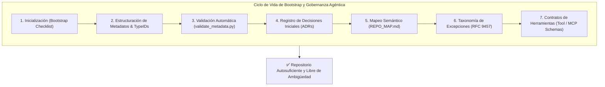
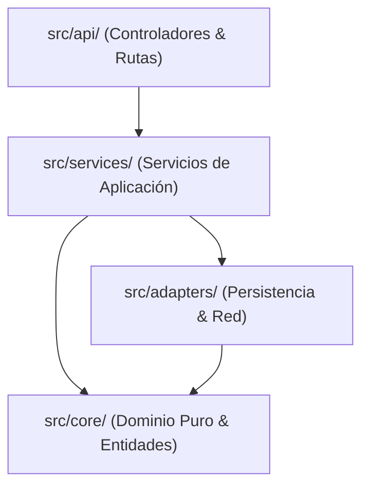
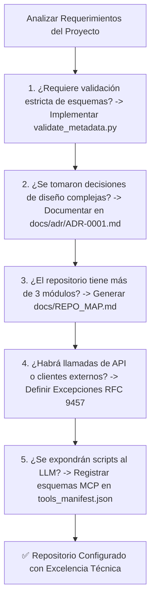

# Guía Fundacional de Metadatos, Herramientas Documentales y Bootstrap

Este documento constituye la **referencia documental unificada** para la inicialización determinista (*Bootstrap*), gobernanza de metadatos, gestión de arquitectura y contratos de herramientas en repositorios diseñados para desarrollo humano y colaboración con **Agentes Autónomos de Inteligencia Artificial**.

Reúne en un único marco de referencia las **6 herramientas fundacionales** que permiten a un agente de IA razonar, estructurar y adaptar los metadatos de un nuevo proyecto según sus necesidades específicas.

---

## 1. Arquitectura de Gobernanza y Ciclo de Bootstrap



> [!IMPORTANT]
> **Regla Inviolable de Diagramación Formal:** Queda terminantemente prohibido construir diagramas de flujo, procesos, mapas o secuencias mediante flechas de texto plano (`->`, `-->`, `==>`, `|`, `/`, `\`), caracteres ASCII o símbolos informales sujetos a interpretación ambigua. Todo flujo o relación visual DEBE modelarse obligatoriamente en formato **Mermaid** (` ```mermaid `) con nodos tipados y direcciones formales.

---

## 2. Módulo 1: Checklist y Procedimiento de Bootstrap (*Day 0*)

Para iniciar un repositorio desde cero (*Greenfield*) a partir del estándar `formato_minimo`, ejecutar el siguiente procedimiento secuencial:

### 2.1 Procedimiento Secuencial de Inicialización
1. **Inicialización de Git:** Ejecutar `git init` y configurar la rama principal en `main` (`git branch -M main`).
2. **Copiar Archivos de Infraestructura Base:** Copiar y adaptar `.editorconfig`, `.gitattributes`, `.gitignore` y `LICENSE` desde `formato_minimo/`.
3. **Instanciar Contratos Operativos:**
   - Crear `AGENTS.md` a partir de `formato_minimo/AGENTS.md`, ajustando la matriz de permisos de herramientas (Sección 3) y la lista de comandos de validación (Sección 10).
   - Crear `README.md` y `ARCHITECTURE.md` con la topología inicial.
4. **Instanciar la Capa de Memoria Persistente:** Crear la carpeta `persistencia_y_memoria/` con `MEMORY.md`, `PROGRESS.md`, `SCRATCHPAD.md` y `PLAYBOOK.md`.
5. **Configurar el Entorno Virtual y Herramientas:**
   - Crear `pyproject.toml` con configuración de linters (`ruff`) y tipado estricto (`mypy`).
   - Generar el lockfile determinista mediante `uv lock` o `poetry lock`.
6. **Validación Pre-Flight y Primer Commit:**
   - Ejecutar la suite inicial de validación (`python scripts/validate_metadata.py` y `ruff check .`).
   - Realizar el commit fundacional: `git commit -m "chore(repo): initial repository bootstrap from minimal format"`.

### 2.2 Checklist de Verificación de Bootstrap (*Day 0 Checklist*)
- [ ] ¿El repositorio está inicializado con `git init` y codificación UTF-8/LF?
- [ ] ¿Están presentes `.editorconfig`, `.gitattributes` y `.gitignore` sin secretos en el árbol?
- [ ] ¿Existe `AGENTS.md` como contrato operativo con guardrails inviolables?
- [ ] ¿Están inicializados `MEMORY.md` y `PROGRESS.md` para retención de estado?
- [ ] ¿Se cuenta con un lockfile de dependencias inmutable versionado en Git?
- [ ] ¿El commit inicial sigue la convención *Conventional Commits*?

---

## 3. Módulo 2: Script y Especificación de Validación de Metadatos

Para evitar la degradación de metadatos (*bit rot*), el repositorio debe contar con un script automatizado ejecutable en CI (`scripts/validate_metadata.py`) que audite la integridad de todos los archivos Markdown y JSONC.

### 3.1 Script Canónico de Validación (`scripts/validate_metadata.py`)

```python
"""Script de validación automática de metadatos Frontmatter y esquemas JSONC."""

import glob
import json
import os
import re
import sys
from collections.abc import Sequence
from pathlib import Path
import yaml

# Expresión regular canónica para TypeIDs: <prefix>_<base32_uuidv7>
TYPEID_REGEX = re.compile(r"^[a-z]{2,12}_[0-9a-hjkmnp-tv-z]{26}$")

# Campos obligatorios en metadatos Frontmatter
REQUIRED_FIELDS = [
    "id",
    "name",
    "title",
    "file_path",
    "version",
    "category",
    "status",
    "tags",
    "description",
]

def parse_jsonc(content: str) -> dict[str, object]:
    """Parsea una cadena JSONC eliminando comentarios de línea y bloque."""
    cleaned = re.sub(r"//.*?$|/\*.*?\*/", "", content, flags=re.MULTILINE | re.DOTALL)
    result = json.loads(cleaned)
    if not isinstance(result, dict):
        raise ValueError("El JSONC debe ser un objeto JSON válido.")
    return result

def validate_markdown_file(file_path: Path) -> list[str]:
    """Valida el bloque Frontmatter YAML de un archivo Markdown."""
    errors: list[str] = []
    content = file_path.read_text(encoding="utf-8")
    
    if not content.startswith("---"):
        return [f"{file_path}: No contiene delimitador inicial '---' de Frontmatter."]
    
    parts = content.split("---", 2)
    if len(parts) < 3:
        return [f"{file_path}: Frontmatter YAML no cerrado correctamente."]
    
    yaml_text = parts[1]
    try:
        data = yaml.safe_load(yaml_text)
    except yaml.YAMLError as exc:
        return [f"{file_path}: Error de sintaxis YAML: {exc}"]
    
    if not isinstance(data, dict):
        return [f"{file_path}: El Frontmatter debe ser un mapa asociativo."]
    
    # 1. Validar campos requeridos
    for field in REQUIRED_FIELDS:
        if field not in data:
            errors.append(f"{file_path}: Campo obligatorio '{field}' ausente.")
    
    # 2. Validar formato de ID (TypeID o Slug numérico)
    doc_id = str(data.get("id", ""))
    is_typeid = bool(TYPEID_REGEX.match(doc_id))
    is_slug = bool(re.match(r"^[0-9]{2}_[a-z0-9_]{3,60}$", doc_id))
    if not (is_typeid or is_slug):
        errors.append(f"{file_path}: ID '{doc_id}' no cumple con TypeID ni Slug numérico.")
    
    # 3. Validar consistencia de file_path
    declared_path = data.get("file_path", "")
    norm_declared = str(declared_path).replace("\\", "/")
    norm_actual = str(file_path.as_posix())
    if not norm_actual.endswith(norm_declared):
        errors.append(f"{file_path}: 'file_path' ({norm_declared}) no coincide con ruta física.")
    
    return errors

def main(argv: Sequence[str] | None = None) -> int:
    """Función principal de ejecución del validador."""
    all_errors: list[str] = []
    root_dir = Path(".")
    
    # Validar todos los archivos Markdown
    for md_file in root_dir.rglob("*.md"):
        if any(ignored in md_file.parts for ignored in [".git", ".venv", "node_modules", "sandbox"]):
            continue
        all_errors.extend(validate_markdown_file(md_file))
    
    # Validar archivos JSONC si existen
    for jsonc_file in root_dir.rglob("*.jsonc"):
        if any(ignored in jsonc_file.parts for ignored in [".git", ".venv", "node_modules"]):
            continue
        try:
            parse_jsonc(jsonc_file.read_text(encoding="utf-8"))
        except Exception as exc:
            all_errors.append(f"{jsonc_file}: Fallo al parsear JSONC: {exc}")
    
    if all_errors:
        print(f"❌ Se encontraron {len(all_errors)} errores de metadatos:")
        for err in all_errors:
            print(f"  - {err}")
        return 1
    
    print("✅ Todos los metadatos y esquemas JSONC son 100% válidos.")
    return 0

if __name__ == "__main__":
    sys.exit(main())
```

---

## 4. Módulo 3: Taxonomía de Excepciones y Errores Estructurados (*RFC 9457*)

Para que los agentes de IA puedan realizar diagnósticos deterministas y auto-reparación (*Self-Healing*), los errores del sistema no deben ser cadenas de texto arbitrarias, sino estructuras conformes al estándar **RFC 9457 (*Problem Details*)**.

### 4.1 Estructura Estándar de Error RFC 9457 para Agentes

```json
{
  "type": "https://errors.repo.internal/errors/ERR_CONFIG_MISSING",
  "title": "Variable de Configuración Requerida Ausente",
  "status": 500,
  "detail": "La variable de entorno 'DATABASE_URL' no se encuentra definida en el entorno actual.",
  "instance": "/runtime/bootstrap/database_adapter.py#L42",
  "error_code": "ERR_CONFIG_MISSING",
  "trace_id": "trace_01j7w2b8k4z0v9m1x2c3d4e5f6",
  "remediation_hint": "Definir 'DATABASE_URL' en el archivo .env basándose en la plantilla .env.example."
}
```

### 4.2 Jerarquía de Clases de Excepción Tipadas en Python

```python
"""Jerarquía canónica de excepciones tipadas con detalles RFC 9457."""

from dataclasses import dataclass

@dataclass(frozen=True)
class ProblemDetails:
    error_code: str
    title: str
    status: int
    detail: str
    remediation_hint: str | None = None

class DomainBaseException(Exception):
    """Excepción base para todos los errores controlados del repositorio."""
    
    def __init__(self, problem: ProblemDetails) -> None:
        super().__init__(f"[{problem.error_code}] {problem.title}: {problem.detail}")
        self.problem = problem

class EntityNotFoundError(DomainBaseException):
    """Elevada cuando una entidad solicitada no existe."""
    pass

class ValidationError(DomainBaseException):
    """Elevada ante violaciones de esquemas o invariantes de negocio."""
    pass

class ToolExecutionError(DomainBaseException):
    """Elevada ante fallas de herramientas externas o timeouts."""
    pass
```

### 4.3 Catálogo Canónico de Prefijos de Error
- `ERR_AUTH_`: Problemas de autenticación, permisos o tokens caducados.
- `ERR_VALIDATION_`: Violación de esquemas de datos, tipos inválidos o datos fuera de rango.
- `ERR_NOT_FOUND_`: Recursos, archivos o entidades no localizadas.
- `ERR_TOOL_`: Fallas en scripts de automatización, timeouts o dependencias de herramientas.
- `ERR_STORAGE_`: Errores de bases de datos, bloqueos de archivo o concurrencia.
- `ERR_SYSTEM_`: Anomalías de configuración, entorno o variables faltantes.

---

## 5. Módulo 4: Plantilla y Estándar de Registros de Decisiones de Arquitectura (ADRs)

Los Registros de Decisiones de Arquitectura (*Architecture Decision Records - ADRs*) capturan el contexto, opciones evaluadas y consecuencias de decisiones clave, evitando que agentes en turnos futuros intenten revertir decisiones consensuadas.

### 5.1 Estándar de Nomenclatura y Ubicación
- **Ubicación:** `docs/adr/`
- **Formato de Archivo:** `ADR-XXXX_nombre_descriptivo_en_snake_case.md` (ej. `ADR-0001_seleccion_pydantic_v2.md`).

### 5.2 Plantilla Canónica de ADR

```markdown
---
id: doc_01j7w2b8k4z0v9m1x2c3d4e5f6
name: adr_0001_seleccion_pydantic_v2
title: "ADR-0001: Selección de Pydantic v2 para Validación de Esquemas y DTOs"
file_path: docs/adr/ADR-0001_seleccion_pydantic_v2.md
version: 1.0.0
category: architecture
tags: [adr, decision, architecture, pydantic, schemas, validation]
description: "Registro de la decisión arquitectónica de adoptar Pydantic v2 como motor central de validación de datos e inmutabilidad."
owner: Architecture Team
status: active
created_at: 2026-08-27T23:00:00Z
updated_at: 2026-08-27T23:00:00Z
schema_version: 1.0.0
---

# ADR-0001: Selección de Pydantic v2 para Validación de Esquemas

## 1. Estado
**Aceptado (Accepted)** | Fecha: 2026-08-27

## 2. Contexto del Problema
El sistema requiere procesar cargas de trabajo heterogéneas provenientes de llamadas a herramientas de agentes y APIs REST. Se necesita una biblioteca de validación de alto rendimiento, con tipado estático nativo y serialización estricta a JSON.

## 3. Opciones Evaluadas
1. **Opción A: Dataclasses estándar de Python + validación manual.**
   - *Ventajas:* Cero dependencias externas.
   - *Desventajas:* Requiere escribir código boilerplate para validación de tipos anidados y serialización.
2. **Opción B: Pydantic v2 (Motor en Rust).**
   - *Ventajas:* Rendimiento 10x respecto a v1, soporte nativo de JSON Schema y compatibilidad directa con FastAPI y LLM tool calling.
   - *Desventajas:* Dependencia externa binaria.

## 4. Decisión Tomada
Adoptar **Pydantic v2** como la única fuente de verdad para validación de esquemas de entrada/salida y DTOs de dominio.

## 5. Consecuencias
- **Positivas:** Reducción drástica de código boilerplate; generación automática de OpenAPI y JSON Schema para agentes.
- **Negativas / Riesgos:** Obligatoriedad de compilar o instalar wheels pre-compilados en entornos CI.
- **Regla Inviolable para Agentes:** Prohibido el uso de `@validator` obsoleto de v1; emplear exclusivamente `@field_validator`.
```

---

## 6. Módulo 5: Estándar y Plantilla de Mapa Semántico (`REPO_MAP.md`)

El archivo `REPO_MAP.md` proporciona al agente de IA un mapa mental compacto del repositorio, permitiendo ubicar qué paquete posee una responsabilidad sin realizar búsquedas masivas de tokens.

### 6.1 Plantilla de Mapa Semántico (`docs/REPO_MAP.md`)

```markdown
# Mapa Semántico del Repositorio (REPO_MAP.md)

Este documento describe la topología de subsistemas, responsabilidades funcionales y contratos exportados en el proyecto.

## 1. Grafo de Dependencias entre Módulos



## 2. Catálogo de Responsabilidades por Subsistema

| **Directorio / Módulo** | **Responsabilidad Principal** | **Símbolos Públicos Clave** | **Dependencias Directas** | **Consumidores** |
|:---|:---|:---|:---|:---|
| `src/core/domain/` | Entidades puras e invariantes de negocio | `User`, `Order`, `Money` | Ninguna (Puro) | `src/services/` |
| `src/core/ports/` | Interfaces y protocolos abstractos | `RepositoryPort`, `NotifierPort` | `src/core/domain/` | `src/adapters/` |
| `src/services/` | Orquestación de casos de uso y flujos | `OrderService`, `AuthService` | `src/core/` | `src/api/` |
| `src/adapters/db/` | Implementación de persistencia con SQLAlchemy | `PostgresOrderRepository` | `src/core/ports/` | `src/main.py` |
| `src/api/` | Controladores HTTP y validación de endpoints | `OrderRouter`, `HealthRouter` | `src/services/` | Clientes Externos |
```

---

## 7. Módulo 6: Especificación de Herramientas y Contratos MCP / Function Calling

Para que herramientas y scripts de automatización en `scripts/` puedan ser invocados de forma determinista por modelos LLM y servidores MCP (*Model Context Protocol*), se deben formalizar mediante contratos JSON Schema.

### 7.1 Plantilla de Esquema de Herramienta (`tools_manifest.json`)

```json
{
  "$schema": "https://json-schema.org/draft-07/schema#",
  "tools": [
    {
      "name": "run_test_suite",
      "description": "Ejecuta la suite de pruebas unitarias o de integración con pytest y genera un reporte estructurado de resultados.",
      "risk_level": "read_only",
      "execution_mode": "sync",
      "timeout_seconds": 60,
      "parameters": {
        "type": "object",
        "properties": {
          "test_path": {
            "type": "string",
            "description": "Ruta del archivo o directorio de pruebas a ejecutar.",
            "default": "tests/unit/"
          },
          "fail_fast": {
            "type": "boolean",
            "description": "Detener la ejecución al primer test fallido (-x).",
            "default": true
          }
        },
        "required": ["test_path"]
      }
    }
  ]
}
```

---

## 8. Protocolo de Razonamiento para la IA Agéntica

Cuando un agente de IA inicie la creación o adaptación de un repositorio desde cero, debe seguir este **protocolo de razonamiento inductivo**:



1. **Evaluar la Complejidad del Stack:** Si el proyecto es un script ligero (Perfil A), aplicar únicamente el validador y checklist de bootstrap. Si es una API o sistema multi-agente (Perfiles C y D), implementar la totalidad de los 6 módulos.
2. **Priorizar Determinismo:** Ninguna decisión arquitectónica o herramienta debe dejarse a la inferencia libre; documentar contratos explícitos en JSON Schema y Markdown estructurado.
3. **Cerrar el Bucle:** Cada excepción nueva debe contar con su código de taxonomía, y cada herramienta nueva debe figurar en el manifiesto JSON.
