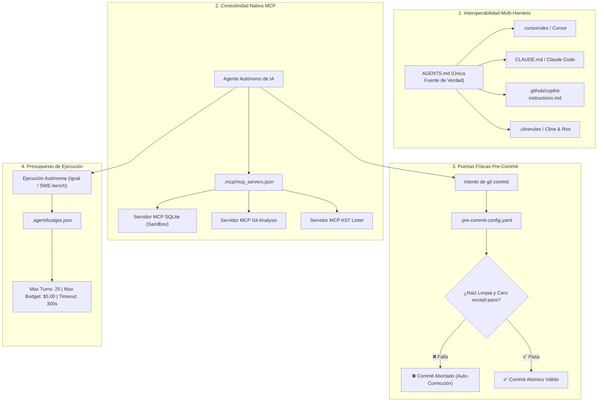

# Guía de Prácticas Emergentes, Protocolo MCP y Gobernanza Avanzada

Este documento compila las **prácticas emergentes y estándares de frontera (2025/2026)** para el desarrollo de software colaborativo con Inteligencia Artificial. Complementa el estándar fundacional con mecanismos avanzados de **interoperabilidad multi-IDE**, integración nativa del protocolo **Model Context Protocol (MCP)**, **puertas de control pre-commit** para agentes y **presupuestos declarativos** para ejecuciones autónomas de larga duración.

---

## 1. Topología del Ecosistema Agéntico de Frontera



> [!IMPORTANT]
> **Regla Inviolable de Diagramación Formal:** Queda terminantemente prohibido construir diagramas de flujo, procesos, mapas o secuencias mediante flechas de texto plano (`->`, `-->`, `==>`, `|`, `/`, `\`), caracteres ASCII o símbolos informales sujetos a interpretación ambigua. Todo flujo o relación visual DEBE modelarse obligatoriamente en formato **Mermaid** (` ```mermaid `) con nodos tipados y direcciones formales.

---

## 2. Módulo 1: Interoperabilidad Multi-Harness y Multi-IDE

En equipos heterogéneos donde los desarrolladores utilizan distintas herramientas (Antigravity, Cursor, Claude Code, Windsurf, Cline, Copilot), mantener archivos de reglas separados produce **deriva de directivas (*Rule Drift*)**.

### 2.1 Principio de Única Fuente de Verdad (SSOT)
El archivo [`AGENTS.md`](../AGENTS.md) es la **única autoridad vinculante**. Todas las demás configuraciones propietarias deben ser enlaces simbólicos (*symlinks*) o archivos puntero de una línea.

### 2.2 Plantillas de Punteros Propietarios

#### A. Para Claude Code (`CLAUDE.md` en la raíz):
```markdown
# Claude Code Project Directives
See `AGENTS.md` for the authoritative operational contract, tool permissions, coding standards, and memory protocols governing this repository.
```

#### B. Para Cursor (`.cursorrules` en la raíz o `.cursor/rules/main.mdc`):
```markdown
---
description: "Authoritative Repository Rules for AI Agents"
globs: ["*"]
alwaysApply: true
---
# Cursor AI Directives
Refer to `AGENTS.md` in the project root for complete operational boundaries, strict typing rules, and workflow standards.
```

#### C. Para GitHub Copilot (`.github/copilot-instructions.md`):
```markdown
# GitHub Copilot Repository Instructions
Follow all architectural standards, type annotations (PEP 585/604), and guardrails defined in `AGENTS.md`.
```

#### D. Para Cline / Roo Code (`.clinerules` en la raíz):
```markdown
# Cline & Roo Code Operating Rules
All task execution must strictly adhere to the operational contract defined in `AGENTS.md` and use `sandbox/` for all temporary exploration.
```

---

## 3. Módulo 2: Configuración Nativa de Model Context Protocol (MCP)

El estándar **Model Context Protocol (MCP)** permite desacoplar las herramientas y fuentes de datos locales del modelo LLM mediante servidores ligeros y estandarizados.

### 3.1 Estructura en el Repositorio
```yaml
.mcp/
  mcp_servers.json       # Configuración canónica de servidores locales
  README.md              # Documentación de sidecars y herramientas
```

### 3.2 Plantilla Canónica de Servidores MCP (`.mcp/mcp_servers.json`)

```json
{
  "$schema": "https://json-schema.org/draft-07/schema#",
  "mcpServers": {
    "repo_sqlite_sandbox": {
      "command": "python",
      "args": ["-m", "mcp_server_sqlite", "--db-path", "sandbox/test_database.db"],
      "env": {
        "SQLITE_READ_ONLY": "true"
      },
      "description": "Servidor MCP de base de datos SQLite aislada en sandbox para pruebas de consultas."
    },
    "repo_git_analyzer": {
      "command": "mcp-server-git",
      "args": ["--repository", "."],
      "description": "Servidor MCP para análisis semántico de historial, commits y diffs."
    },
    "repo_filesystem_guard": {
      "command": "mcp-server-filesystem",
      "args": ["src/", "tests/", "docs/", "sandbox/"],
      "description": "Acceso restringido al sistema de archivos local, protegiendo directorios del sistema operativo."
    }
  }
}
```

### 3.3 Guardrails de Seguridad para MCP
1. **Sandboxing de Servidores:** Los servidores MCP locales no deben tener acceso fuera del directorio de trabajo del repositorio.
2. **Modo Solo Lectura por Defecto:** Bases de datos de staging o analíticas deben montarse con banderas de solo lectura (`SQLITE_READ_ONLY=true`).
3. **Cero Secretos en Configuración:** Las credenciales requeridas por servidores MCP deben inyectarse exclusivamente mediante variables de entorno (`env`).

---

## 4. Módulo 3: Git Pre-Commit Hooks Específicos para Agentes

Para evitar que un agente con una alucinación transitoria comitee código defectuoso o viole guardrails, se configuran **puertas de control pre-commit automatizadas**.

### 4.1 Configuración de `.pre-commit-config.yaml`

```yaml
# =============================================================================
# PUERTAS DE CONTROL PRE-COMMIT PARA DESARROLLO AGÉNTICO Y HUMANO
# =============================================================================
repos:
  # 1. Higiene y Formato Estándar
  - repo: https://github.com/astral-sh/ruff-pre-commit
    rev: v0.6.0
    hooks:
      - id: ruff
        args: [--fix, --exit-non-zero-on-fix]
      - id: ruff-format

  # 2. Detección de Secretos y Credenciales
  - repo: https://github.com/gitleaks/gitleaks
    rev: v8.18.0
    hooks:
      - id: gitleaks

  # 3. Validaciones Personalizadas para Guardrails de Agentes
  - repo: local
    hooks:
      # A. Rechazar archivos temporales huérfanos en la raíz
      - id: check-root-cleanliness
        name: Validar Limpieza de Raíz (No Throwaways)
        entry: python -c "
import os, sys
banned_prefixes = ['temp', 'test_', 'debug', 'check_', 'repro']
root_files = [f for f in os.listdir('.') if os.path.isfile(f)]
violations = [f for f in root_files if any(f.startswith(p) for p in banned_prefixes) and f not in ['test_suite.py']]
if violations:
    print(f'⛔ ERROR: Archivos temporales no permitidos en la raíz: {violations}. Muévelos a sandbox/.')
    sys.exit(1)
"
        language: python
        stages: [commit]

      # B. Prohibir bloques de fallo silencioso (except: pass)
      - id: check-no-silent-fallbacks
        name: Prohibición de Fallo Silencioso (No Silent Fallbacks)
        entry: python -c "
import sys, re
from pathlib import Path
pattern = re.compile(r'except(?:\s+Exception)?:\s*(?:pass|return\s+None)')
violations = []
for p in Path('src').rglob('*.py'):
    text = p.read_text(encoding='utf-8')
    if pattern.search(text):
        violations.append(str(p))
if violations:
    print(f'⛔ ERROR: Fallo silencioso detectado en: {violations}. Eleva excepciones tipadas de dominio.')
    sys.exit(1)
"
        language: python
        stages: [commit]

      # C. Validar sincronización de metadatos Frontmatter
      - id: validate-metadata
        name: Validar Integridad de Metadatos Frontmatter
        entry: python scripts/validate_metadata.py
        language: python
        stages: [commit]
```

---

## 5. Módulo 4: Presupuesto y Límites para Ejecuciones Autónomas

Cuando un agente ejecuta tareas autónomas de larga duración (ej. refactorizaciones multi-paquete, generación de suites de tests o pipelines overnight con `/goal`), se debe establecer un **presupuesto declarativo** para prevenir bucles infinitos de auto-corrección y consumo excesivo de tokens.

### 5.1 Estructura del Archivo de Presupuesto (`.agent/budget.json`)

```json
{
  "$schema": "https://json-schema.org/draft-07/schema#",
  "autonomous_execution_limits": {
    "max_turns_per_task": 25,
    "max_tokens_total": 500000,
    "max_cost_usd": 3.00,
    "timeout_seconds_per_tool": 120,
    "max_files_in_diff": 5,
    "max_lines_in_diff": 250,
    "loop_detection": {
      "enabled": true,
      "max_repeated_tool_calls": 3,
      "circuit_breaker_action": "halt_and_ask_user"
    }
  },
  "protected_branches": ["main", "master", "release/*"],
  "allowed_mutation_directories": ["src/", "tests/", "sandbox/", "docs/"]
}
```

### 5.2 Protocolo de Interrupción (*Circuit Breaker Agéntico*)
Si durante la ejecución autónoma se detecta:
1. **Bucle de Fallo Repetido:** El agente ejecuta el mismo comando de prueba 3 veces consecutivas con el mismo resultado fallido sin cambiar el enfoque.
2. **Superación del Presupuesto de Diff:** La modificación excede los 5 archivos o 250 líneas de diff.
3. **Acción Requerida:** El motor de IA debe **detener inmediatamente la mutación**, registrar el estado actual en `PROGRESS.md` y presentar un resumen estructurado al desarrollador humano solicitando asistencia (*Human-in-the-Loop*).

---

## 6. Checklist de Verificación para Prácticas Emergentes

Al habilitar estas prácticas avanzadas en el repositorio:

- [ ] **Interoperabilidad:** ¿Se crearon los archivos puntero (`CLAUDE.md`, `.cursorrules`, etc.) referenciando `AGENTS.md`?
- [ ] **Configuración MCP:** ¿El manifiesto `.mcp/mcp_servers.json` restringe los directorios de acceso y utiliza solo lectura en DBs?
- [ ] **Pre-Commit Agéntico:** ¿El archivo `.pre-commit-config.yaml` bloquea archivos temporales en la raíz y fallos silenciosos (`except: pass`)?
- [ ] **Presupuesto Autónomo:** ¿Están fijados los límites de pasos (máx. 25 turnos) y líneas de diff en `.agent/budget.json`?
- [ ] **Sandboxing Integrado:** ¿El sandbox y sus reglas de exclusión en `.gitignore` operan en armonía con los hooks?
