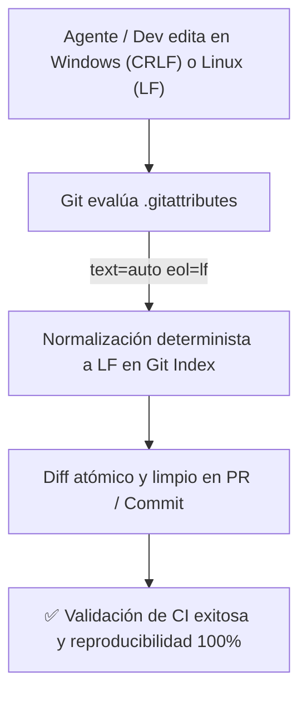

# Patrón Maestro y Plantilla de .gitattributes

Este documento define la **especificación canónica de control de finales de línea (EOL), drivers de diff semánticos y exclusiones de exportación en Git** para desarrolladores humanos y agentes autónomos de IA.

---

## 1. Función y Relevancia en Repositorios Agénticos

En repositorios donde conviven agentes autónomos y desarrolladores trabajando en plataformas heterogéneas (Linux en runners de CI/CD, Windows o macOS en máquinas locales):

1. **Prevención de *Diff Pollution* por Conversión CRLF:** Si Git convierte `LF` a `CRLF` en entornos Windows, los analizadores de diffs de LLM y herramientas de patch quirúrgico interpretan cada línea del archivo como modificada, destruyendo el historial y disparando falsas alarmas de regresión.
2. **Normalización Forzada en Repositorio (`eol=lf`):** `.gitattributes` instruye a Git a persistir todos los archivos de texto exclusivamente con saltos `LF`, independientemente de configuraciones locales del usuario (`core.autocrlf`).
3. **Diffs Semánticos Especializados:** Facilita la generación de diffs estructurados mediante `diff=python` y `diff=markdown`, permitiendo a los LLMs rastrear cabeceras de funciones y secciones sin ambigüedad.



> [!IMPORTANT]
> **Regla Inviolable de Diagramación Formal:** Queda terminantemente prohibido construir diagramas de flujo, procesos, mapas o secuencias mediante flechas de texto plano (`->`, `-->`, `==>`, `|`, `/`, `\`), caracteres ASCII o símbolos informales sujetos a interpretación ambigua. Todo flujo o relación visual DEBE modelarse obligatoriamente en formato **Mermaid** (` ```mermaid `) con nodos tipados y direcciones formales.

---

## 2. Plantilla Canónica Lista para Instanciar (`.gitattributes`)

<!-- ======================================================================= -->
<!-- Bloque de configuración .gitattributes con comentarios de BP integrado. -->
<!-- ======================================================================= -->

```gitattributes
# =============================================================================
# 1. CONFIGURACIÓN GLOBAL DE NORMALIZACIÓN DE FINALES DE LÍNEA (EOL)
# BP: bp_0113_convention_over_configuration & bp_0502_atomic_commits_and_clean_history
# Fuerza normalización automática a LF para todo archivo de texto.
# =============================================================================
* text=auto eol=lf

# =============================================================================
# 2. DOCUMENTACIÓN Y CONFIGURACIÓN ESTRUCTURADA
# BP: bp_0601_documentation_as_code
# Habilita driver semántico de diff para Markdown y persistencia LF estricta.
# =============================================================================
*.md            text eol=lf diff=markdown
*.markdown      text eol=lf diff=markdown
*.txt           text eol=lf
*.yaml          text eol=lf
*.yml           text eol=lf
*.json          text eol=lf
*.jsonc         text eol=lf
*.toml          text eol=lf
*.ini           text eol=lf
*.editorconfig  text eol=lf

# =============================================================================
# 3. CÓDIGO FUENTE Y TIPADO
# BP: bp_0904_agent_readable_code
# Habilita driver semántico diff=python para seguimiento de funciones y clases.
# =============================================================================
*.py            text eol=lf diff=python
*.pyi           text eol=lf diff=python
*.ts            text eol=lf
*.tsx           text eol=lf
*.js            text eol=lf
*.jsx           text eol=lf
*.html          text eol=lf
*.css           text eol=lf
*.sql           text eol=lf

# =============================================================================
# 4. SCRIPTS DE EJECUCIÓN Y AUTOMATIZACIÓN
# BP: bp_0801_operational_boundaries_and_blast_radius
# Scripts Unix obligatoriamente en LF; scripts Batch en CRLF por compatibilidad.
# =============================================================================
*.sh            text eol=lf
*.bash          text eol=lf
*.ps1           text eol=lf
*.bat           text eol=crlf
*.cmd           text eol=crlf

# =============================================================================
# 5. ARCHIVOS BINARIOS E INMUTABLES (PROHIBIDO ALTERAR BYTES O EOL)
# BP: bp_0703_high_signal_to_noise_ratio
# Tratamiento binario estricto para evitar corrupción por conversiones de texto.
# =============================================================================
*.png           binary
*.jpg           binary
*.jpeg          binary
*.gif           binary
*.ico           binary
*.svg           text eol=lf
*.pdf           binary
*.zip           binary
*.tar.gz        binary
*.parquet       binary
*.db            binary
*.sqlite        binary
*.onnx          binary
*.pt            binary

# =============================================================================
# 6. EXCLUSIONES DE EMPAQUETADO (git archive)
# BP: bp_0503_reproducible_builds_and_lockfiles
# Excluye metadatos internos y tests al generar releases de distribución.
# =============================================================================
.github         export-ignore
.gitignore      export-ignore
.gitattributes  export-ignore
tests           export-ignore
docs            export-ignore
sandbox         export-ignore
```

---

## 3. Delimitación de Secciones y Explicación Técnica

| **Sección** | **Patrones Clave** | **Propósito para Humanos y Agentes** | **Riesgo si se Omite** |
|:---|:---|:---|:---|
| **1. Regla Global** | `* text=auto eol=lf` | Normalización omnímoda de archivos de texto a `LF` en el índice de Git. | Falsos positivos masivos en diffs cuando se edita en Windows. |
| **2. Documentación** | `*.md diff=markdown` | Muestra el título de la sección modificada en la cabecera del diff (`git diff`). | Diffs ambiguos en documentos extensos sin contexto de sección. |
| **3. Código Fuente** | `*.py diff=python` | Muestra la firma de la función o clase en la cabecera del chunk de diff. | Dificultad para agentes al asociar ediciones con sus métodos padre. |
| **4. Scripts** | `*.sh text eol=lf` | Previene que runners de CI o Docker fallen por caracteres `\r` (CRLF) residuales. | Error `\r: command not found` crítico en servidores Linux. |
| **5. Binarios** | `*.png binary` | Protege archivos compilados, imágenes y bases de datos contra corrupción. | Destrucción de archivos binarios al aplicar conversiones de texto. |
| **6. Export Ignore** | `docs export-ignore` | Mantiene livianos los archivos generados con `git archive`. | Empaquetados sobredimensionados con archivos innecesarios. |

---

## 4. Buenas Prácticas Agénticas Aplicadas a .gitattributes

1. **Normalización Preventiva con `git add --renormalize .`:**
   - Al incorporar `.gitattributes` en un repositorio existente, ejecutar `git add --renormalize .` para asegurar que todo archivo histórico quede convertido a `LF` en un único commit atómico.
2. **Sinergia con `.editorconfig`:**
   - `.editorconfig` regula el editor durante la escritura.
   - `.gitattributes` actúa como la salvaguarda definitiva en la capa de transporte y almacenamiento de Git.

---

## 5. Guía de Límites y Fronteras Operativas de .gitattributes

Para evitar superposición de responsabilidades entre herramientas de configuración:

| **Responsabilidad / Tarea** | **¿Corresponde a .gitattributes?** | **Herramienta / Ubicación Correcta** |
|:---|:---:|:---|
| Normalización de finales de línea (`LF`) en el almacenamiento de Git | ✅ **SÍ** | `.gitattributes`. |
| Configuración de drivers semánticos de diff (`diff=python`, `diff=markdown`) | ✅ **SÍ** | `.gitattributes`. |
| Exclusión de rutas en `git archive` (`export-ignore`) | ✅ **SÍ** | `.gitattributes`. |
| Formato de indentación en el editor (espacios vs tabs) | ❌ **NO** | `.editorconfig`. |
| Exclusión de archivos y carpetas del seguimiento de versiones | ❌ **NO** | `.gitignore`. |
| Reglas de linter y formateo automático de sintaxis | ❌ **NO** | `ruff.toml` / `pyproject.toml`. |

---

## 6. Comandos de Verificación para Agentes

Para inspeccionar o corregir atributos de Git:

```bash
# 1. Verificar qué atributos aplican a un archivo determinado
git check-attr -a src/paquete/modulo.py
git check-attr -a README.md

# 2. Re-normalizar todo el repositorio si se detectan saltos mixtos históricos
git add --renormalize .
git status --porcelain
```
