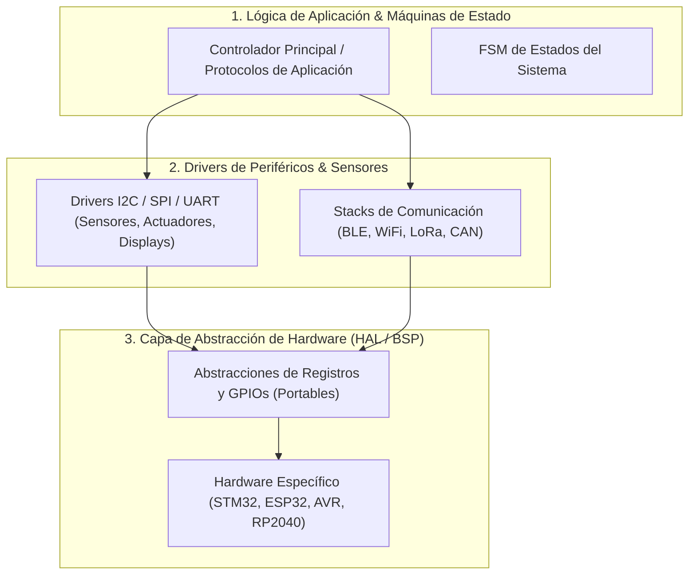

# Arquitectura para Sistemas Embebidos y Bare-Metal (ARCHITECTURE.md)

Este documento define las **capas de abstracción de hardware, límites de memoria y máquinas de estado** para este proyecto embebido.

---

## 1. Topología de Abstracción de Hardware (HAL)

El código se organiza en tres capas desacopladas para permitir portabilidad entre microcontroladores y pruebas unitarias en host:

---

## 2. Delimitación de Responsabilidades

| **Capa** | **Directorio Físico** | **Responsabilidad** | **Reglas de Aislamiento** |
|:---|:---|:---|:---|
| **Aplicación (`app/`)** | `src/app/` | Lógica pura del producto, toma de decisiones y estados. | `MUST_NOT` acceder a registros de hardware directamente. Compilable en Host nativo. |
| **Drivers (`drivers/`)** | `src/drivers/` | Protocolos de sensores, decodificación de tramas y buses. | Consume interfaces abstractas de HAL. |
| **HAL / BSP (`bsp/`)** | `src/bsp/` | Configuración de pines, interrupciones (ISRs), DMA y timers. | Única capa acoplada al SDK del microcontrolador específico. |

---

## 3. Invariantes de Sistemas Embebidos

1. **Gestión de Memoria Determinista:** `MUST_NOT` usar asignación dinámica de memoria (`malloc()`, `free()`, `new`) en bucles principales de tiempo real para evitar fragmentación del heap.
2. **ISRs Ultracortas:** Las Rutinas de Servicio de Interrupción (ISRs) solo deben fijar flags o escribir en ring-buffers; el procesamiento pesado se delega al bucle principal o tarea RTOS.
3. **Simulabilidad en Host:** La capa de aplicación debe compilar y probarse con mocks en el computador de desarrollo (Linux/Windows/macOS) sin requerir hardware físico conectado para pruebas unitarias.
