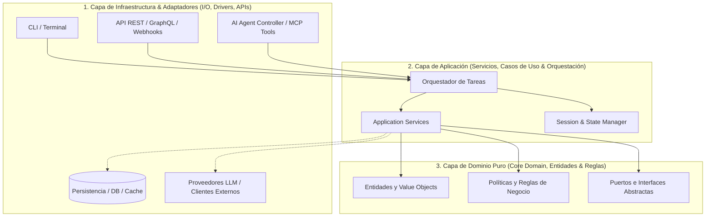
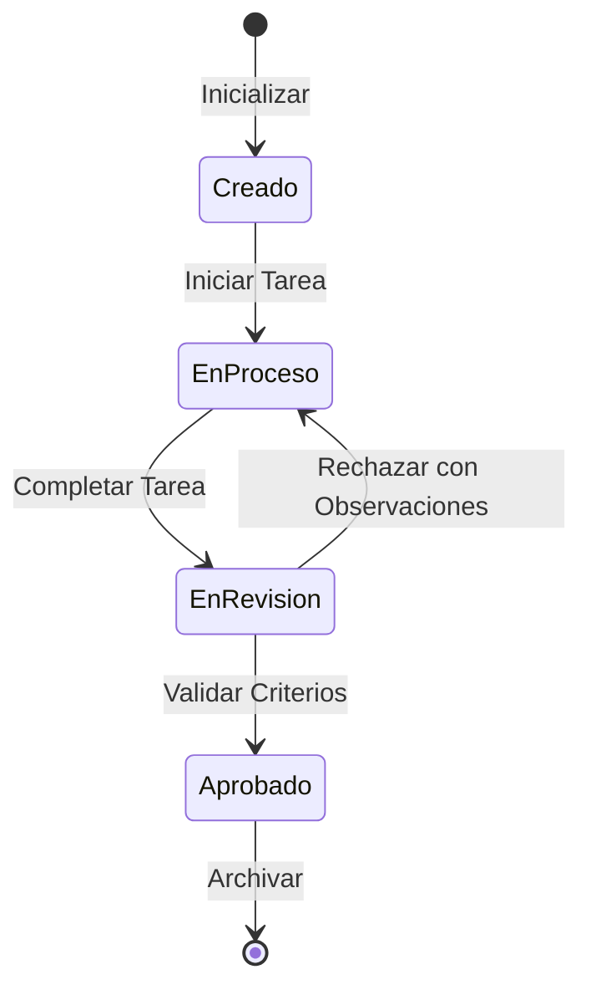

# Arquitectura Hexagonal: Puertos y Adaptadores (ARCHITECTURE.md)

Este documento define la **topología técnica, límites de capas, puertos, adaptadores e invariantes de dependencia** para este repositorio.

---

## 1. Topología del Sistema y Capas Concéntricas

El sistema implementa una **Arquitectura Hexagonal (Puertos y Adaptadores)** desacoplada en cuatro capas concéntricas con regla de dependencia unidireccional estricta hacia el núcleo:

> [!IMPORTANT]
> **Regla de Dependencia Unidireccional (`MUST_NOT`):** La capa de Dominio (`core/` o `domain/`) NUNCA debe importar librerías de infraestructura, frameworks web, clientes de bases de datos o servicios externos de E/S. Las dependencias externas se invierten mediante interfaces abstractas (Puertos).

---

## 2. Delimitación de Capas y Responsabilidades

| **Capa Arquitectónica** | **Directorio Físico Sugerido** | **Responsabilidad Principal** | **Reglas de Dependencia e Importación** |
|:---|:---|:---|:---|
| **Dominio Puro (*Core/Domain*)** | `src/<paquete>/core/` o `src/<paquete>/domain/` | Entidades puras, Value Objects, reglas de negocio e interfaces de puertos. | `MUST_NOT` importar frameworks, DBs, requests, o librerías de E/S. |
| **Aplicación (*Services/Use Cases*)** | `src/<paquete>/services/` o `src/<paquete>/application/` | Casos de uso, orquestación de flujos, transacciones y coordinación. | Solo depende de `core/` y de interfaces/puertos abstractos. |
| **Infraestructura (*Adapters/Infra*)** | `src/<paquete>/adapters/` o `src/<paquete>/infra/` | Implementación concreta de puertos: clientes de DB, APIs externas, filesystem, LLMs. | Implementa interfaces de `core/`. No contiene reglas de negocio. |
| **Puntos de Entrada (*Entrypoints/Agents*)** | `src/<paquete>/entrypoints/` o `src/<paquete>/api/` | Routers HTTP, controladores CLI, herramientas MCP y consumidores de eventos. | Consume `services/` mediante DTOs tipados. Prohibido saltar directo a DB. |

---

## 3. Máquina de Estados y Ciclo de Vida del Dominio

Para entidades con ciclos de vida complejos, modelar las transiciones mediante máquinas de estado finito (FSM):

---

## 4. Registro de Decisiones de Arquitectura (ADR)

Toda modificación estructural significativa debe formalizarse mediante un registro de decisión en `docs/adr/`.
Consulte [`docs/adr/index.md`](file:///docs/adr/index.md) para el catálogo de decisiones históricas.
