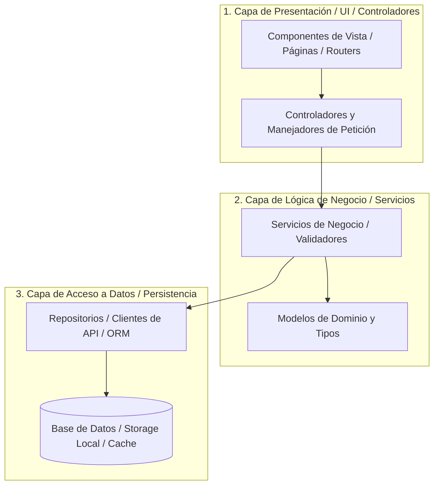

# Arquitectura en Capas Tradicionales (ARCHITECTURE.md)

Este documento define la **organización en capas, separación de responsabilidades y flujo de control** del sistema.

---

## 1. Topología del Sistema en Capas

El sistema se estructura en capas horizontales donde cada nivel consume únicamente los servicios del nivel inferior inmediato:

---

## 2. Delimitación de Capas y Responsabilidades

| **Capa** | **Directorio Físico** | **Responsabilidad** | **Reglas de Acceso** |
|:---|:---|:---|:---|
| **Presentación** | `src/presentation/` o `src/views/` | Renderizado visual, captura de eventos de usuario y enrutamiento. | Solo invoca servicios de la capa de negocio. `MUST_NOT` consultar BD directamente. |
| **Lógica de Negocio** | `src/services/` o `src/business/` | Reglas operativas, validaciones de datos y transformación. | Depende de modelos y repositorios de datos. |
| **Acceso a Datos** | `src/repositories/` o `src/data/` | Consultas a bases de datos, consumo de APIs externas y almacenamiento. | Provee abstracciones para que la capa de negocio no lidie con detalles de conexión. |

---

## 3. Manejo de Estado y Flujo Unidireccional

1. Los componentes de vista emiten acciones o eventos.
2. Los controladores validan los parámetros y delegan a la capa de servicios.
3. Los servicios ejecutan la lógica, mutan el estado y persisten mediante los repositorios.
4. La respuesta enriquecida retorna de forma determinista a la capa de presentación.
