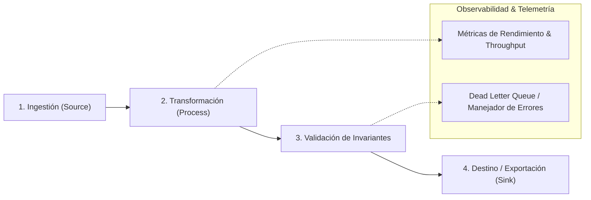

# Arquitectura de Pipeline y Flujos de Datos (ARCHITECTURE.md)

Este documento define la **secuencia de etapas de procesamiento, transformaciones intermedias y contratos de datos** del pipeline.

---

## 1. Topología del Pipeline de Procesamiento

El sistema se estructura como un grafo dirigido de procesamiento por etapas independientes y desacopladas:

---

## 2. Definición de Etapas del Pipeline

| **Etapa** | **Módulo Físico** | **Entrada** | **Transformación** | **Salida** |
|:---|:---|:---|:---|:---|
| **1. Ingestión (*Source*)** | `src/pipeline/sources/` | Archivos crudos, streams, APIs | Parseo de formato crudo a DTOs tipados | Stream de registros crudos |
| **2. Transformación (*Transformers*)** | `src/pipeline/transforms/` | Registros crudos | Limpieza, normalización, enriquecimiento | Registros transformados |
| **3. Validación (*Validators*)** | `src/pipeline/validators/` | Registros transformados | Validación de esquemas y reglas de integridad | Registros válidos / Registros fallidos |
| **4. Destino (*Sinks*)** | `src/pipeline/sinks/` | Registros validados | Serialización y persistencia | Base de datos, archivos parquet, cloud storage |

---

## 3. Invariantes del Pipeline

1. **Idempotencia:** Cada etapa del pipeline debe ser idempotente y reproducible ante reejecuciones.
2. **Inmutabilidad:** Los datos de entrada no deben mutarse *in-place*; cada etapa emite un nuevo registro tipado.
3. **Manejo de Errores por Registro (*Dead Letter Queue*):** Los registros corruptos no deben detener el pipeline completo; deben aislarse en un registro de anomalías con metadatos de error.
