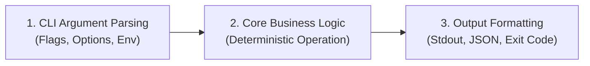

# Arquitectura de Scripts y Herramientas CLI (ARCHITECTURE.md)

Este documento define la **estructura liviana y el flujo de ejecución de 3 etapas** para esta herramienta de línea de comandos.

---

## 1. Flujo de Ejecución en 3 Etapas (*Parse -> Execute -> Output*)

```
+------------------+      +-------------------+      +--------------------+
|  1. Parseo Args  | ---> |  2. Lógica Core   | ---> |  3. Formato Salida |
| (CLI / Env / Flg)|      |  (Acción Pura)    |      | (JSON / Stdout / Exit)
+------------------+      +-------------------+      +--------------------+
```



---

## 2. Organización del Código

Para mantener la herramienta mantenible y libre de sobrecarga innecesaria:

- **Entrada / Parser (`cli.py` / `main()`):** Responsable exclusivo de parsear argumentos, validar flags obligatorios y mostrar la ayuda (`--help`).
- **Núcleo Lógico (`core.py` / función principal):** Ejecuta la operación real sin acoplamiento a `sys.argv` o `print()`. Recibe parámetros estructurados y retorna resultados o lanza excepciones tipadas.
- **Salida y Códigos de Salida (`formatters.py`):** Formatea el resultado (texto plano legible, tabla o JSON con `--json`) y asigna el código de retorno POSIX (`0` para éxito, `>0` para error).

---

## 3. Códigos de Salida POSIX Estándar

| Código | Significado | Escenario |
|:---:|:---|:---|
| `0` | Éxito | Operación completada satisfactoriamente. |
| `1` | Error General | Excepción no manejada o fallo en la operación. |
| `2` | Error de Uso / Argumentos | Parámetro obligatorio faltante o flag inválido. |
| `130` | Interrupción por Usuario | Script cancelado mediante `Ctrl+C` (SIGINT). |
