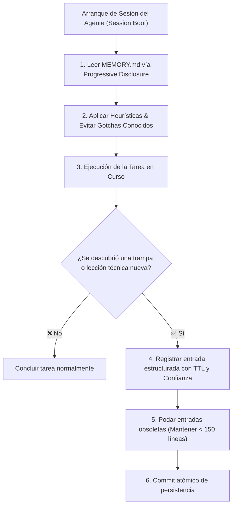

# Memoria Semántica y Aprendizaje Continuo (MEMORY.md)

Este documento constituye la **memoria a largo plazo (semántica y epistémica)** del repositorio. Almacena de forma estructurada las lecciones aprendidas, heurísticas empíricas, trampas de librerías (*gotchas*) y decisiones sutiles de diseño descubiertas durante el ciclo de vida del software.

---

## 1. Ciclo de Aprendizaje y Arranque de Sesión (*Session Boot*)



---

## 2. Registro Estructurado de Heurísticas y Lecciones

Toda entrada en esta memoria DEBE registrarse con metadatos estructurados para garantizar vigencia y evitar obsolescencia:

```yaml
- id: "mem_01m13x99q3fzgb3mjb7nd1ags5"
  timestamp: "2026-08-29T21:00:00Z"
  scope: "database_drivers"
  confidence: "high"               # high | medium | low
  source: "empirical_test"          # empirical_test | user_instruction | documentation | inferred
  last_validated: "2026-08-29"
  expires_at: "2027-02-28"          # TTL opcional para dependencias volátiles
  rule: "En SQLite in-memory multihilo, usar URI sqlite:///:memory:?cache=shared para evitar locks."
  rationale: "Las pruebas concurrentes en pytest fallaban esporádicamente por bloqueo de tablas."

- id: "mem_01m13x99q3fzgb3mjb7nd1ags6"
  timestamp: "2026-08-29T21:05:00Z"
  scope: "file_io_windows"
  confidence: "high"
  source: "empirical_test"
  last_validated: "2026-08-29"
  rule: "Especificar siempre encoding='utf-8' en llamadas open() en entornos Windows."
  rationale: "El default cp1252 corrompe caracteres acentuados al ejecutar en Linux CI."
```

---

## 3. Protocolo de Poda y Gobernanza de Memoria

Para evitar el agotamiento de la ventana de contexto y mantener alta densidad de señal:

1. **Límite de Líneas Activas:** `MEMORY.md` DEBE mantenerse por debajo de **150 líneas activas**.
2. **Criterios de Poda:**
   - Si una regla ya fue codificada directamente en una prueba automatizada o linter, eliminar la entrada de memoria.
   - Si una entrada superó su fecha `expires_at`, auditar si la librería subyacente corrigió el bug y eliminar si ya no aplica.
   - Si una heurística tiene confianza `low` y no ha sido validada en 90 días, archivar o purgar.
