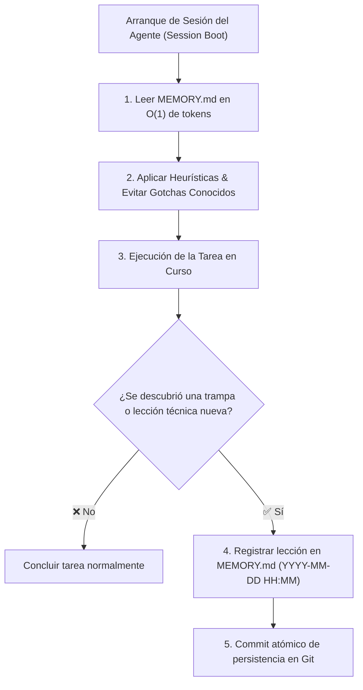

<!-- ======================================================================= -->
<!-- SECCIÓN 1: CABECERA Y ROL COGNITIVO DE LA MEMORIA SEMÁNTICA            -->
<!-- BP RECOMENDADA: bp_0912_knowledge_loops_and_repo_learning               -->
<!-- Establece el ancla de memoria a largo plazo para eliminar la amnesia.   -->
<!-- LÍMITES: Mantener el documento conciso (menos de 200 líneas totales).   -->
<!-- ======================================================================= -->

# Memoria Semántica del Repositorio y Aprendizaje Continuo (MEMORY.md)

Este documento constituye la **memoria a largo plazo (memoria semántica y epistémica)** del repositorio. Almacena de forma estructurada las lecciones aprendidas, heurísticas de código, trampas de dependencias (*gotchas*), decisiones técnicas sutiles y directivas no evidentes descubiertas por desarrolladores humanos y agentes de Inteligencia Artificial.

---

<!-- ======================================================================= -->
<!-- SECCIÓN 2: CICLO DE APRENDIZAJE Y ARRANQUE DE SESIÓN (BOOT)             -->
<!-- BP RECOMENDADA: bp_0701_context_engineering_principles                  -->
<!-- Flujo de consulta e ingesta de memoria para agentes.                    -->
<!-- ======================================================================= -->

## 1. Ciclo de Aprendizaje y Arranque de Sesión (*Session Boot*)



> [!IMPORTANT]
> **Regla Inviolable de Diagramación Formal:** Queda terminantemente prohibido construir diagramas de flujo, procesos, mapas o secuencias mediante flechas de texto plano (`->`, `-->`, `==>`, `|`, `/`, `\`), caracteres ASCII o símbolos informales sujetos a interpretación ambigua. Todo flujo o relación visual DEBE modelarse obligatoriamente en formato **Mermaid** (` ```mermaid `) con nodos tipados y direcciones formales.

---

<!-- ======================================================================= -->
<!-- SECCIÓN 3: REGLAS Y HEURÍSTICAS CRÍTICAS APRENDIDAS                     -->
<!-- BP RECOMENDADA: bp_0904_agent_readable_code & bp_0113_convention        -->
<!-- Directivas descubiertas empíricamente durante el ciclo de vida.         -->
<!-- ======================================================================= -->

## 2. Reglas y Heurísticas Críticas Aprendidas

<!-- Formato Canónico: - **[YYYY-MM-DD HH:MM] [Módulo / Tecnología]:** Descripción concisa de la lección y regla a aplicar. -->

- **[2026-08-27 18:30] [Codificación UTF-8 & Windows]:** En entornos Windows, las funciones de lectura/escritura de archivos (`open()`, `Path.write_text()`, scripts PowerShell) DEBEN especificar explícitamente `encoding='utf-8'` para evitar que caracteres especiales rompan el AST en pipelines de CI en Linux.
- **[2026-08-27 20:15] [Modelos Pydantic v2]:** Prohibido el uso de decoradores obsoletos `@validator` de Pydantic v1. Emplear exclusivamente `@field_validator(mode='before'/'after')` y `model_validate()`.
- **[2026-08-27 21:40] [Diagramación Mermaid]:** Todo diagrama de flujo, arquitectura o máquina de estados debe formalizarse obligatoriamente en bloques ` ```mermaid ` con nodos tipados entre comillas dobles; prohibido el uso de flechas de texto plano (`->`).
- **[2026-08-27 22:10] [Sandboxing Obligatorio]:** Los scripts de prueba destructiva o utilidades de un solo uso (*throwaway*) deben crearse estrictamente dentro de `sandbox/` para evitar contaminación en `src/` o en la raíz.

---

<!-- ======================================================================= -->
<!-- SECCIÓN 4: TRAMPAS DE DEPENDENCIAS Y ENTORNO (*GOTCHAS*)                -->
<!-- BP RECOMENDADA: bp_0818_no_silent_fallbacks                             -->
<!-- Errores sutiles de librerías externas y sus soluciones comprobadas.     -->
<!-- ======================================================================= -->

## 3. Trampas de Dependencias y Entorno (*Gotchas & Workarounds*)

- **Librería de Red / Cliente HTTP:** No invocar métodos sincrónicos de conexión (`client.get_sync()`) dentro de corutinas asíncronas activas; utilizar el cliente asíncrono `httpx.AsyncClient` con context manager para evitar bloqueo del loop de eventos.
- **Base de Datos SQLite en Pruebas:** Para pruebas concurrentes en memoria con `pytest`, emplear la URI de conexión `sqlite:///:memory:?cache=shared` para prevenir errores de tablas bloqueadas (*database is locked*).
- **Parsers YAML:** Al serializar metadatos Frontmatter, asegurar que cadenas con caracteres reservados (`:`, `{`, `}`, `[`, `]`, `*`) se encuentren envueltas en comillas dobles para evitar excepciones de parseo sintáctico.

---

<!-- ======================================================================= -->
<!-- SECCIÓN 5: PREFERENCIAS DE DISEÑO Y CONVENCIONES DESCUBIERTAS           -->
<!-- BP RECOMENDADA: bp_0207_domain_driven_design & bp_0102_solid_principles -->
<!-- Patrones preferidos en el código base descubiertos en refactorizaciones. -->
<!-- ======================================================================= -->

## 4. Preferencias de Diseño y Convenciones Descubiertas

- **Manejo de Excepciones:** No capturar excepciones genéricas con `except: pass`. Elevar excepciones tipadas de dominio (`raise DomainValidationError(...)`) enriquecidas con la causa raíz original (*RFC 9457*).
- **Inmutabilidad en Configuraciones:** Centralizar parámetros de módulo mediante clases decoradas con `@dataclass(frozen=True)` en lugar de diccionarios mutables globales.

---

<!-- ======================================================================= -->
<!-- SECCIÓN 6: ÍNDICE DE ENRUTAMIENTO DE DOCUMENTACIÓN ESPECIALIZADA        -->
<!-- BP RECOMENDADA: bp_0702_progressive_disclosure                          -->
<!-- Punteros directos para resolver dudas en O(1) de tokens.                -->
<!-- ======================================================================= -->

## 5. Índice de Enrutamiento de Documentación Especializada

- **Topología hexagonal, capas y modelos de datos:** Consultar [`ARCHITECTURE.md`](file:///G:/REPOSITORIOS%20GITHUB/BUENAS%20PRACTICAS/formato_minimo/ARCHITECTURE.md).
- **Contrato operativo, permisos de herramientas y guardrails:** Consultar [`AGENTS.md`](file:///G:/REPOSITORIOS%20GITHUB/BUENAS%20PRACTICAS/formato_minimo/AGENTS.md).
- **Diccionario de términos y conceptos del dominio:** Consultar [`GLOSSARY.md`](file:///G:/REPOSITORIOS%20GITHUB/BUENAS%20PRACTICAS/formato_minimo/GLOSSARY.md).
- **Diario de trabajo en tiempo real y subtareas activas:** Consultar [`PROGRESS.md`](file:///G:/REPOSITORIOS%20GITHUB/BUENAS%20PRACTICAS/formato_minimo/persistencia_y_memoria/PROGRESS.md).
- **Procedimientos paso a paso para tareas recurrentes:** Consultar [`PLAYBOOK.md`](file:///G:/REPOSITORIOS%20GITHUB/BUENAS%20PRACTICAS/formato_minimo/persistencia_y_memoria/PLAYBOOK.md).

---

<!-- ======================================================================= -->
<!-- SECCIÓN 7: PROTOCOLO DE PODA Y MANTENIMIENTO (*MEMORY PRUNING*)         -->
<!-- BP RECOMENDADA: bp_0703_high_signal_to_noise_ratio                      -->
<!-- Reglas para mantener el archivo compacto y libre de redundancia.        -->
<!-- ======================================================================= -->

## 6. Protocolo de Poda y Mantenimiento (*Memory Pruning*)

1. **Límite de Longitud:** El archivo no debe superar las **200 líneas**. Si se aproxima al límite, el agente debe realizar una sesión de poda (*Memory Pruning*).
2. **Promoción de Conocimiento:** Cuando una heurística se consolida de forma definitiva en el código base (mediante linters, pruebas o refactorizaciones) o se documenta formalmente en `ARCHITECTURE.md` o `AGENTS.md`, debe ser removida de `MEMORY.md` para evitar redundancia.

---

<!-- ======================================================================= -->
<!-- GUÍA DE LÍMITES Y FRONTERAS OPERATIVAS DEL MEMORY.md                    -->
<!-- ======================================================================= -->

## Guía de Límites y Fronteras Operativas del MEMORY.md

Para mantener el archivo `MEMORY.md` con alta densidad de señal y evitar que se convierta en una bitácora de tareas o volcado de logs:

| **Contenido / Información** | **¿Debe estar en MEMORY.md?** | **Ubicación Correcta Designada** |
|:---|:---:|:---|
| Lecciones aprendidas permanentes y heurísticas técnicas | ✅ **SÍ** | `MEMORY.md` (Sección 2). |
| Trampas de librerías (*gotchas*) y sus workarounds comprobados | ✅ **SÍ** | `MEMORY.md` (Sección 3). |
| Punteros a documentación especializada del repositorio | ✅ **SÍ** | `MEMORY.md` (Sección 5). |
| Estado paso a paso de subtareas activas o diario de ejecución | ❌ **NO** | `PROGRESS.md`. |
| Hipótesis temporales de trabajo, borradores o trazas de debug | ❌ **NO** | `SCRATCHPAD.md` o `sandbox/`. |
| Notas de release para usuarios finales (SemVer) | ❌ **NO** | `CHANGELOG.md`. |
| Topología exhaustiva de módulos y diagramas de secuencia | ❌ **NO** | `ARCHITECTURE.md`. |
| Procedimientos operativos estandarizados paso a paso | ❌ **NO** | `PLAYBOOK.md`. |
