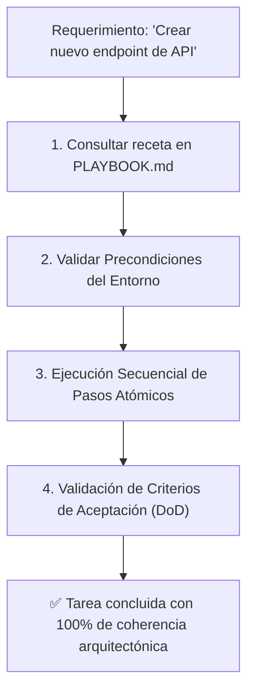

<!-- ======================================================================= -->
<!-- SECCIÓN 1: CABECERA Y ROL COGNITIVO DE LA MEMORIA PROCEDIMENTAL        -->
<!-- BP RECOMENDADA: bp_0603_runbooks_and_operational_documentation          -->
<!-- BP RECOMENDADA: bp_0607_facts_rules_and_procedures_separation           -->
<!-- Catálogo de procedimientos paso a paso deterministas para agentes.      -->
<!-- ======================================================================= -->

# Procedimientos Operativos Estandarizados y Recetas de Ejecución (PLAYBOOK.md)

Este documento constituye la **memoria procedimental oficial y catálogo de Procedimientos Operativos Estandarizados (*Standard Operating Procedures - SOPs*)** del proyecto. Proporciona recetas paso a paso, deterministas y verificables para la ejecución de tareas técnicas recurrentes, garantizando que tanto agentes autónomos de IA como desarrolladores sigan exactamente los mismos estándares de calidad y arquitectura.

---

<!-- ======================================================================= -->
<!-- SECCIÓN 2: FLUJO DE EJECUCIÓN DE PROCEDIMIENTOS (SOP)                   -->
<!-- ======================================================================= -->

## 1. Flujo de Ejecución de Procedimientos Estandarizados



> [!IMPORTANT]
> **Regla Inviolable de Diagramación Formal:** Queda terminantemente prohibido construir diagramas de flujo, procesos, mapas o secuencias mediante flechas de texto plano (`->`, `-->`, `==>`, `|`, `/`, `\`), caracteres ASCII o símbolos informales sujetos a interpretación ambigua. Todo flujo o relación visual DEBE modelarse obligatoriamente en formato **Mermaid** (` ```mermaid `) con nodos tipados y direcciones formales.

---

<!-- ======================================================================= -->
<!-- SECCIÓN 3: RECETA 1 - CREACIÓN DE UN NUEVO SERVICIO O PUERTO HEXAGONAL  -->
<!-- BP RECOMENDADA: bp_0201_layered_architecture & bp_0903_contract_driven  -->
<!-- ======================================================================= -->

## 2. Receta 1: Creación de un Nuevo Servicio de Dominio / Puerto

### Precondiciones:
- Entorno virtual activo con dependencias instaladas (`pytest`, `mypy`, `ruff`).
- Suite de pruebas actual en estado verde (`pytest`).

### Procedimiento Paso a Paso:
1. **Definir el Puerto Abstracto (Contrato):**
   - Crear el archivo `src/paquete/core/ports/<nombre_servicio>_port.py`.
   - Declarar la interfaz mediante `typing.Protocol` o `abc.ABC`.
2. **Definir los Esquemas de Entrada y Salida (DTOs):**
   - Crear DTOs inmutables con Pydantic v2 en `src/paquete/schemas/<nombre_servicio>_dto.py`.
3. **Implementar el Servicio de Aplicación:**
   - Crear la implementación en `src/paquete/services/<nombre_servicio>_service.py`.
   - Incluir tipado estricto PEP 585/604 y Google Docstrings completos.
4. **Escribir la Suite de Pruebas Unitarias:**
   - Crear `tests/unit/test_<nombre_servicio>_service.py` testeando el camino feliz y excepciones de dominio.
5. **Verificación de Calidad y DoD:**
   - Ejecutar `pytest tests/unit/test_<nombre_servicio>_service.py -vv`.
   - Ejecutar `mypy --strict src/paquete/services/<nombre_servicio>_service.py`.
   - Ejecutar `ruff check src/` y `ruff format --check src/`.

---

<!-- ======================================================================= -->
<!-- SECCIÓN 4: RECETA 2 - DIAGNÓSTICO Y REPRODUCCIÓN AISLADA DE BUGS        -->
<!-- BP RECOMENDADA: bp_0914_reproducible_bug_reports & bp_0910_worktree     -->
<!-- ======================================================================= -->

## 3. Receta 2: Diagnóstico y Reproducción Aislada de Bugs en Sandbox

### Procedimiento Paso a Paso:
1. **Crear Script Mínimo de Reproducción:**
   - Crear `sandbox/repro_<nombre_bug>.py` con el payload exacto que detona el error.
2. **Ejecutar y Aislar la Causa Raíz:**
   - Ejecutar `python sandbox/repro_<nombre_bug>.py` y registrar la traza en `sandbox/SCRATCHPAD.md`.
3. **Aplicar Corrección Quirúrgica:**
   - Editar exclusivamente los archivos necesarios en `src/` (respetando el presupuesto de cambios: máx. 3 archivos / 50 líneas).
4. **Validar Corrección:**
   - Re-ejecutar `python sandbox/repro_<nombre_bug>.py` hasta confirmar resolución.
5. **Promover a Test Permanente:**
   - Convertir la lógica de reproducción en un test formal en `tests/unit/test_regression_<nombre_bug>.py`.
6. **Limpieza:**
   - Eliminar `sandbox/repro_<nombre_bug>.py`.

---

<!-- ======================================================================= -->
<!-- SECCIÓN 5: RECETA 3 - PROCEDIMIENTO DE RELEASE Y ACTUALIZACIÓN SEMVER   -->
<!-- BP RECOMENDADA: bp_0502_atomic_commits_and_clean_history                -->
<!-- ======================================================================= -->

## 4. Receta 3: Procedimiento de Release y Actualización de Versión

### Procedimiento Paso a Paso:
1. **Actualizar Registro de Cambios:**
   - Añadir la nueva versión y notas en `CHANGELOG.md` siguiendo el estándar *Keep a Changelog 1.1.0*.
2. **Incrementar Versión SemVer:**
   - Actualizar el campo `version` en `pyproject.toml` y en los metadatos Frontmatter de archivos alterados.
3. **Verificación Integral:**
   - Ejecutar suite completa: `pytest`, `mypy --strict src/`, `ruff check .`.
4. **Commit Atómico y Tag de Git:**
   - Ejecutar `git commit -m "chore(release): vX.Y.Z"` y crear el tag correspondiente `git tag -a vX.Y.Z -m "Release vX.Y.Z"`.

---

<!-- ======================================================================= -->
<!-- GUÍA DE LÍMITES Y FRONTERAS OPERATIVAS DEL PLAYBOOK.md                  -->
<!-- ======================================================================= -->

## Guía de Límites y Fronteras Operativas del PLAYBOOK.md

| **Contenido / Información** | **¿Debe estar en PLAYBOOK.md?** | **Ubicación Correcta Designada** |
|:---|:---:|:---|
| Recetas procedimentales paso a paso para tareas técnicas recurrentes | ✅ **SÍ** | `PLAYBOOK.md` (Secciones 2, 3, 4). |
| Precondiciones y comandos de verificación por procedimiento | ✅ **SÍ** | `PLAYBOOK.md`. |
| Reglas de precedencia de instrucciones y permisos de herramientas | ❌ **NO** | `AGENTS.md`. |
| Topología exhaustiva de módulos y diagramas de arquitectura | ❌ **NO** | `ARCHITECTURE.md`. |
| Lecciones aprendidas permanentes o trampas descubiertas (*gotchas*) | ❌ **NO** | `MEMORY.md`. |
| Estado de avance de subtareas activas en tiempo real | ❌ **NO** | `PROGRESS.md`. |
| Borradores de hipótesis o experimentos transitorios de razonamiento | ❌ **NO** | `SCRATCHPAD.md` o `sandbox/`. |
