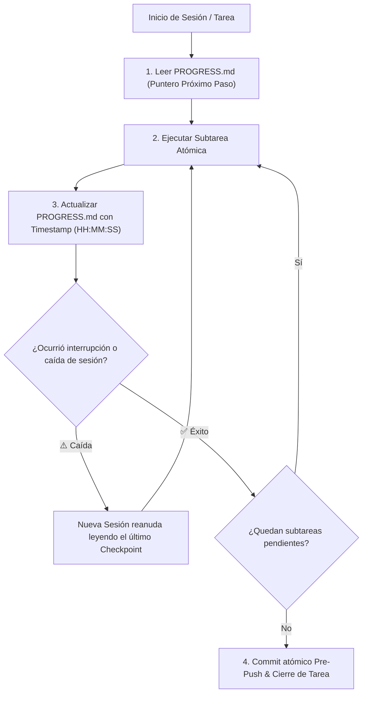

<!-- ======================================================================= -->
<!-- SECCIÓN 1: CABECERA Y ROL COGNITIVO DE LA MEMORIA EPISÓDICA            -->
<!-- BP RECOMENDADA: bp_0511_checkpointing_and_rollback                      -->
<!-- BP RECOMENDADA: bp_0819_task_artifacts_and_state_retention              -->
<!-- Libro contable de tareas (Task Ledger) y resiliencia ante caídas.       -->
<!-- ======================================================================= -->

# Registro de Avance y Estado de Ejecución en Tiempo Real (PROGRESS.md)

Este documento constituye la **memoria episódica y libro contable de ejecución (*Task Ledger*)** del repositorio. Registra el desglose de subtareas activas, checkpoints atómicos con marcas de tiempo de alta resolución (`YYYY-MM-DD HH:MM:SS`), bloqueos detectados y el puntero al próximo paso inmediato, asegurando la resiliencia operativa ante cortes de energía, límites de ventana de contexto o transferencias de sesión (*Session Handoffs*).

---

<!-- ======================================================================= -->
<!-- SECCIÓN 2: FLUJO DE RESILIENCIA Y TRANSFERENCIA DE SESIÓN               -->
<!-- BP RECOMENDADA: bp_0703_high_signal_to_noise_ratio                      -->
<!-- ======================================================================= -->

## 1. Flujo de Resiliencia y Transferencia de Sesión (*Session Handoff*)



> [!IMPORTANT]
> **Regla Inviolable de Diagramación Formal:** Queda terminantemente prohibido construir diagramas de flujo, procesos, mapas o secuencias mediante flechas de texto plano (`->`, `-->`, `==>`, `|`, `/`, `\`), caracteres ASCII o símbolos informales sujetos a interpretación ambigua. Todo flujo o relación visual DEBE modelarse obligatoriamente en formato **Mermaid** (` ```mermaid `) con nodos tipados y direcciones formales.

---

<!-- ======================================================================= -->
<!-- SECCIÓN 3: METADATOS DE LA TAREA ACTIVA                                 -->
<!-- ======================================================================= -->

## 2. Metadatos de la Tarea Activa

- **ID de Tarea:** `task_01j7w2b8k4z0v9m1x2c3d4e5f6`
- **Título del Objetivo:** `[Título Descriptivo y Conciso del Objetivo en Curso]`
- **Estado Global:** `[EN_PROCESO | EN_VERIFICACION | COMPLETADO | BLOQUEADO]`
- **Fecha y Hora de Inicio:** `2026-08-27 22:00:00`
- **Última Actualización:** `2026-08-27 22:45:12`
- **Presupuesto de Modificación (*Change Budget*):** Máx. 4 archivos / 150 líneas de diff.

---

<!-- ======================================================================= -->
<!-- SECCIÓN 4: DESGLOSE DE SUBTAREAS Y CHECKPOINTS ATÓMICOS                 -->
<!-- BP RECOMENDADA: bp_0313_acceptance_criteria_and_definition_of_done      -->
<!-- Estados válidos: [x] Completado, [/] En Proceso, [ ] Pendiente.         -->
<!-- ======================================================================= -->

## 3. Desglose de Subtareas y Checkpoints Atómicos

- [x] **Subtarea 1: Análisis exploratorio e inspección de dependencias** `[COMPLETADO: 2026-08-27 22:15:30]`
  - *Archivos leídos:* `pyproject.toml`, `src/core/config.py`.
  - *Resultado:* Se identificó la interfaz requerida para soportar inyección de dependencias.
- [x] **Subtarea 2: Creación de modelo de configuración inmutable** `[COMPLETADO: 2026-08-27 22:30:15]`
  - *Archivos modificados:* `src/core/settings.py`.
  - *Tests ejecutados:* `pytest tests/unit/test_settings.py` (3 passed).
- [/] **Subtarea 3: Refactorización de servicios de aplicación** `[EN_PROCESO: 2026-08-27 22:45:12]`
  - *Paso en curso:* Migrando `src/services/pipeline.py` para inyectar `Settings`.
  - *Archivos en mutación:* `src/services/pipeline.py`.
  - *Bloqueos:* Ninguno.
- [ ] **Subtarea 4: Validación integral de DoD y análisis estático** `[PENDIENTE]`
  - *Criterio de éxito:* `pytest`, `mypy --strict` y `ruff check` con 0 errores.
- [ ] **Subtarea 5: Sincronización de documentación y commit atómico** `[PENDIENTE]`

---

<!-- ======================================================================= -->
<!-- SECCIÓN 5: PRÓXIMO PASO INMEDIATO (POINTER PARA HANDOFF)                -->
<!-- Permite que cualquier agente reanude en 5 segundos sin re-analizar.     -->
<!-- ======================================================================= -->

## 4. Próximo Paso Inmediato (*Immediate Next Action*)

> **Instrucción para Reanudación Instantánea:** Continuar la edición en `src/services/pipeline.py` a partir de la línea 45 para sustituir las llamadas a variables de entorno globales por el atributo `Settings.pipeline_timeout`. Inmediatamente después, ejecutar `pytest tests/unit/test_pipeline.py -vv`.

---

<!-- ======================================================================= -->
<!-- SECCIÓN 6: HISTORIAL RECIENTE DE TAREAS COMPLETADAS                     -->
<!-- ======================================================================= -->

## 5. Historial Reciente de Tareas Completadas

| **Fecha / Hora** | **ID de Tarea** | **Descripción del Objetivo** | **Archivos Alterados** | **Estado** |
|:---|:---|:---|:---|:---:|
| `2026-08-27 21:00:00` | `task_01h455vb4p` | Estandarización de `AGENTS.md` | `formato_minimo/AGENTS.md` | ✅ Completado |
| `2026-08-27 21:30:00` | `task_01h455vb8x` | Plantilla maestra de `.gitignore` | `formato_minimo/gitignore_template.md` | ✅ Completado |

---

<!-- ======================================================================= -->
<!-- SECCIÓN 7: PROTOCOLO PRE-PUSH Y SINCRONIZACIÓN                          -->
<!-- BP RECOMENDADA: bp_0502_atomic_commits_and_clean_history                -->
<!-- ======================================================================= -->

## 6. Protocolo de Sincronización Pre-Push

1. **Marcas Temporales con Segundos:** Cada registro de avance debe incluir timestamp en formato `YYYY-MM-DD HH:MM:SS`.
2. **Commit Atómico de Despliegue:** Si se realiza un `git push`, este archivo DEBE actualizarse e incluirse en el commit para garantizar la consistencia del árbol remoto.

---

<!-- ======================================================================= -->
<!-- GUÍA DE LÍMITES Y FRONTERAS OPERATIVAS DEL PROGRESS.md                  -->
<!-- ======================================================================= -->

## Guía de Límites y Fronteras Operativas del PROGRESS.md

Para mantener el archivo `PROGRESS.md` como un libro contable operativo ágil y evitar confusiones con la memoria permanente o notas públicas de versión:

| **Contenido / Información** | **¿Debe estar en PROGRESS.md?** | **Ubicación Correcta Designada** |
|:---|:---:|:---|
| Diario de trabajo en tiempo real y estado de subtareas activas | ✅ **SÍ** | `PROGRESS.md` (Secciones 2 y 3). |
| Puntero al próximo paso inmediato (*Next Immediate Action*) | ✅ **SÍ** | `PROGRESS.md` (Sección 4). |
| Checkpoints con marcas temporales de alta precisión (`HH:MM:SS`) | ✅ **SÍ** | `PROGRESS.md` (Sección 3). |
| Heurísticas permanentes o trampas descubiertas de librerías | ❌ **NO** | `MEMORY.md`. |
| Borradores de razonamiento, hipótesis o experimentos temporales | ❌ **NO** | `SCRATCHPAD.md` o `sandbox/`. |
| Notas de release para usuarios finales (SemVer) | ❌ **NO** | `CHANGELOG.md`. |
| Topología de módulos y diagramas de capas | ❌ **NO** | `ARCHITECTURE.md`. |
| Recetas procedimentales paso a paso para tareas recurrentes | ❌ **NO** | `PLAYBOOK.md`. |
