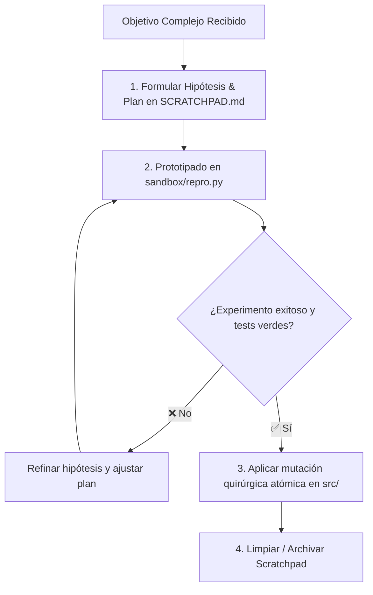

<!-- ======================================================================= -->
<!-- SECCIÓN 1: CABECERA Y ROL COGNITIVO DE LA MEMORIA DE TRABAJO           -->
<!-- BP RECOMENDADA: bp_0910_worktree_isolation_and_parallel_exploration     -->
<!-- BP RECOMENDADA: bp_0703_high_signal_to_noise_ratio                      -->
<!-- Espacio de borrador estructurado para Look Before You Leap.             -->
<!-- ======================================================================= -->

# Memoria de Trabajo, Hipótesis y Plan de Ejecución (SCRATCHPAD.md)

Este documento constituye la **memoria de trabajo temporal (*Working Memory*)** del agente de IA. Funciona como un espacio de borrador analítico donde se formulan hipótesis técnicas, se evalúan alternativas arquitectónicas, se diseñan experimentos aislados y se establece el plan de mutación quirúrgica antes de alterar archivos de código fuente en producción.

---

<!-- ======================================================================= -->
<!-- SECCIÓN 2: CICLO DE RAZONAMIENTO, EXPERIMENTACIÓN Y MUTACIÓN            -->
<!-- ======================================================================= -->

## 1. Ciclo de Razonamiento, Experimentación y Mutación



> [!IMPORTANT]
> **Regla Inviolable de Diagramación Formal:** Queda terminantemente prohibido construir diagramas de flujo, procesos, mapas o secuencias mediante flechas de texto plano (`->`, `-->`, `==>`, `|`, `/`, `\`), caracteres ASCII o símbolos informales sujetos a interpretación ambigua. Todo flujo o relación visual DEBE modelarse obligatoriamente en formato **Mermaid** (` ```mermaid `) con nodos tipados y direcciones formales.

---

<!-- ======================================================================= -->
<!-- SECCIÓN 3: COMPRENSIÓN DEL PROBLEMA Y RESTRICCIONES                     -->
<!-- ======================================================================= -->

## 2. Comprensión del Problema y Restricciones

- **Objetivo Principal:** `[Descripción detallada del problema técnico a resolver o feature a implementar]`.
- **Fronteras y Módulos Afectados:** `src/paquete/core/`, `src/paquete/services/`, `tests/unit/`.
- **Invariantes Inquebrantables:**
  1. No modificar la firma de interfaces públicas preexistentes sin compatibilidad hacia atrás.
  2. Mantener la cobertura de pruebas unitarias al 100% en los módulos alterados.
  3. No introducir dependencias externas que no figuren en `pyproject.toml`.

---

<!-- ======================================================================= -->
<!-- SECCIÓN 4: EVALUACIÓN DE HIPÓTESIS TÉCNICAS Y EXPERIMENTOS              -->
<!-- BP RECOMENDADA: bp_0103_kiss_principle & bp_0818_no_silent_fallbacks     -->
<!-- ======================================================================= -->

## 3. Evaluación de Hipótesis Técnicas y Experimentos

### Hipótesis A: [Nombre de la Solución Principal - Ej. Parser Iterativo Basado en Pila]
- **Enfoque Técnico:** Reemplazar llamadas recursivas por un bucle `while stack:` con despacho polimórfico de nodos.
- **Ventajas:** Previene `RecursionError` en árboles de sintaxis profunda; menor consumo de memoria de pila.
- **Riesgos / Trade-offs:** Requiere gestionar explícitamente el estado de los delimitadores abiertos.
- **Experimento en Sandbox:** Prototipar en `sandbox/proto_stack_parser.py` y estresar con 500 niveles de anidación.

### Hipótesis B: [Nombre de Solución Alternativa - Ej. Incrementar Límite de Recursión de Python]
- **Enfoque Técnico:** Ejecutar `sys.setrecursionlimit(5000)`.
- **Evaluación:** ⛔ **Descartada.** Viola el principio de diseño limpio (`bp_0103_kiss_principle`), oculta fallas de arquitectura y puede causar *crashes* de memoria del intérprete CPython.

---

<!-- ======================================================================= -->
<!-- SECCIÓN 5: PLAN QUIRÚRGICO DE IMPLEMENTACIÓN (TDD)                      -->
<!-- BP RECOMENDADA: bp_0302_test_driven_development                         -->
<!-- ======================================================================= -->

## 4. Plan Quirúrgico de Implementación (Ciclo Red-Green-Refactor)

1. [ ] **Fase 1 (TDD Red):** Crear prueba unitaria con caso de estrés en `tests/unit/test_parser.py` que reproduzca el fallo actual.
2. [ ] **Fase 2 (TDD Green):** Implementar la estructura `TokenStack` en `src/paquete/core/parser.py` hasta que la prueba pase.
3. [ ] **Fase 3 (Refactor):** Simplificar la lógica de despacho de operadores y tipar con `Sequence[Token]` estricto.
4. [ ] **Fase 4 (DoD Verification):** Ejecutar `pytest tests/unit/`, `mypy --strict src/` y `ruff check src/`.

---

<!-- ======================================================================= -->
<!-- SECCIÓN 6: CICLO DE VIDA Y POLÍTICA DE LIMPIEZA                         -->
<!-- ======================================================================= -->

## 5. Ciclo de Vida y Política de Limpieza del Scratchpad

1. **Ubicación Canónica:** Este archivo se mantiene activamente en `sandbox/SCRATCHPAD.md` o en `.ai/scratchpad.md`.
2. **Efimeridad:** Una vez que la tarea ha sido completada, validada y commiteada, el contenido del scratchpad se limpia o se sintetizan sus conclusiones en `MEMORY.md` si aportaron un aprendizaje permanente.

---

<!-- ======================================================================= -->
<!-- GUÍA DE LÍMITES Y FRONTERAS OPERATIVAS DEL SCRATCHPAD.md                -->
<!-- ======================================================================= -->

## Guía de Límites y Fronteras Operativas del SCRATCHPAD.md

| **Contenido / Información** | **¿Debe estar en SCRATCHPAD.md?** | **Ubicación Correcta Designada** |
|:---|:---:|:---|
| Formulación de hipótesis, experimentos y análisis de trade-offs | ✅ **SÍ** | `SCRATCHPAD.md` (Sección 3). |
| Plan quirúrgico paso a paso para la tarea en curso | ✅ **SÍ** | `SCRATCHPAD.md` (Sección 4). |
| Trazas intermedias de depuración y logs de análisis | ✅ **SÍ** | `SCRATCHPAD.md` o `sandbox/`. |
| Estado de subtareas activas o registro histórico con timestamps | ❌ **NO** | `PROGRESS.md`. |
| Lecciones permanentes o trampas descubiertas (*gotchas*) | ❌ **NO** | `MEMORY.md`. |
| Código de producción final probado y testeado | ❌ **NO** | `src/`. |
| Procedimientos operativos estandarizados para tareas recurrentes | ❌ **NO** | `PLAYBOOK.md`. |
