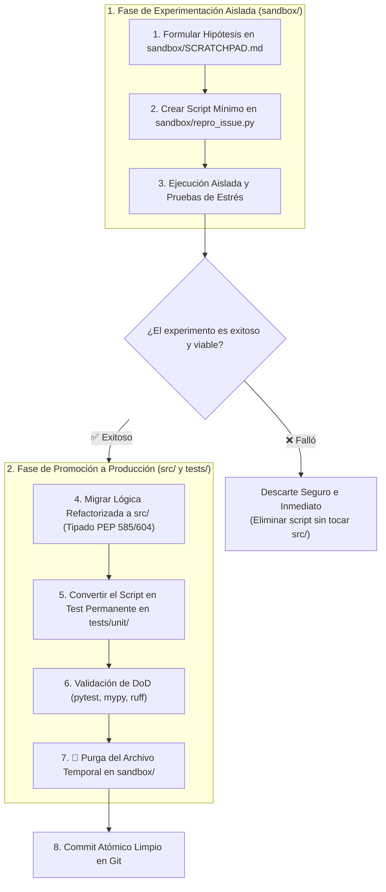
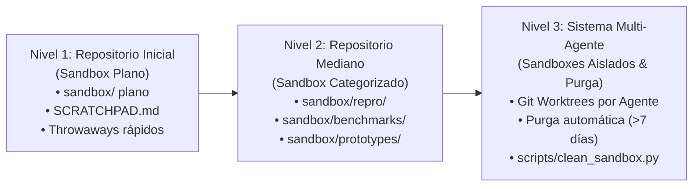

# Guía Estándar de Sandboxing y Espacios de Experimentación para IA Agéntica

Esta guía define las **prácticas estándar de la industria, la arquitectura y las reglas de gobernanza** para el directorio de pruebas y experimentación temporal (**`sandbox/`**) en repositorios con desarrollo asistido por **Agentes Autónomos de Inteligencia Artificial**.

El objetivo central del sandbox es proporcionar un laboratorio seguro con **Blast Radius Controlado**, erradicar la contaminación del árbol de trabajo (*Repo Littering*) y establecer un flujo determinista para promover prototipos exitosos al código de producción en `src/`.

---

## 1. Ciclo de Vida del Sandbox y Protocolo de Promoción



> [!IMPORTANT]
> **Estándar de Diagramación Formal y Texto Limpio:**
> - `SHOULD`: Modelar ciclos de promoción y flujos de contención en bloques **Mermaid** (` ```mermaid `) con nodos tipados y direcciones formales.
> - `MAY`: Utilizar texto estructurado para listas de verificación o comandos de terminal.

---

## 2. Configuración Inicial del Repositorio (*Day 0 Setup*)

Al instanciar un nuevo repositorio a partir de `formato_minimo`, el sandbox debe configurarse de forma que esté presente en cada clon, pero su contenido temporal quede estrictamente aislado de Git.

### 2.1 Estructura de Directorio Canónica
```yaml
sandbox/
  .gitkeep               # Preserva el directorio en el árbol de Git
  README.md              # Guía operativa y reglas del sandbox para agentes
  SCRATCHPAD.md          # Memoria de trabajo, hipótesis y borradores analíticos
```

### 2.2 Reglas de Exclusión en `.gitignore`
Para evitar que scripts temporales, volcados JSON o trazas de depuración se añadan por accidente a los commits, se debe configurar una regla de lista blanca (*whitelist pattern*) en el archivo `.gitignore` raíz:

```gitignore
# =============================================================================
# ZONA DE SANDBOX Y SCRATCH TEMPORAL DE AGENTES DE IA (Blast Radius Controlado)
# =============================================================================
# Ignorar todo el contenido temporal dentro de sandbox/
sandbox/*

# Preservar exclusivamente los archivos de control y memoria estructurada
!sandbox/.gitkeep
!sandbox/README.md
!sandbox/SCRATCHPAD.md
```

### 2.3 Directivas Vinculantes en `AGENTS.md`
En el contrato operativo `AGENTS.md` (Secciones 8 y 9), se deben declarar las siguientes reglas no negociables:

```markdown
### 8. Entorno de Pruebas (Sandbox) y Scripts Temporales
- **Uso Obligatorio de `sandbox/`:** Todos los scripts temporales, utilidades throwaway de un solo uso, pruebas destructivas, scripts de reproducción de bugs (`repro_issue.py`) y borradores de análisis DEBEN ser creados y ejecutados únicamente dentro del directorio `sandbox/`.
- **Prohibición de Contaminación:** Queda estrictamente prohibido crear scripts de prueba o archivos temporales en la raíz del proyecto o en `src/`.
- **Protocolo de Promoción:** Si un script de prueba en `sandbox/` valida una solución exitosa, su lógica debe promoverse formalmente a `src/`, su caso de prueba debe convertirse en un test permanente en `tests/unit/`, y el archivo temporal en `sandbox/` debe eliminarse antes de concluir la tarea.
```

---

## 3. Protocolo de Promoción Paso a Paso (*Sandbox-to-Production*)

Para transformar un experimento aislado en código de producción de alta calidad, el agente debe seguir estos 5 pasos deterministas:

| **Paso** | **Acción en Sandbox** | **Acción en Producción (`src/` y `tests/`)** | **Criterio de Validación** |
|:---|:---|:---|:---|
| **1. Hipótesis** | Documentar el enfoque y trade-offs en `sandbox/SCRATCHPAD.md`. | Ninguna (código intacto). | Claridad en la estrategia técnica. |
| **2. Prototipo** | Escribir `sandbox/repro_<nombre>.py` con el caso mínimo reproducible. | Ninguna (código intacto). | El script reproduce el bug o valida la feature. |
| **3. Migración** | Validar que el algoritmo resuelva el problema de forma determinista. | Implementar la lógica en `src/paquete/` con tipado estricto PEP 585/604 y docstrings Google. | `mypy --strict src/` pasa con 0 errores. |
| **4. Test Permanente** | El script de sandbox ya cumplió su función exploratoria. | Convertir la lógica del script en un test unitario formal en `tests/unit/test_<nombre>.py`. | `pytest tests/unit/` pasa 100% verde. |
| **5. Limpieza** | **Eliminar `sandbox/repro_<nombre>.py`**. | Mantener solo el código promovido y los tests permanentes. | `git status` muestra solo archivos en `src/` y `tests/`. |

---

## 4. Evolución y Tratamiento a Medida que Crece el Repositorio

El tratamiento del sandbox evoluciona conforme el proyecto aumenta en escala, complejidad y concurrencia multi-agente:



### Nivel 1: Repositorio Inicial / Monolito Pequeño (Sandbox Plano)
* **Estructura:** Directorio `sandbox/` plano sin subcarpetas complejas.
* **Flujo:** El agente crea `sandbox/test_script.py`, ejecuta, promueve a `src/` y elimina.
* **Mantenimiento:** Limpieza manual tras cada tarea.

### Nivel 2: Repositorio Mediano / Multi-Módulo (Sandbox Categorizado)
Cuando múltiples desarrolladores o agentes trabajan en diferentes subsistemas, se estructura `sandbox/` en subcarpetas temáticas:
* `sandbox/repro/`: Casos Mínimos de Reproducción de bugs (*MREs*) reportados en incidencias.
* `sandbox/benchmarks/`: Scripts de prueba de carga, perfilado de memoria y estrés de latencia.
* `sandbox/prototypes/`: Pruebas de integración con nuevas APIs o librerías antes de adoptar dependencias.
* `sandbox/dumps/`: Volcados de datos JSON temporales para inspección analítica.

### Nivel 3: Repositorio Grande / Sistemas Multi-Agente Concurrentes
En entornos donde múltiples subagentes operan simultáneamente para evitar colisiones en archivos de sandbox:
1. **Aislamiento por Git Worktrees:** Cada subagente opera en su propio worktree aislado (`.agent/worktrees/agent-<id>/sandbox/`).
2. **Script de Purga Automatizada (`scripts/clean_sandbox.py`):** Utilidad en CI o pre-commit que elimina automáticamente cualquier script temporal no rastreado con más de 7 días de antigüedad.
3. **Comando de Limpieza Rápida:**
   ```bash
   # Elimina todos los archivos temporales no rastreados dentro de sandbox/
   git clean -fdX sandbox/
   ```

---

## 5. Guardrails de Seguridad y Reglas Inviolables en Sandbox

1. ⛔ **Prohibido Guardar Secretos o Credenciales:** Nunca almacenar API keys reales, tokens de autenticación o contraseñas en scripts dentro de `sandbox/`. Utilizar variables de entorno (`.env`) o valores mockeados.
2. ⛔ **Prohibidas Operaciones Destructivas en Bases de Datos Reales:** Los scripts de prueba en `sandbox/` no deben ejecutar `DROP TABLE`, `DELETE FROM` masivos o mutaciones en bases de datos de producción o staging compartidas. Emplear exclusivamente SQLite en memoria (`sqlite:///:memory:`) o contenedores efímeros aislados.
3. ⛔ **Direccionalidad Estricta de Importaciones (No Reverse Imports):**
   * ✅ `sandbox/script.py` **PUEDE** importar módulos de `src/` (para probarlos).
   * ⛔ El código de producción en `src/` **JAMÁS** debe importar nada proveniente de `sandbox/`.
4. ⛔ **Prohibido Depender de Archivos de Sandbox en CI:** La suite de pruebas oficial en `tests/` y los pipelines de CI nunca deben depender de la existencia de archivos dentro de `sandbox/`.

---

## 6. Plantilla Estándar para `sandbox/README.md`

Snippet listo para copiar al inicializar la carpeta `sandbox/` en un nuevo repositorio:

```markdown
# Espacio de Pruebas y Experimentación Temporal (Sandbox)

Este directorio es un laboratorio seguro de **radio de impacto cero** destinado a scripts temporales, utilidades de un solo uso (*throwaways*), pruebas de concepto y reproducción de bugs creados por desarrolladores humanos y agentes de Inteligencia Artificial.

## Reglas Operativas para Agentes de IA:
1. **Aislamiento:** Todo script de prueba, prototipo o experimento DEBE guardarse aquí y NUNCA en la raíz o en `src/`.
2. **Git Hygiene:** El contenido de este directorio está ignorado en `.gitignore` por defecto (excepto este README y `SCRATCHPAD.md`).
3. **Protocolo de Promoción:** Si una solución desarrollada aquí es exitosa:
   - Migrar la lógica a su módulo correspondiente en `src/`.
   - Convertir el script de prueba en un test permanente en `tests/unit/`.
   - Eliminar el script temporal de este directorio.
4. **Seguridad:** Prohibido escribir secretos, tokens reales o ejecutar mutaciones destructivas en bases de datos externas.
```
