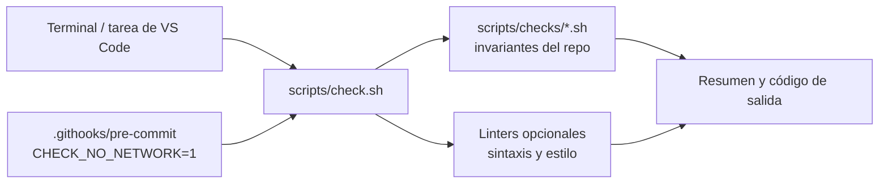

# Arquitectura

El repositorio tiene tres piezas: documentación por capas (cada archivo responde una sola pregunta, ver [README.md](README.md)), una autoevaluación determinista con un único punto de entrada y una configuración local que apunta a las bases teóricas externas.

## Estructura de carpetas

```text
.
├── AGENTS.md                       Contrato para agentes (fuente única de reglas)
├── ARCHITECTURE.md                 Este documento
├── CLAUDE.md                       Adaptador: importa AGENTS.md
├── CONTRIBUTING.md                 Procedimientos de cambio
├── README.md                       Entrada al proyecto
├── .editorconfig                   Formato común para editores
├── .gitattributes                  Normalización a LF
├── .gitignore                      Exclusiones (incluye la configuración local)
├── .markdownlint-cli2.jsonc        Configuración de markdownlint-cli2
├── .yamllint.yaml                  Configuración de yamllint
├── .githooks/pre-commit            Hook: autoevaluación sin red
├── .github/
│   ├── copilot-instructions.md     Adaptador: apunta a AGENTS.md
│   └── instructions/               Reglas por ruta para Copilot (*.instructions.md)
├── .vscode/tasks.json              Tareas de VS Code
├── config/
│   └── external-bases.example      Plantilla de la configuración local (versionada)
├── docs/
│   └── adr/                        ADR en formato MADR e índice README.md
├── scripts/
│   ├── check.sh                    Punto de entrada único de la autoevaluación
│   ├── checks/                     Un script por invariante del repositorio
│   └── lib/common.sh               Utilidades compartidas por los chequeos
├── src/                            Código del proyecto (vacío en la plantilla)
└── tests/                          Pruebas del proyecto (vacío en la plantilla)
```

## Autoevaluación

`scripts/check.sh` ejecuta primero los chequeos propios y después los linters. Termina con código 0 solo si no hay fallos.



Cada comprobación tiene un solo responsable:

| Comprobación | Responsable | Qué valida |
| --- | --- | --- |
| Archivos obligatorios | `scripts/checks/required-files.sh` | Existencia y contenido de la lista de archivos obligatorios. La lista está en el script. |
| Cabeceras y secciones | `scripts/checks/headers.sh` | Esquema de frontmatter de [ADR-0002](docs/adr/0002-frontmatter-schema.md), unicidad de `id`, coherencia de `name` y `file_path`, y secciones obligatorias por archivo. |
| Numeración de ADRs | `scripts/checks/adr-numbering.sh` | Nombres `NNNN-titulo.md`, secuencia desde 0001 sin huecos ni duplicados, y presencia en el índice. |
| Enlaces internos | `scripts/checks/internal-links.sh` | Que los destinos relativos existan; rechaza rutas absolutas. |
| Configuración externa | `scripts/checks/external-config.sh` | Que el archivo local esté ignorado y sin versionar, y que la ruta configurada exista, sea legible y esté fuera del repo. |
| Shell | shellcheck | Scripts de `scripts/` y `.githooks/`. |
| Markdown | markdownlint-cli2 | Estilo y anclas `#` dentro del mismo archivo. |
| YAML | yamllint | Sintaxis de los `.yaml` y del frontmatter de cada `.md`. |
| Enlaces externos | lychee | URLs `http`/`https`. Se omite con `CHECK_NO_NETWORK=1`. |

Comportamiento:

- Si un linter no está instalado, se emite un `AVISO` con el comando de instalación y se omite. Con `CHECK_STRICT=1` cuenta como fallo.
- Sin bases externas configuradas solo hay un `AVISO`, para que un clon recién creado pase el chequeo.
- Límites conocidos: no se validan las anclas hacia otros archivos (`otro.md#seccion`), y el hook revisa la copia de trabajo, no solo lo preparado con `git add`.

## Bases teóricas externas

La ruta se resuelve en este orden:

1. Variable de entorno `EXTERNAL_BASES_DIR`.
2. Clave `EXTERNAL_BASES_DIR` en `config/external-bases.local`, que está ignorado por git. Se lee como datos y no se ejecuta.
3. Ninguna: queda sin configurar y se emite un aviso.

Las reglas de uso por parte de los agentes están en [AGENTS.md](AGENTS.md). Las decisiones que justifican esta estructura están en [docs/adr/](docs/adr/README.md).
